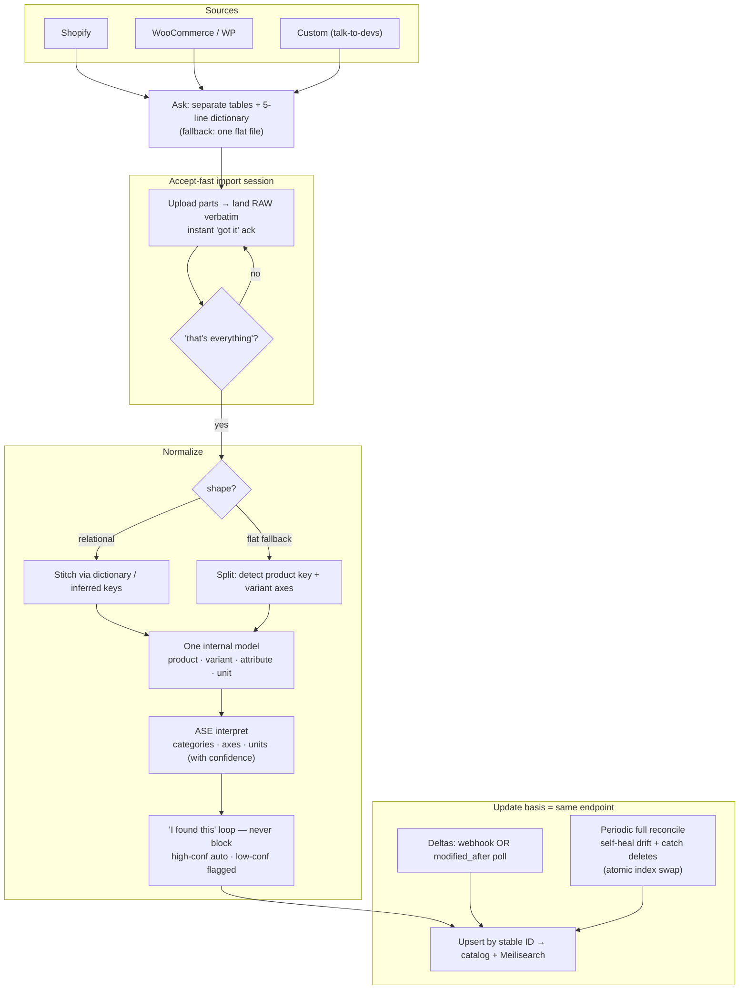
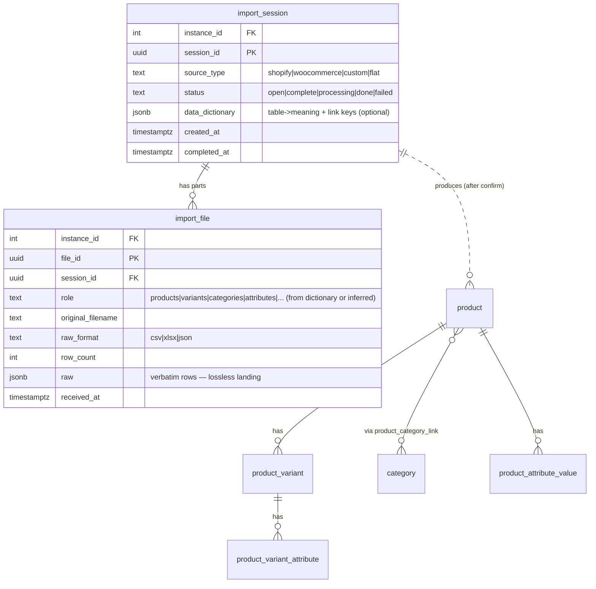

# Bulk Catalog Intake & Sync

Status: Draft (directional — not locked)
Owner: Tuncho

## The problem

A merchant should get their catalog into GroLabs with the **least possible
formatting work**, and keep it fresh without thinking about it. The only thing
we ever *require* is a stable ID per record; everything else is our job to
interpret. This doc decides the intake shape, the accept-fast pipeline, and the
update basis.

## Decisions

### 1. The intake ask — separate tables + a tiny data dictionary

Merchant data arrives in one of two natural shapes. We accept both, but we
**default to the one that preserves the most structure**:

- **Default — separate tables, as-is, + a one-line data dictionary.** When we
  can talk to devs (Shopify, WooCommerce, or a custom system), this is the ask.
  The merchant exports their tables unchanged and writes a five-line note: what
  each table is and which column links it to the others. This is *less* work for
  them than a join query and gives us the join graph explicitly.

  ```
  products.csv    — our products.          key: product_id
  variants.csv    — sizes/colors.          links to products by product_id
  categories.csv  — category tree.         links to products by category_id
  attributes.csv  — attribute definitions. key: attribute_id
  attr_values.csv — values per product.    links by product_id + attribute_id
  ```

  The dictionary is **optional, never a gate** — if absent, we infer join keys
  (matching column names + value overlap) and confirm them in the same loop.

- **Fallback — one flat file, we split it.** For merchants who can only press an
  "Export all products" button (typical Shopify export) and don't know their
  structure. We detect the repeating product key, treat constant-within-group
  columns as product-level and varying columns as variant axes. Used only when
  separate tables aren't available.

- **Rejected — the mega flat join.** Asking the merchant to join everything into
  one denormalized file is the worst option: it destroys the foreign keys we
  want, is *more* work for them, and explodes rows combinatorially. We never
  offer it.

### 2. Accept-fast — raw landing in an import session

Intake is a **session** that buffers all the parts, not a per-file action
(you can't stitch `variants` to `products` until `products` has arrived):

1. Client opens a session and uploads each part → each lands **raw and verbatim**
   in staging and gets an instant *"got it"* ack (same accept-fast model as the
   existing push-ingest API and `wc_raw` raw preservation).
2. Client signals **"that's everything"** (or completeness is derived from the
   dictionary).
3. *Then* the stitch → interpret → confirm pipeline runs over the complete set.

### 3. AI normalization — stitch / split → interpret → confirm

Both shapes collapse into **one internal model** (product · variant · attribute ·
unit), then the existing ASE interpretation runs identically on top:

- **Stitch** (relational) — join the tables via the dictionary or inferred keys.
- **Split** (flat fallback) — reshape the wide file into product/variant.
- **Interpret** (ASE) — `/agents/analyze-categories` + `/agents/group-products`
  infer categories, extract variant axes, read units/quantities — each with a
  confidence score.
- **"I found this" confirm loop — never block.** High-confidence interpretations
  apply themselves; low-confidence ones are flagged for a glance; the raw data is
  searchable in the meantime; corrections teach the next import. This is the
  agent-panel pattern the app is already built around (CLAUDE.md §14), and it
  reuses the import wizard's review step.

### 4. The update basis — the SAME endpoint as the initial load

There is **no separate update pipeline**. This is the trick Algolia, Meilisearch,
and Shopify all use. One endpoint, keyed on a stable external ID:

- ID exists → **update** (upsert). ID is new → **insert**.
- A full sync is "send all of them"; a delta is "send the changed ones."
- The only extra verb is **delete**.

The existing push-ingest API already does upsert-by-`id`, delete-by-id, and
delete-all — so the model is already in place.

**Steady state per source:**

| Source | Initial load | Update basis | Deletes |
|---|---|---|---|
| Shopify | Bulk pull once | `products/*` webhooks → ingest API | `products/delete` webhook |
| WooCommerce / WP | WC REST pull (existing) | Poll `?modified_after=`, or a plugin push hook | Delete hook, or full reconcile |
| Custom (devs) | The tables | Webhook **or** an `updated_at` column we poll | Agreed explicitly with devs |

**Safety net — periodic full reconcile.** A nightly/weekly full re-sync everywhere
self-heals drift and catches the deletes that timestamp-based deltas silently
miss (a deleted row just stops existing — there's no timestamp to catch it).
Anything in our index not present in the latest full snapshot is removed. For the
search index, do the full replace atomically via Meilisearch index swap (the
Algolia `replaceAllObjects` / temporary-index equivalent) so there's never a
half-empty window.

**The dev ask for updates** is one sentence on top of the tables ask:
> "…and give us a way to know what changed — either ping us on every
> create/update/delete, or put a `modified_at` column on the tables so we can ask
> for deltas — and tell us how a delete is signalled."

## Flow



## Data model

New staging tables this design introduces (**import_session**, **import_file**);
they feed the existing catalog tables, which are unchanged by this design.



Both staging tables carry `instance_id` and are RLS-isolated like every
operational table (CLAUDE.md §2). Raw landing is lossless — nothing is discarded
before interpretation, mirroring the `wc_raw` precedent.

## Implementation plan (discrete prompts — confirm before building)

> Ordered. Each is independently executable; later prompts depend on earlier ones
> as noted. Per design-session-protocol R-1, no code until the owner confirms.

1. **Staging schema migration.**
   *What:* Add `import_session` + `import_file` tables (above) with RLS + an
   `instance_id` index. *Where:* `web-apps/app` (`supabase/migrations/`, apply +
   verify per CLAUDE.md §12). *Why:* the raw landing zone every other prompt
   builds on. *Depends on:* none.

2. **Multi-part intake API.**
   *What:* Extend `/api/v1/catalog/**` with session lifecycle — open session,
   upload part (lands raw, instant ack), mark complete. *Where:* `web-apps/app`
   (`src/app/api/v1/catalog/`). *Why:* accept-fast multi-table intake.
   *Depends on:* 1.

3. **Shape detection + stitch (relational).**
   *What:* On session-complete, read the dictionary (or infer join keys via
   column-name + value-overlap) and stitch parts into the internal model.
   *Where:* `web-apps/app` (`src/lib/import/`), optionally an ASE assist for key
   inference. *Why:* the default, structure-preserving path. *Depends on:* 2.

4. **Flat-file split (fallback).**
   *What:* Detect the repeating product key; constant-within-group columns →
   product, varying → variant axes. *Where:* `web-apps/app` `src/lib/import/`
   (reuses the wizard's grouping concepts). *Why:* support Shopify-style single
   exports. *Depends on:* 2.

5. **Wire interpretation to the session.**
   *What:* Feed the stitched/split model through the existing ASE agents
   (`analyze-categories`, `group-products`) and persist confidence-scored
   proposals. *Where:* `web-apps/app` (`src/lib/ase.ts` + import lib). *Why:*
   reuse the AI normalization that already exists in the wizard. *Depends on:*
   3, 4.

6. **"I found this" confirm surface.**
   *What:* Reuse the wizard review step to confirm interpretations from an
   API-originated session; high-confidence auto-applies, low-confidence flagged;
   never blocks. *Where:* `web-apps/app` (`src/app/[locale]/(app)/import/`).
   *Why:* the human-in-the-loop without gating. *Depends on:* 5.

7. **Delta + reconcile sync.**
   *What:* Confirm the upsert/delete endpoint covers deltas (it does); add a
   scheduled `modified_after` WC poll and a periodic full reconcile (atomic
   Meilisearch index swap) that removes records absent from the latest snapshot.
   *Where:* `web-apps/app` (pg_cron + sync lib). *Why:* the update basis +
   delete-catcher safety net. *Depends on:* none (orthogonal to 1–6).

8. **Source change-signals.**
   *What:* Shopify webhook registration + handler; a WooCommerce push hook in the
   GroLabs WP plugin (optional, alternative to polling). *Where:* `web-apps/app`
   (Shopify) + `wp-plugins/grolabs-wordpress-*` (WC hook). *Why:* real-time
   deltas incl. deletes. *Depends on:* 7.

9. **Doc amendments (sign-off prompts, not inline).**
   *What:* Amend `wc-import.md` to point its update story at this design; add the
   Shopify source. *Where:* `web-apps/app/docs/`. *Why:* docs travel with code.
   *Depends on:* the relevant prompts landing. (`wc-import.md` is a policy doc —
   amend only via its own sign-off per protocol R-4.)

## Why this shape

- **Least merchant work:** the only hard requirement is a stable ID. "Send your
  tables + a five-line note" beats every rigid-schema competitor and is easier
  than a join.
- **One brain, two front doors:** the relational and flat paths converge before
  interpretation, so the AI normalization is built once.
- **No drift:** upsert-by-ID makes every write idempotent; the periodic reconcile
  guarantees convergence and is the only reliable delete-catcher.
- **Already half-built:** the push-ingest API (upsert/delete/accept-fast) and the
  wizard (stitch/split/interpret/confirm) exist — this design connects them and
  adds the session + sync layer.
