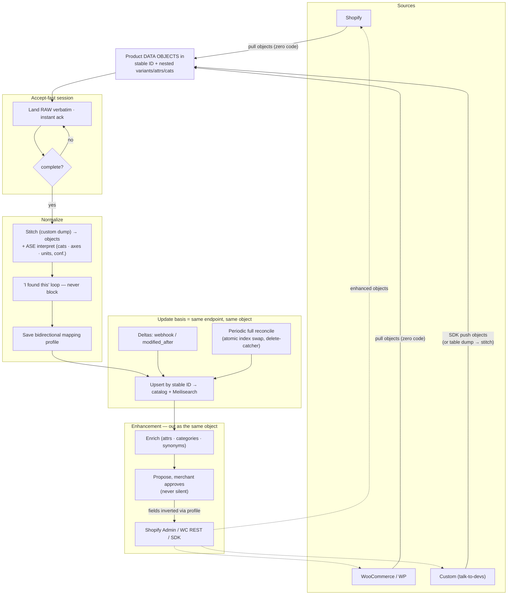
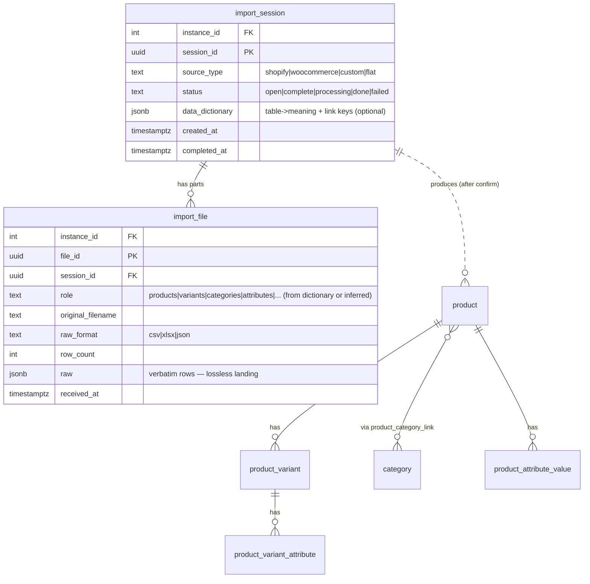

# Bulk Catalog Intake & Sync

Status: Draft (directional — not locked)
Owner: Tuncho

## The problem

A merchant should get their catalog into GroLabs with the **least possible
formatting work**, and keep it fresh without thinking about it. The only thing
we ever *require* is a stable ID per record; everything else is our job to
interpret. This doc decides the intake shape, the accept-fast pipeline, and the
update basis.

## Decisions

### 1. The canonical unit is the product data object — in both directions

The data flow is **bidirectional**: GroLabs ingests the merchant's catalog *and*
sends enhanced products back to enrich it (better attributes, categories,
synonyms). That write-back requirement is decisive — a table dump is a one-way
street you cannot write enrichments into. So the shared currency, in and out, is
the **product data object**: a stable ID + nested variants / attributes /
categories. Updates are product objects; enhancements are product objects; the
initial load resolves to product objects too. One unit everywhere.

**"We help them create them" — the SDK.** Merchants don't reverse-engineer our
schema from docs; they use the **generated SDK** (one OpenAPI spec → per-language
SDKs, TS flagship — the push-ingest API + `public/openapi.yaml` from PR #232 are
the start of this). `buildProduct({...})` produces a valid object. Because the
SDK is generated from the spec, the same types describe the enhancement objects we
send *back* — one spec, both directions.

**How objects arrive/depart varies by source; the unit does not:**

- **Shopify / WooCommerce — zero merchant code.** We *pull* (their APIs already
  return product-shaped objects) and write enhancements *back* through their
  platform APIs (Shopify Admin / WC REST). The object is internal; the merchant
  installs our app/plugin and writes nothing.
- **Custom (talk-to-devs) — SDK push/pull.** They send objects built with the
  SDK, and receive enhancement objects on the same channel. Minimal, unavoidable
  plumbing for a bespoke system, but never per-product upsert/mapping logic —
  that's ours.

**Table dumps are demoted** to an *initial-load convenience for a custom source*:
if exporting tables + a five-line data dictionary is easier for a one-time
backfill than serializing objects, we accept them and **stitch them into product
objects on arrival** (dictionary or inferred join keys; confirmed in the loop).
They are not a second pipeline and never carry updates or enhancements. The mega
flat join stays rejected (destroys foreign keys, more work, row explosion).

### 2. Accept-fast — raw landing in an import session

Intake is a **session** that buffers all the parts, not a per-file action
(you can't stitch `variants` to `products` until `products` has arrived):

1. Client opens a session and uploads each part → each lands **raw and verbatim**
   in staging and gets an instant *"got it"* ack (same accept-fast model as the
   existing push-ingest API and `wc_raw` raw preservation).
2. Client signals **"that's everything"** (or completeness is derived from the
   dictionary).
3. *Then* the stitch → interpret → confirm pipeline runs over the complete set.

### 3. AI normalization — stitch / split → interpret → confirm

Both shapes collapse into **one internal model** (product · variant · attribute ·
unit), then the existing ASE interpretation runs identically on top:

- **Stitch** (relational) — join the tables via the dictionary or inferred keys.
- **Split** (flat fallback) — reshape the wide file into product/variant.
- **Interpret** (ASE) — `/agents/analyze-categories` + `/agents/group-products`
  infer categories, extract variant axes, read units/quantities — each with a
  confidence score.
- **"I found this" confirm loop — never block.** High-confidence interpretations
  apply themselves; low-confidence ones are flagged for a glance; the raw data is
  searchable in the meantime; corrections teach the next import. This is the
  agent-panel pattern the app is already built around (CLAUDE.md §14), and it
  reuses the import wizard's review step.

### 4. The mapping profile — discover the field map once, apply it forever

The wire shape is **JSON**: an array of record objects, each carrying the stable
ID plus arbitrary fields under **the merchant's own names** (`peso_neto`,
`categoria`, `Option1 Value`) — not ours. So "how do we know what field is what?"
must be answered without re-running the AI on every upsert.

Answer: the field map is **discovered once and persisted**, and it is
**bidirectional** — because we also send enhancements back, the map must invert
(`weight` → their `peso_neto`) so outbound objects speak the merchant's language.
Discovery (the session + dictionary + ASE interpret + confirm loop above) produces
a saved **mapping profile** per integration — the artifact that turns the confirm
loop's output into a deterministic transform, applied inbound on ingest and
inverted outbound on enhancement:

```jsonc
{
  "id_field": "id",
  "fields": {
    "Title":         { "target": "name" },
    "peso_neto":     { "target": "attribute:weight", "type": "quantity", "unit_hint": "parse" },
    "categoria":     { "target": "category", "split": ">" },
    "Option1 Value": { "target": "variant_axis", "axis_from": "Option1" }
  }
}
```

Two phases follow from this:

- **Discovery (onboarding, once)** — establish + save the profile.
- **Steady-state upsert (every delta after)** — pass each incoming JSON record
  through the **saved profile**: rename, parse `"500 g"` → `{value: 500, unit: g}`,
  split category paths, pull variant axes. No AI, deterministic, repeatable. The
  stable ID + the mapping profile together **are** the integration contract.

**Unknown new field** (`color_hex` appears, wasn't in the profile): it lands raw
and triggers a *fresh, tiny* confirm round — it never blocks, and everything
already mapped keeps flowing. The profile grows over time.

**Who adapts to whom** — one genuine choice, both ending at the same model:

| Model | Merchant sends | Map lives | Default for |
|---|---|---|---|
| **We adapt** (recommended) | Their **own raw** field names | Our saved profile | Least merchant work — Shopify, WC, most customs |
| **They adapt** | Our **canonical** keys (`id`, `name`, `price`, `categories`…) | Their side | Partner devs who'd rather map once and send clean docs (push API canonical keys already support this) |

Default to **we adapt** — consistent with "the only thing they must format is the
ID."

### 5. The update basis — the SAME endpoint as the initial load

There is **no separate update pipeline**. This is the trick Algolia, Meilisearch,
and Shopify all use. One endpoint, keyed on a stable external ID:

- ID exists → **update** (upsert). ID is new → **insert**.
- A full sync is "send all of them"; a delta is "send the changed ones."
- The only extra verb is **delete**.

The existing push-ingest API already does upsert-by-`id`, delete-by-id, and
delete-all — so the model is already in place.

**Steady state per source:**

| Source | Initial load | Update basis | Deletes |
|---|---|---|---|
| Shopify | Bulk pull once | `products/*` webhooks → ingest API | `products/delete` webhook |
| WooCommerce / WP | WC REST pull (existing) | Poll `?modified_after=`, or a plugin push hook | Delete hook, or full reconcile |
| Custom (devs) | The tables | Webhook **or** an `updated_at` column we poll | Agreed explicitly with devs |

**Safety net — periodic full reconcile.** A nightly/weekly full re-sync everywhere
self-heals drift and catches the deletes that timestamp-based deltas silently
miss (a deleted row just stops existing — there's no timestamp to catch it).
Anything in our index not present in the latest full snapshot is removed. For the
search index, do the full replace atomically via Meilisearch index swap (the
Algolia `replaceAllObjects` / temporary-index equivalent) so there's never a
half-empty window.

**The dev ask for updates** is one sentence on top of the tables ask:
> "…and give us a way to know what changed — either ping us on every
> create/update/delete, or put a `modified_at` column on the tables so we can ask
> for deltas — and tell us how a delete is signalled."

### 6. Write-back — enhancements flow out as the same object, propose-then-approve

The reason objects (not dumps) are canonical: GroLabs sends **enhanced products
back** to enrich the merchant's catalog. The outbound object is the same shape as
the inbound one, addressed by the **stable shared ID**, with our fields inverted
to the merchant's via the bidirectional mapping profile (§4).

- **Departure by source:** Shopify Admin API / WC REST write for the platforms
  (zero merchant code); the SDK channel for custom.
- **Never silent.** Writing into a merchant's live catalog is outward-facing and
  hard to reverse — it is *their* data. Enhancements are **proposed**, not
  auto-applied: the merchant accepts them (the same "I found this, approve?" loop,
  pointed outward). Default to suggestions the merchant confirms, not overwrites.
- This is a larger product commitment than read-only intake (we become a *writer*
  into the store). It is the endgame of an enrichment engine, called out here so
  the object-as-unit decision is understood as serving it — not gold-plating.

## Flow



## Data model

New staging tables this design introduces (**import_session**, **import_file**);
they feed the existing catalog tables, which are unchanged by this design.



Both staging tables carry `instance_id` and are RLS-isolated like every
operational table (CLAUDE.md §2). Raw landing is lossless — nothing is discarded
before interpretation, mirroring the `wc_raw` precedent.

The **mapping profile** (§4) persists per integration. Simplest home is a
`mapping_profile` JSONB sub-key under `instance.integrations_config.<source>`
(the established integration-config pattern, CLAUDE.md §7); promote to a dedicated
`import_mapping_profile` table only if versioning/history is needed. ERD: N/A
while it lives in `integrations_config` (no new table).

## Implementation plan (discrete prompts — confirm before building)

> Ordered. Each is independently executable; later prompts depend on earlier ones
> as noted. Per design-session-protocol R-1, no code until the owner confirms.

1. **Product data object schema + SDK builder.**
   *What:* Extend `public/openapi.yaml` to the full product object (stable ID +
   nested variants/attributes/categories) used in *both* directions; generate the
   TS flagship SDK with a `buildProduct({...})` helper. *Where:* `web-apps/app`
   (`public/openapi.yaml`) + the SDK repo. *Why:* the canonical unit + the "we
   help them create them" tooling; one spec drives ingest and write-back.
   *Depends on:* none.

2. **Staging schema migration.**
   *What:* Add `import_session` + `import_file` tables (above) with RLS + an
   `instance_id` index. *Where:* `web-apps/app` (`supabase/migrations/`, apply +
   verify per CLAUDE.md §12). *Why:* the raw landing zone every other prompt
   builds on. *Depends on:* none.

3. **Multi-part intake API.**
   *What:* Extend `/api/v1/catalog/**` with session lifecycle — open session,
   upload part (lands raw, instant ack), mark complete. Accepts product objects
   directly, or table-dump parts for a custom backfill. *Where:* `web-apps/app`
   (`src/app/api/v1/catalog/`). *Why:* accept-fast intake. *Depends on:* 1, 2.

4. **Stitch table dumps → product objects (custom backfill).**
   *What:* On session-complete, read the dictionary (or infer join keys via
   column-name + value-overlap) and stitch dump parts into product objects; the
   flat-file fallback (detect product key; constant-within-group → product,
   varying → variant axes) for single exports. *Where:* `web-apps/app`
   (`src/lib/import/`), optional ASE assist for key inference. *Why:* the
   custom-source initial-load convenience; everything else already arrives as
   objects. *Depends on:* 3.

5. **Wire interpretation + persist the bidirectional mapping profile.**
   *What:* Feed objects through the existing ASE agents (`analyze-categories`,
   `group-products`), persist confidence-scored proposals, and on confirm **save
   the bidirectional mapping profile** (§4) to
   `integrations_config.<source>.mapping_profile`. *Where:* `web-apps/app`
   (`src/lib/ase.ts` + import lib). *Why:* the AI normalization + the artifact
   that makes upserts deterministic *and* lets write-back speak their language.
   *Depends on:* 4.

6. **"I found this" confirm surface.**
   *What:* Reuse the wizard review step to confirm interpretations from an
   API-originated session; high-confidence auto-applies, low-confidence flagged;
   never blocks. *Where:* `web-apps/app` (`src/app/[locale]/(app)/import/`).
   *Why:* the human-in-the-loop without gating. *Depends on:* 5.

7. **Delta + reconcile sync (apply the saved profile).**
   *What:* Confirm the upsert/delete endpoint covers deltas (it does); apply the
   saved mapping profile to each incoming object (deterministic transform, no AI),
   routing unknown fields to raw + a fresh confirm round; add a scheduled
   `modified_after` WC poll and a periodic full reconcile (atomic Meilisearch
   index swap) that removes records absent from the latest snapshot. *Where:*
   `web-apps/app` (pg_cron + sync lib). *Why:* the update basis + delete-catcher
   safety net. *Depends on:* 5 (needs the profile).

8. **Source change-signals.**
   *What:* Shopify webhook registration + handler; a WooCommerce push hook in the
   GroLabs WP plugin (optional, alternative to polling). *Where:* `web-apps/app`
   (Shopify) + `wp-plugins/grolabs-wordpress-*` (WC hook). *Why:* real-time
   deltas incl. deletes. *Depends on:* 7.

9. **Write-back — enhancement out as the same object (propose-then-approve).**
   *What:* Build the outbound path — enrich, invert fields via the mapping
   profile, **propose** changes the merchant approves (never silent), then write
   via Shopify Admin / WC REST / the SDK channel. *Where:* `web-apps/app`
   (enhancement lib + a review surface) + the SDK. *Why:* the bidirectional
   endgame the object-as-unit decision exists to serve. *Depends on:* 1, 5.

10. **Doc amendments (sign-off prompts, not inline).**
    *What:* Amend `wc-import.md` to point its update story at this design; add the
    Shopify source; note the write-back/SDK direction. *Where:* `web-apps/app/docs/`.
    *Why:* docs travel with code. *Depends on:* the relevant prompts landing.
    (`wc-import.md` is a policy doc — amend only via its own sign-off per protocol
    R-4.)

## Why this shape

- **One unit, both directions:** the product data object is canonical in and out.
  Write-back (enhancement) is what forces this — a table dump is a one-way street
  you cannot write enrichments into.
- **Least merchant work:** only hard requirement is a stable ID; the SDK builds
  the object. Shopify/WC are zero-code (we pull + write via their APIs); custom
  uses the SDK; table dumps survive only as a custom initial-load convenience.
- **Bidirectional mapping:** discovered once, saved, inverted for write-back —
  enhancements come back in the merchant's own field names.
- **No drift:** upsert-by-ID makes every write idempotent; the periodic reconcile
  guarantees convergence and is the only reliable delete-catcher.
- **Safe outbound:** writing into a live store is propose-then-approve, never
  silent.
- **Already half-built:** the push-ingest API (upsert/delete/accept-fast),
  `openapi.yaml`, and the wizard (stitch/interpret/confirm) exist — this design
  connects them and adds the session, sync, SDK, and write-back layers.
