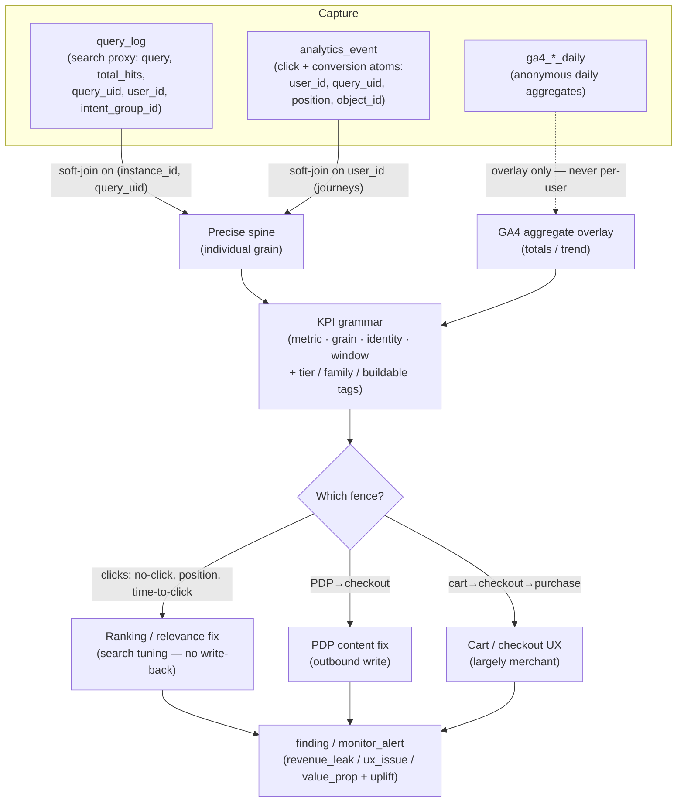
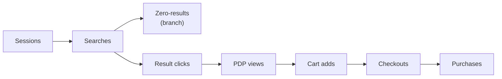
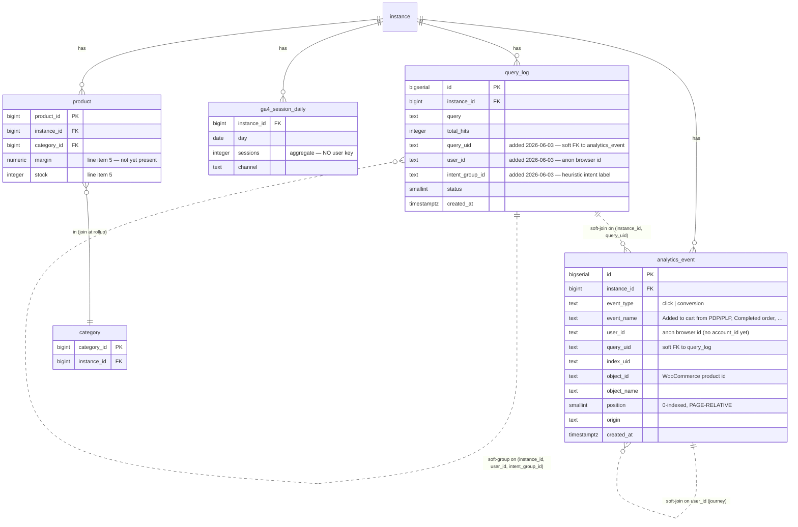

# Conversion-Measurement Foundations (B1 — Funnel & KPI)

Status: **Directional / early exploration.** NOT locked policy. This is the "B1 / Funnel & KPI"
foundation referenced in the backlog. It captures an agreed design so a later session can pick it
up without re-deriving it. No application code was written for this capture (design session —
`docs/policy/design-session-protocol.md`).

Owner: Tuncho · Date: 2026-06-24

> **Update 2026-06-27 — instrumentation landed.** The tracking-store changes this dossier called for
> (§8 line items) shipped in plugin **v0.9.0**: committed-search marking (#2), un-gated firing +
> remove-from-cart (#3), `account_id` (#4), and the global-position fix. The consolidated tracking
> model now lives in [`event-tracking.md`](event-tracking.md); `query_log` / `analytics_event` gained
> the columns (migrations `20260627000001`/`2`, applied + verified). What remains for THIS dossier is
> the **derivation layer** — grain rollups (§5/P5) and the metric/taxonomy registry (§6/P6), still
> pending the two storage-shape decisions. Read §8/§11 below as the pre-v0.9.0 baseline.
>
> **Update 2026-06-27 (2) — derivation layer landed (P5 + P6).** Decisions resolved: **daily tables,
> view-defined + materialized** (P5) and **code-constant catalog** (P6). Shipped: **`metric_daily`**
> (GA4 `*_daily` shape) fed by the `event_stream` → `session_assignment` → `metric_daily_source` views
> and `refresh_metric_daily()`, on a **nightly pg_cron** (migrations `20260627000003`–`5`); the metric
> catalog as `src/lib/analytics/metrics.ts`. **13 KPIs materialized + backfilled + cross-checked**;
> sessionization = 30-min/day, journey window = 7 days; the committed-search `user_id` gap is **closed**
> (cookie mirror, plugin v0.10.0). Remaining = the metrics tagged `needs_instrumentation`/`later` in
> `metrics.ts` (PDP-view event, order revenue, journey grain, reformulation). The §6 KPI catalog and
> §8 line items below predate this and read as the original plan.

> **Purpose.** Measure conversion precisely, identify where it leaks, and pinpoint the fix. The
> grammar below makes "conversion" unambiguous by always pinning it to a grain, an identity rule,
> a time window, a source tier, and an outcome family. Delivery is **manual** (consulting / growth
> service) now; **productization** (an agent that runs this grammar automatically and emits
> findings) comes later. Pairs with
> [`unified-findings-and-monitoring.md`](unified-findings-and-monitoring.md) (where a measured leak
> becomes a stored finding) and [`search-proxy-event-pipeline.md`](search-proxy-event-pipeline.md)
> (the durable event pipeline that makes the spine loss-free enough to feed revenue).

---

## 1. Flow — measure → interpret → fix

## 2. Four locked decisions

1. **Identity — Option B (device tier, v1).** Capture an opaque **`account_id`** on events from
   login day one (cheap, nullable, populated when logged in). Compute at **device tier** in v1; the
   full identity-resolution graph is **deferred**. Non-registered shoppers are stitched by a
   **persistent anonymous browser id** — the WC plugin stores it in `localStorage` under the
   misleadingly-named key `grolabs_wordpress_search_session_id`, which is **persistent per-browser,
   NOT per-session**. The wiki must distinguish **"browser id"** from **"session."** Login is the
   merge point: when `account_id` first appears it retroactively attaches the prior anonymous
   history to the human.
2. **Jurisdiction — non-EU only (v1).** Consent model = **disclose + opt-out** (no pre-consent
   gate). The opt-in consent gate is a **reserved hook**, EU-triggered (Constitution Art. 4's
   trigger-to-revisit). **Do not onboard EU-targeted merchants.** "Non-EU" = the merchant's target
   market, not the visitor's location.
3. **Grains & schema.** Every KPI = **(metric, grain, identity rule, time window)** plus three
   tags: **source tier**, **outcome family**, **buildable-now status**. "Conversion" is the same
   metric at several grains, not one number.
4. **Source tiers.** A **precise spine** — registered identity + storefront events + `query_log` —
   joins at the individual grain (via `query_uid` and the account link). **GA4** is an anonymous
   daily-aggregate **overlay**: totals/trend only, never joined per user. Mixing rules:
   (a) join only on a shared key at that grain; (b) a rate's numerator and denominator must come
   from the same source/population; (c) GA4 layers above the spine, never threaded into an
   individual record; (d) tag every metric with its source tier, never average across tiers.

## 3. The wiki (definitions)

- **Anonymous user** — persistent **browser id** (random UUID, localStorage); best-effort,
  device-scoped; breaks on storage clear / private mode / device switch / ITP eviction (~7 days
  inactivity).
- **Registered user** — opaque `account_id` stamped at login; the only handle that means a **human
  across devices**.
- **Event** — one recorded action (the atom).
- **Intent** — one demand expressed (a search, or a distinct product/category pursued); may span a
  reformulation chain; **satisfied** if any query in the chain earns a click/purchase.
- **Session** — one activity burst, bounded by inactivity/day; derived.
- **Journey** — one user's full path to an outcome across sessions; cart = carry-over thread; the
  correct unit for purchase conversion.
- **Search-outcome taxonomy** (per committed search): `zero-result` | `no-click` |
  `reformulated-then-clicked` | `first-query success`.
- **Keystroke vs committed search vs intent** — a *keystroke* is typing in progress (counts for
  nothing); a *committed search* is the settled query (debounce, enter, or engagement); an *intent*
  is the demand (possibly several committed reformulations). **Only committed searches feed KPIs.**
  Mark commitment **at capture time**, not reconstructed later. ⚠️ *Today this is unenforced — see
  Verification 1.*
- **Reformulation types** — **narrowing** (adds words → breadth/faceting signal) | **lateral**
  (swaps descriptors → **vocabulary gap**) | **broadening** | **correcting** (typo). A **vocabulary
  gap** = shopper's words ≠ catalog's words; each lateral chain ending in success is a **synonym
  candidate** (the catalog's job to close, via synonyms). Classification is the
  **Demand-Interpretation agent's** job (semantic comparison).

## 4. The funnel

Per-transition rates are **session/event** grain; **journey & intent** grain span the whole funnel.

## 5. Fence discipline (hard rule)

Ranking/relevance is judged by **clicks** (no-click rate, click position, time-to-click).
Conversion is judged separately as **PDP → checkout**. A clicked-but-not-bought item is a
PDP/checkout signal, **not** a ranking error. **Never cross-attribute** — search-layer fixes never
touch the PDP; PDP fixes never touch ranking.

## 6. KPI catalog

Tags per row: **grain · source** (spine = event-level joinable / GA4 = aggregate overlay) **· now**
(✓ buildable today / ~ needs a small instrumentation change / later).

### Findability — family: revenue (fix = search tuning, no write-back)

| KPI | Definition | Grain | Source | Now |
|---|---|---|---|---|
| No-result rate | zero-result searches ÷ all searches | intent | spine (query_log) | ✓ |
| No-click rate | searches with results but zero clicks ÷ searches with results | intent | spine (query_log ⟕ click on query_uid) | ✓ |
| Search CTR | result clicks ÷ searches with results | intent | spine | ✓ |
| Time-to-first-click | first-click ts − search ts (join on query_uid); **median** / capped | intent | spine | ✓ |
| Avg click position (+ MRR = mean of 1/position) | mean position over clicked results; **conditional on a click** | intent | spine | ✓ |
| Reformulation rate | intents needing ≥1 rewrite ÷ intents | intent | spine | ~ |
| Reformulation depth | avg rewrites before a click within an intent | intent | spine | ~ |
| First-query success rate | intents satisfied on the first query ÷ intents | intent | spine | ~ |
| **Reformulation type** (dimension) | narrowing / lateral / broadening / correcting | agent-classified | spine + agent | later |
| **Vocabulary-gap signals** | lateral chains yielding a synonym candidate (feeds synonym tuning) | intent | spine + agent | later |

> ⚠️ Avg click position uses the **0-indexed, page-relative** `position` (Verification 2) — read
> per-page or correct for pagination before averaging. MRR inherits the same caveat.

### Conversion rates — family: revenue

| KPI | Definition | Grain | Source | Now |
|---|---|---|---|---|
| Click → PDP | PDP views ÷ result clicks | event | spine | ✓ |
| PDP → cart | cart adds ÷ PDP views | event | spine | ~ |
| Cart → checkout | checkouts ÷ cart adds | event | spine | ✓ |
| Checkout → purchase | purchases ÷ checkouts | event | spine | ✓ |
| PDP → checkout (PDP-enhancement fence) | checkouts ÷ PDP reached, **any arrival** | event | spine | ~ |
| Search → purchase | purchases attributed to a search ÷ searches | intent→journey | spine | ✓ |

### Conversion by grain — family: revenue (same metric, four units)

| KPI | Definition | Grain | Source | Now |
|---|---|---|---|---|
| Session conversion | sessions ending in purchase ÷ sessions | session | spine | ✓ *(misleading alone — assist trap)* |
| Journey conversion | journeys ending in purchase ÷ journeys | journey | spine | ✓ device · ~ human |
| Intent conversion | satisfied intents ÷ expressed intents | intent | spine | ~ *(dead-end searches need query_log.user_id — now present)* |
| User conversion | purchasing users ÷ users | user | spine | ✓ device · ~ human |

> The "dead-end searches need `query_log.user_id`" precondition is **already satisfied** —
> `user_id` was added 2026-06-03 (Verification 3). Intent conversion's `~` now reflects only the
> reformulation/commitment work, not the missing column.

### Value — family: revenue

| KPI | Definition | Grain | Source | Now |
|---|---|---|---|---|
| AOV | revenue ÷ orders | journey | spine | ✓ |
| Revenue per session | revenue ÷ sessions (matched population) | session | spine | ✓ |

### Internal economics — family: internal economics (fix = ranking levers, no write-back)

| KPI | Definition | Grain | Source | Now |
|---|---|---|---|---|
| In-stock exposure | sales to in-stock ÷ total sales | intent/SKU | spine + catalog stock | ~ |
| Margin-mix shift | realized margin ÷ baseline margin, same revenue | journey/SKU | spine + catalog margin | later |
| Overstock sell-through | overstock units sold ÷ overstock on hand | SKU | spine + catalog stock | later |

### Cart behavior — family: revenue/predictive (Cart-analysis module, mostly future)

| KPI | Definition | Grain | Source | Now |
|---|---|---|---|---|
| Time-to-purchase | purchase ts − first-add ts | journey | spine (cart events) | later |
| Basket-building cadence | adds per journey before purchase | journey | spine | later |
| Predicted conversion of today's adds | model over store history | journey | spine | later |

### Traffic — family: revenue (top-of-funnel context)

| KPI | Definition | Grain | Source | Now |
|---|---|---|---|---|
| Sessions / users / channel mix / engagement | from GA4 daily tables | aggregate | GA4 | ✓ *(overlay only — never a per-user denominator)* |

### Descriptive only (not a KPI to act on)

- **Avg conversion position** = mean search-result position of the bought item. Record as funnel
  context, **explicitly NOT a ranking verdict**. (The earlier "rank-inversion" idea is **dropped** —
  a clicked-but-not-bought item is a downstream signal, not a ranking error.)

## 7. Measure → interpret → fix → funnel-stage map

Build this as a table grouped by layer. *(Open TODO: add buildable-now as a 5th column so it
doubles as a build order — §10.)*

### Search layer — fix = search tuning, no write-back · family = revenue

| Measure | Interpretation | Fix | Stage |
|---|---|---|---|
| No-result rate | catalog can't answer | synonyms / expansion / add product | Search→Results |
| No-click rate | results shown but irrelevant | relevance / ranking | Results→Click |
| Search CTR | engagement | ranking | Results→Click |
| Time-to-first-click | relevant item buried | ranking | Results→Click |
| Avg click position / MRR | how high relevant ranked | ranking | Results→Click |
| Reformulation (narrowing) | too broad | faceting / specificity | Search→Results |
| Reformulation (lateral) | vocabulary gap | synonyms | Search→Results |
| Reformulation (correcting) | misspelling | typo tolerance | Search→Results |
| First-query success | engine understood first try | all the above | Search→Click |

### Merchandising layer — ranking levers, no write-back · family = internal economics

| Measure | Interpretation | Fix | Stage |
|---|---|---|---|
| In-stock exposure | surfacing fulfillable stock | stock-aware ranking | Results→Cart (inventory) |
| Margin-mix shift | high-margin items surfaced | margin-aware ranking / brand boost | Results→Cart (margin) |
| Overstock sell-through | clearing dead stock | overstock boost | Results→Cart (inventory) |

### PDP layer — fix = PDP content, outbound write

| Measure | Interpretation | Fix | Stage |
|---|---|---|---|
| PDP → cart | page convinces to add | PDP content enhancement | PDP→Cart |
| PDP → checkout (any arrival) | content moves to buy | PDP content enhancement | PDP→Checkout |

### Cart & checkout layer

| Measure | Interpretation | Fix | Stage |
|---|---|---|---|
| Cart → checkout | cart friction / weak intent | cart UX / reminders (largely merchant) | Cart→Checkout |
| Checkout → purchase | payment / trust / friction | checkout UX (merchant) | Checkout→Purchase |
| Time-to-purchase / basket cadence | buying rhythm | nudge timing; later prediction | Cart→Purchase (spans) |

### Cross-cutting (grain) — fix is a measurement choice, not a lever

| Measure | Interpretation | Fix | Scope |
|---|---|---|---|
| Session conversion | mislabels assists | reframe to journey grain — don't localize | whole |
| Journey conversion | true close rate w/ carryover | whole-funnel | whole journey |
| Intent conversion | demand invisible at user level | fix where the intent died (search vs PDP) | per-intent, spans |
| User conversion | reach (device now / human later) | context only | whole |
| AOV / revenue per session | value per order / visit | merchandising + PDP together | whole |

## 8. Instrumentation line items (build precursors)

Leverage-ordered. **Status reflects what is actually on disk (Verifications 1–3) — not the
handoff's assumptions.**

1. **`query_log.user_id`** — *handoff called this HIGHEST leverage and not-yet-built.* **Already
   built** (migration `20260603000001`, 2026-06-03; written by `/api/v1/search`; plugin sends
   `userId`). It unlocks intent conversion for dead-end searches, no-click attribution to a journey,
   and reformulation analysis — **and those are now unblocked at the data-presence level.** Remaining
   work is the *analysis* on top, plus line item 2 (commitment) for data hygiene. `intent_group_id`
   (migration `20260603000002`) and a heuristic `assignIntent()` (`src/lib/analytics/intent.ts`)
   also already exist — reformulation grouping has a skeleton.
2. **Committed-search marking** — debounce/enter/engagement flag at search-log time to separate
   keystrokes from committed searches. **Genuinely NOT built** and the highest *real* gap: the
   typeahead fires the **logged** `/api/v1/search` on every debounced keystroke (Verification 1),
   so `query_log` is polluted with prefix queries and has **no commitment column**. Data-hygiene
   precondition for the entire search-quality layer. `intent_group_id` partially clusters prefixes
   but does not mark commitment.
3. **Unconditional event firing** — the WC plugin currently fires only *search-attributed*
   conversions (requires a `queryUid`). Full-journey + PDP→checkout coverage needs all cart adds /
   orders emitted, not just search-originated ones. (PDP vs PLP is already distinguished via
   `event_name`; finer list types — recommended/upsell/cross-sell — are not.) *Tracks with
   unified-findings §5 "un-gated completed order + remove-from-cart."*
4. **`account_id` on events** — Option B capture (cheap, nullable, populated when logged in).
   **Not built** — `analytics_event` has no `account_id` column (Verification 3). Net-new.
5. **Catalog margin/stock fields** — required for the internal-economics KPIs. Join
   `product_id → category` at rollup time (don't denormalize category onto events —
   unified-findings R-6).
6. **Identity resolution graph** — deferred (follows `account_id` capture; device → human tier).

## 9. Data model (ERD)

Bold tables in this dossier: **query_log**, **analytics_event**, **ga4_session_daily** (stands in
for the five `ga4_*_daily` overlay tables), **product** / **category** (catalog join for
stock/margin). The individual-grain joins are **soft** (logical, not FK-enforced).

> Missing/planned columns are annotated inline (`account_id` on `analytics_event`, `margin`/`stock`
> on `product`) — these are the §8 instrumentation precursors, not current schema.

## 10. Open questions (TODO — leave for sign-off)

- [ ] **TODO:** Add the **buildable-now status as a 5th column** to the §7 measure→fix table so it
  doubles as a build order?
- [ ] **TODO:** Tag the **merchandising rows with their outcome family** (revenue vs internal
  economics) inline in §7?

## 11. Verification findings (Step 3 — checked against the repo)

The repo is the source of truth (Constitution Art. 10). Where a grounded fact from the handoff
conflicts with disk, **disk wins and the conflict is flagged.**

1. **Typeahead vs `query_log` — pollution CONFIRMED.**
   [`grolabs-wordpress-search-typeahead.js`](../../../../wp-plugins/grolabs-wordpress-search/assets/js/grolabs-wordpress-search-typeahead.js)
   fires the **logged** `/api/v1/search` (the same proxy that writes `query_log`) on **every
   debounced keystroke** — `debounce` default 200 ms, `minChars` default 2, `offset: 0, limit: 8`,
   and it sends `userId`. It is **not** committed-only. So `query_log` **is** polluted with prefix
   queries, and there is **no commitment flag** to filter them. → Instrumentation line item 2
   (committed-search marking) is real and unbuilt; it must precede any search-quality KPI.

2. **`position` semantics — PAGE-RELATIVE, 0-indexed (not global, not 1-indexed).**
   `parse_response()` in
   [`class-grolabs-wordpress-search.php`](../../../../wp-plugins/grolabs-wordpress-search/includes/class-grolabs-wordpress-search.php)
   resets `$position = 0` per response; the results page paginates with
   `offset = (paged − 1) × limit`, so page 2's top hit is recorded as position **0** again.
   `analytics_event.position` is `smallint` and its column comment says "zero-indexed rank within
   the result set," but the real semantics are **per-page**. Typeahead's `data-position` is the
   0-based index within the ≤8 typeahead hits — a **different surface/denominator**. ⇒ "Average
   position 4" is biased by pagination; compute per-page or correct before averaging (affects Avg
   click position + MRR).

3. **`query_log` / `analytics_event` schema — one CONFLICT, one confirmation.**
   - ❗ **CONFLICT with grounded fact "query_log lacks user_id."** `query_log` now has **`user_id`**
     and **`query_uid`** (migration `20260603000001_query_log_bridge_keys`, 2026-06-03) **and**
     **`intent_group_id`** (migration `20260603000002_query_log_intent_group`). `/api/v1/search`
     (`route.ts`) writes all three and calls `assignIntent()`. Full current columns: `id`,
     `instance_id`, `query`, `total_hits`, `processing_time_ms`, `variant_selection`, `origin`,
     `created_at`, `status`, `denial_reason`, `total_handler_ms`, `query_uid`, `user_id`,
     `intent_group_id`. This is the **PostHog Analytics MVP** (memory: built 2026-06-03,
     uncommitted). ⇒ Instrumentation line item 1 is **largely already built**; the design's
     "highest-leverage, not-yet-built" framing is stale (R-7).
   - ✅ **Confirmed: `analytics_event` has no journey keys.** Columns are exactly `id`,
     `instance_id`, `event_type`, `event_name`, `user_id`, `query_uid`, `index_uid`, `object_id`,
     `object_name`, `position`, `origin`, `created_at`. **No `session_id` / `cart_id` / `order_id` /
     `account_id`.** The plugin's event payload sends only `userId` (anon browser id); `orderId`
     exists in the plugin's order context but is used **only for dedup**, never written as a column.
     The SDK README's "journey keys" are **not** implemented — they match line items 3 & 4.

4. **Plugin test state — GA4 + login/SSO BUILT but UNTESTED (confirmed).**
   - **GA4 plugin** (`grolabs-wordpress-ga4` v0.2.6): built and packaged (includes tracker /
     settings / plugin classes; 7 build zips 0.2.0→0.2.6) — **no test harness** (no `tests/` dir,
     no test files).
   - **Login plugin** (`grolabs-wordpress-login`): built (`src/`, `composer.json`, `vendor/`,
     `build/`) — **no tests found**.
   - **SSO plugin** (`grolabs-sso` v0.1.2): built (`src/Auth`, `src/Surfaces`; 3 build zips) —
     **no tests found**.
   - For contrast, the **search plugin** is the only WP plugin with a test harness
     (`tests/test-card.php`, `tests/test-search.php`, fixtures, bootstrap, runner). ⇒ "GA4 +
     login/SSO built but untested" is correct: shipped/versioned, zero automated coverage.

## 12. Related GroLabs modules / applications

- **Search Engine / search proxy** (`/api/v1/search`, `src/lib/search/*`) — upstream producer of
  `query_log`; owns the spine's search half and the `position` semantics.
- **Analytics — PostHog MVP** (`src/lib/analytics/intent.ts`, `posthog.ts`,
  [`posthog-analytics-mvp.md`](posthog-analytics-mvp.md)) — already built the `query_log` bridge +
  intent skeleton this design depends on.
- **Analytics — GA4** ([`ga4-integration.md`](../policy/ga4-integration.md)) — the aggregate
  overlay tier; the source of the no-mixing rule (R-2).
- **Unified Findings & Monitoring** ([`unified-findings-and-monitoring.md`](unified-findings-and-monitoring.md))
  — downstream consumer: where a measured leak becomes a `finding` / `monitor_alert`
  (`revenue_leak` / `ux_issue` / `value_prop`). This dossier supplies the metrics; that doc supplies
  the storage + delivery.
- **Search proxy event pipeline** ([`search-proxy-event-pipeline.md`](search-proxy-event-pipeline.md))
  — the durable buffer making events loss-free enough to feed revenue KPIs.
- **WP storefront plugin** (`wp-plugins/grolabs-wordpress-search`) — emits the spine's events; owns
  the anonymous browser id and the typeahead/commitment behavior.
- **Optimization / Demand-Interpretation Agent** (Constitution Art. 12, not yet built) — the
  reformulation-type + vocabulary-gap classifier behind the `later` KPIs.
- **Catalog** (`product` / `category`, `src/lib/actions/*`) — supplies stock/margin for the
  internal-economics family.
- **User & account management** ([`user-management.md`](../policy/user-management.md)) — the `login`
  / SSO surface that produces the registered `account_id` Option B captures.

## 13. External applications & required credentials

- **Meilisearch Cloud** — relevance store + analytics; the storefront posts events with a
  **tenant token** minted by RRE (`/api/v1/events/token`). Token is page-scoped, in memory only.
  RRE holds the Meilisearch admin/search keys (per-instance) server-side.
- **Google Analytics 4** — overlay source. OAuth credentials for the GA4 Data API; polled on a
  Vercel cron. Read-only; anonymous daily aggregates. (See `ga4-integration.md`.)
- **Anthropic API** — for the future Demand-Interpretation agent (reformulation classification /
  synonym candidates). `ANTHROPIC_API_KEY` env var (same pattern as blog AI). Not used by the
  manual-delivery v1.
- **Supabase / Postgres** — stores `query_log`, `analytics_event`, `ga4_*_daily`, catalog. Service
  role used by the event receiver (`/api/v1/events`) and the search proxy's `query_log` insert.
- **WordPress / WooCommerce** (merchant-owned) — the storefront the plugins run on; no GroLabs
  credential beyond the per-instance API key the merchant pastes back (Constitution Art. 3).
- **PostHog** — *terminology caution* (per `search-proxy-event-pipeline.md`): "posthog" is used both
  for the product and for our own post-hoc store. The MVP that built `query_log.user_id` is our
  **in-app** analytics, not necessarily the PostHog SaaS. Resolve before integrating the external
  product.

---

**End — directional design capture. No code written. Awaiting review of the §10 open questions and
the Verification-3 conflict before any implementation session.**
