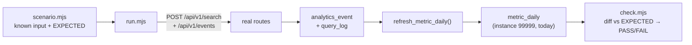

# Conversion-Measurement — Test Harness & Verification Runbook (B1)

Status: **Draft / living runbook.** Pairs with
[`conversion-measurement-foundations.md`](conversion-measurement-foundations.md) (the KPI grammar),
[`event-tracking.md`](event-tracking.md) (the tracking store), and the metric catalog
`src/lib/analytics/metrics.ts`.

> **What this is.** A **known synthetic dataset pushed through the REAL APIs**, paired with a
> hand-computed expected sheet, so every stage can be validated round-trip:
> input → API → storage → rollup → interpretation. It doubles as a CI-able regression assertion
> (non-zero exit on any KPI drift).

---

## 1. Pipeline under test



## 2. The harness — `web-apps/app/scripts/emulator/`

| File | Role |
|---|---|
| `scenario.mjs` | The cast (10 shoppers, 3 logged-in), searches + events, and **`EXPECTED`** (the hand-computed KPI sheet — "data we know how to read"). |
| `run.mjs` | Pushes the scenario through `/api/v1/search` + `/api/v1/events`, exactly like the WP plugin (instance 99999, Origin `test.local`). Has a `--yes-prod` guard. |
| `check.mjs` | `refresh_metric_daily()` then diffs `metric_daily` (instance 99999, today) vs `EXPECTED`; prints PASS/FAIL, exits non-zero on mismatch. |
| `reset.mjs` | Clears instance-99999 rows for a deterministic re-run. |
| `db.mjs` | Shared service-role Supabase client (env via `--env-file=.env.local`). |
| `scenario.phase2.mjs` | Phase 2 catalog + hit/miss/click/order intents + EXPECTED (staged). |
| `seed-meili.mjs` | Seeds/tears down the `inst_99999` Meili index (Phase 2). |
| `run.phase2.mjs` | Meili-aware Phase 2 runner (attributes clicks/orders to real query_uids). |
| `README.md` | Quick reference (mirrors this doc). |

## 3. How to run

```bash
# terminal 1 — the app (writes to the scout DB via .env.local)
npm run dev

# terminal 2 — full cycle: reset → push → check
npm run emulate
```

Granular steps: `npm run emulate:reset`, `npm run emulate:push`, `npm run emulate:check`.
Against a deployed URL (writes real rows, instance 99999 only):
`node scripts/emulator/run.mjs --url https://app.grolabs.ai --yes-prod`.

**Convention:** the generator + fixtures + expected sheet are version-controlled (here + under
`scripts/`); the *generated rows* live in the DB under test instance 99999 and are regenerated on
demand (not committed). The instance-99999 seed itself is in `supabase/migrations`
(`20260520000001`).

## 4. The reserved test instance

`instance_id = 99999`, `storefront_domains = [test.local]` — reserved for integration tests
(`supabase/migrations/20260520000001`). The emulator sends `Origin: http://test.local` so the routes'
origin check passes. Isolated by `instance_id` + RLS; never touches real tenant data.

## 5. Expected sheet (Phase 1) — last verified 2026-06-27: **13/13 PASS**

| KPI | expected | why |
|---|---|---|
| `search_volume` | 25 | 25 committed searches pushed |
| `zero_result_searches` | 25 | no 99999 index → all zero-hit |
| `no_result_rate` | 1.0 | DEGENERATE in Phase 1 (no index); Phase 2 makes it a real fraction |
| `avg_click_position` | 2.0 | Σpos 20 / 10 clicks |
| `mrr` | 0.4567 | mean 1/(pos+1) |
| `cart_to_checkout` | 0.50 | 10 checkouts / 20 adds |
| `checkout_to_purchase` | 0.80 | 8 orders / 10 checkouts |
| `search_to_purchase` | 0.0 | orders carry no queryUid in Phase 1 |
| `session_conversion` | 0.40 | 4 converting sessions / 10 |
| `user_conversion` | 0.40 | 4 purchasing users / 10 active |
| `search_ctr` / `no_click_rate` / `time_to_first_click_median` | **absent** | Phase 2 (need real query_uid join) |

Column population also verified on the stored rows: `analytics_event.account_id` (18 = 3 logged-in
shoppers × 6 events), `cart_id` (42), `order_id` (8), `cart_remove` (4); `query_log.user_id` (25),
`account_id` + `is_committed` on committed searches (after the denial-path logging fix, 2026-06-27).

## 6. Manual SQL cross-checks (when not using check.mjs)

```sql
-- KPIs for the test instance, today
select metric_key, grain, numerator, denominator, round(value,4) value, sample_size
from public.metric_daily where instance_id = 99999 order by metric_key;

-- new columns actually written by the live code
select count(*) rows,
  count(*) filter (where account_id is not null) acct,
  count(*) filter (where cart_id  is not null)   cart,
  count(*) filter (where order_id is not null)   ord,
  count(*) filter (where event_type='cart_remove') removes
from public.analytics_event where instance_id = 99999;

-- wipe the fixture
delete from public.analytics_event where instance_id=99999;
delete from public.query_log     where instance_id=99999;
delete from public.metric_daily  where instance_id=99999;
```

## 7. Phase 1 vs Phase 2

- **Phase 1 (current):** no Meilisearch index for 99999 → searches return no hits. Deterministic for
  conversion / position / grain KPIs + search volume. The search↔click JOIN KPIs (`search_ctr`,
  `no_click_rate`, `time_to_first_click_median`, real `no_result_rate`, `search_to_purchase`) are
  **absent by design**, asserted as such.
- **Phase 2 (VERIFIED 2026-06-27 — 9/9 PASS):** seeds a tiny (~12-product) Meilisearch index
  `inst_99999` so some queries hit and some miss, then attributes clicks/orders to the real
  `query_uid`s. Files: `scenario.phase2.mjs` (catalog + hit/miss/click/order intents + EXPECTED),
  `seed-meili.mjs` (+ `--teardown`), `run.phase2.mjs` (Meili-aware runner). `check.mjs` is
  phase-agnostic (`EMU_SCENARIO` selects the scenario).

  **Two real findings the run surfaced** (both fixed): (1) seed docs MUST carry
  `variation_summary.type` (the route's variant-matcher dereferences it — `"simple"` → returns
  null, no throw); (2) the CTR/click join had a `click.created_at >= search.created_at` guard that
  dropped real clicks, because the search's `query_log` row is written *deferred* (after the
  response) while the click inserts immediately, so the click often timestamps *before* the search.
  `query_uid` is the unique attribution key, so the guard was removed (migration `…000004`).
  Caveat: `time_to_first_click_median` can read slightly negative in the emulator for the same
  reason (click ≈ search time); in production searches log before clicks, so it's positive — the
  EXPECTED only asserts the metric is *present* (n=6). Meili must return `metadata.queryUid`, which
  it does when the `Meili-Include-Metadata: true` header is sent (the app's `searchInstance` does).

  **Prerequisites (owner):** add `MEILISEARCH_HOST` + `MEILISEARCH_MASTER_KEY` to `.env.local`
  (currently absent — the reason local searches 502); OK a throwaway `inst_99999` index. *(Assumes
  the Meili tier returns `metadata.queryUid` — the plugin's attribution already relies on it.)*

  **Run (once creds + dev server are up):**
  ```bash
  npm run emulate:seed        # build + load inst_99999
  npm run emulate:phase2      # reset → seed → push(Phase 2) → check(Phase 2)
  npm run emulate:teardown    # delete inst_99999 when done
  ```
  Expected (ordering-independent, count-based): `no_result_rate` 0.40 (8/20), `search_ctr` 0.50
  (6/12), `no_click_rate` 0.50, `search_to_purchase` 0.15 (3/20), `avg_click_position` 0.0 (top
  clicks), `time_to_first_click_median` present (n=6).

## 8. Related GroLabs modules / applications

- **Search Engine / proxy** (`/api/v1/search`) + **Event receiver** (`/api/v1/events`) — the routes
  under test.
- **Rollup layer** (`metric_daily`, `refresh_metric_daily`, the views) + **metric catalog**
  (`src/lib/analytics/metrics.ts`).
- **WP plugin** (`grolabs-wordpress-search`) — the real producer the emulator imitates.
- Sibling smoke harness: `scripts/calcom-webhook-smoke.mjs` (same `scripts/` + `--yes-prod` pattern).

## 9. External applications & required credentials

- **Supabase** (`scout` project) — `NEXT_PUBLIC_SUPABASE_URL` + `SUPABASE_SERVICE_ROLE_KEY` from
  `.env.local` (reset/check use the service role; routes use it server-side).
- **Meilisearch** (Phase 2 only) — `MEILISEARCH_HOST` + `MEILISEARCH_MASTER_KEY`. Not required for
  Phase 1.
- No external SaaS writes: the emulator targets instance 99999 locally; PostHog mirroring is
  best-effort and harmless.
