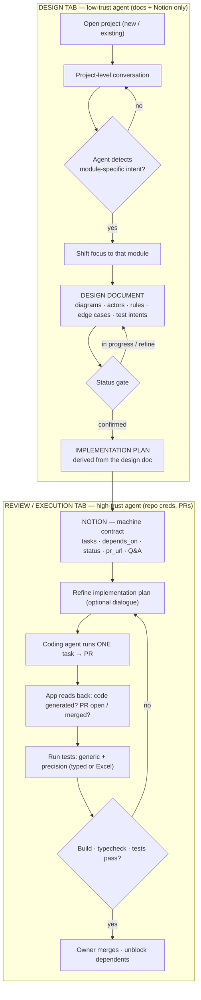
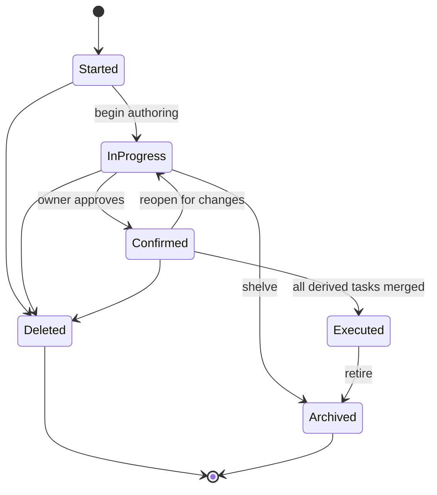
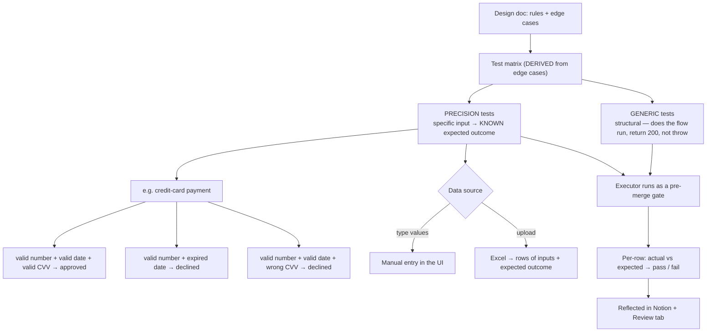
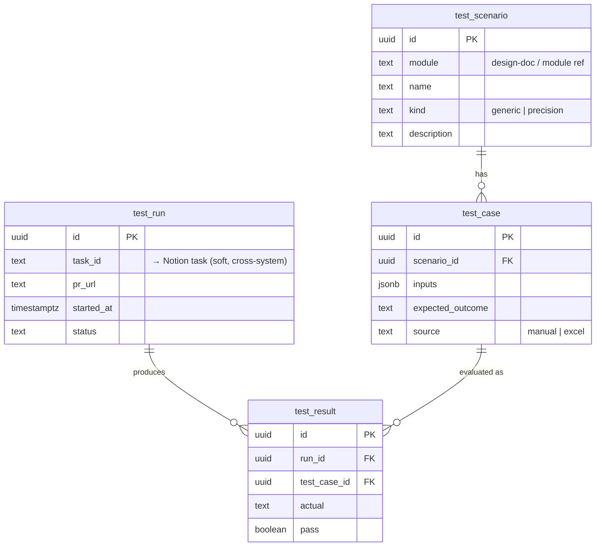

# Dev Studio — faces & data model (working visualization)

Status: **Working draft — for visual review.** Not the finalized design doc.
Three decisions are still open and are noted at the bottom.

## 1. The faces, end to end

## 2. The design-document lifecycle

## 3. The testing model

## 4. Supabase — the test-data schema

The tables in bold are **test_scenario**, **test_case**, **test_run**,
**test_result**. They are the only relational data Dev Studio needs; Notion
is bad at hundreds of tabular rows, so the test data lives in Postgres.

## Open decisions (block finalizing the design)

- **G1 — design doc vs implementation plan:** separate linked documents
  (recommended) or one document with two sections?
- **G4 — testing:** a gate the Executor must pass before opening/merging a PR
  (recommended), or a separate QA face triggered after code exists?
- **Store choice:** A (Notion board + Supabase for test data — recommended),
  B (Supabase system-of-record, Notion synced view), or C (drop Notion, Dev
  Studio's own board on Supabase)?
