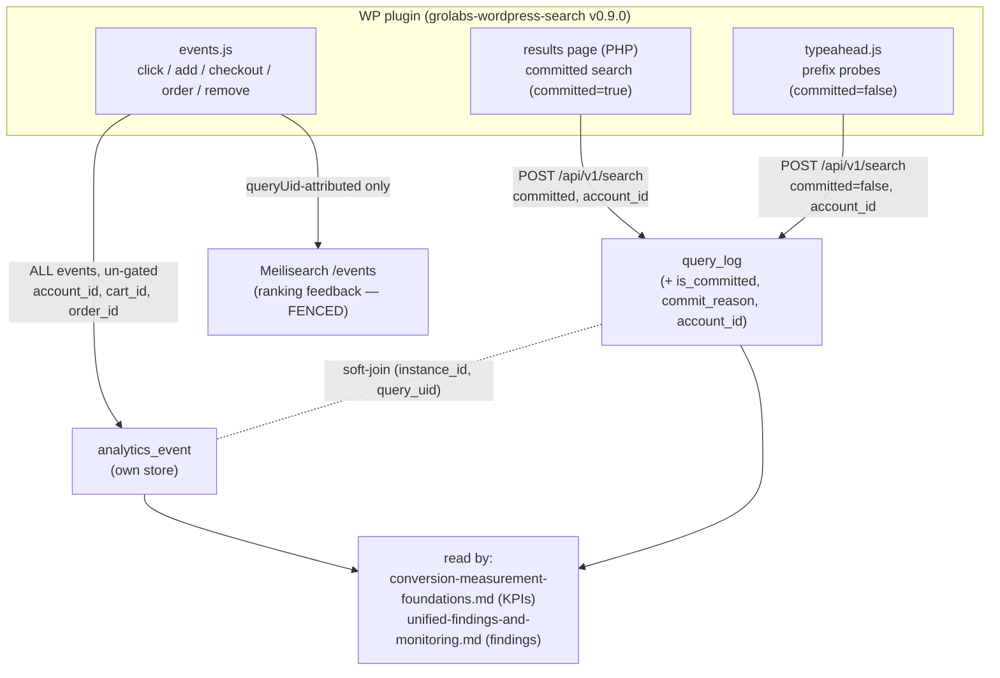
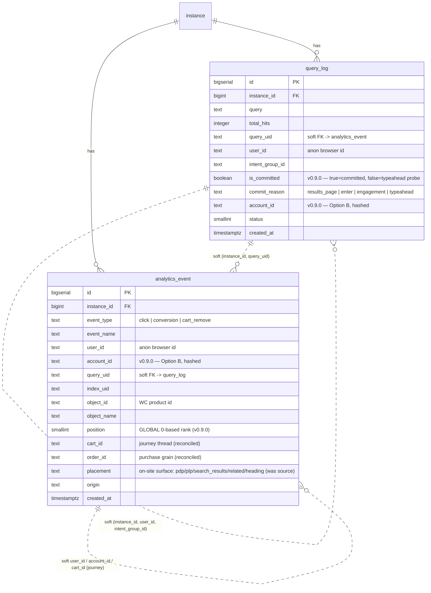

# Event Tracking — the GroLabs-owned tracking store

Status: **Directional / early.** NOT locked policy. This doc owns the GroLabs-owned event tracking
**store** — emission, storage, identity, gating. Its locked sibling
[`search-events.md`](../policy/search-events.md) owns the **Meilisearch relevance-feedback** subset.
Together with the [GA4 overlay](../policy/ga4-integration.md) they constitute "tracking." The KPI
grammar ([`conversion-measurement-foundations.md`](conversion-measurement-foundations.md)) and the
findings store ([`unified-findings-and-monitoring.md`](unified-findings-and-monitoring.md)) **read**
this store.

Owner: Tuncho · Date: 2026-06-27 · Plugin: `grolabs-wordpress-search` **v0.9.0**

> **What landed in v0.9.0 (this session).** Committed-search marking, global click position, Option B
> `account_id`, un-gated journey firing + `remove-from-cart`, journey keys (`cart_id`/`order_id`)
> populated, and a drift reconciliation of `cart_id`/`order_id`/`source`. Migrations
> `20260627000001` (query_log) + `20260627000002` (analytics_event) applied + verified. The KPI
> derivation layer (rollups, metric registry) is **next**, not in this pass.

---

## 1. Flow — one producer, two gated consumers

## 2. Event taxonomy

| Event | eventType | Destinations | Keys carried |
|---|---|---|---|
| Search Performed | — (query_log row) | query_log | query, total_hits, query_uid, user_id, **is_committed**, commit_reason, **account_id**, intent_group_id |
| Search Result Clicked | `click` | Meili + own store | queryUid, **position (global)**, object_id, user_id, account_id |
| Added to cart | `conversion` | own store always; Meili iff attributed | object_id, user_id, account_id, cart_id, **placement** (pdp/plp/search_results/related/heading…), queryUid? position? |
| Proceeded to checkout | `conversion` | own store always; Meili iff attributed | object_id, account_id, cart_id, queryUid? |
| Completed order | `conversion` | own store always; Meili iff attributed | object_id, account_id, cart_id, **order_id**, queryUid? |
| Removed from cart | `cart_remove` | **own store only** | object_id, user_id, account_id, cart_id |

"Meili iff attributed" = the Meilisearch write fires only when a `queryUid` attribution exists for
that product (the fence — R-1). The own-store write always fires.

## 3. Identity (Option B, device tier)

- **`user_id`** — the persistent anonymous **browser id** (random UUID in `localStorage` key
  `grolabs_wordpress_search_session_id`; persistent per-browser, **NOT** a session). Best-effort,
  device-scoped.
- **`account_id`** — opaque **SHA-256 over (instance_id, WC user id)**, stamped when the shopper is
  logged in. Never the raw WC id, never PII. The only handle that means a human across devices.
  Computed once in `Grolabs_WordPress_Search::current_account_id()` and shared by the results-page
  search, the typeahead, and the event tracker so all three stamp the **same** value.
- **Login = merge point.** When `account_id` first appears for a browser id, the prior anonymous
  history attaches to the human (at device tier). The full identity-resolution graph is **deferred**.

## 4. Data model (ERD)

Bold tables: **query_log**, **analytics_event**. Soft joins (logical, not FK-enforced) carry the
spine. The GA4 overlay is a sibling source, never joined per-user.

## 4a. OPEN DECISION — event-store substrate (DEC-1)

> **Decision to be made, not yet made.** `analytics_event` is one row per event
> on a transactional Postgres (Supabase), but the workload is analytical
> (group-by, time-bucketing, funnels, per-`cart_id` folds) and high-volume
> (every click + typeahead probe + cart action). Whether the raw event store
> should stay OLTP Postgres or move to an analytics-optimised substrate
> (ClickHouse / Timescale columnar / warehouse / managed platform / hybrid) is
> **open** — it sets the dashboard data path, ingest-at-scale, and cost, so it is
> a precondition for further dashboard build-out. Recorded in
> [`../state/open-decisions.md`](../state/open-decisions.md) §B (DEC-1), with the
> related cart-state-model decision (DEC-2) and the PostHog mirror decision
> (DEC-5). Do not expand storage or rollups here until DEC-1 is decided.

## 5. Drift reconciliation (Constitution Art. 10)

The live `scout` DB carried `cart_id`, `order_id`, `source` on `analytics_event` with **no migration
file and no `scout_schema_version` row** — added out-of-band (likely the BYO/SDK work ~2026-06-05;
the SDK README's "journey keys" the event payload never actually sent). Migration
`20260627000002` formalizes them (`ADD COLUMN IF NOT EXISTS` — a no-op against the live DB) so the
repo is the source of truth again. `cart_id` and `order_id` are now **populated** (R-5); `source` is
left unpopulated until the work that introduced it is consulted.

## 6. Derivation layer — SHIPPED (2026-06-27)

The KPI rollups landed in the same push (decisions resolved: **daily tables, view-defined +
materialized** + **code-constant catalog**):

- **`metric_daily`** table (narrow: `instance_id, day, metric_key, grain, numerator, denominator,
  value, sample_size`) — GA4 `*_daily` shape (migration `20260627000003`).
- **View-defined logic** — `event_stream` → `session_assignment` (30-min/day) → `metric_daily_source`
  (every KPI as a daily row); single source of truth, cheap to change (migration `20260627000004`).
- **`refresh_metric_daily()`** materializer + **nightly pg_cron** `refresh-metric-daily` (05:20 UTC,
  yesterday — GA4 "through yesterday" convention) (migration `20260627000005`).
- **Metric catalog** as a typed code constant: `src/lib/analytics/metrics.ts` (`METRICS[]`), keys
  matching the view. **13 KPIs materialized**; the rest tagged `needs_instrumentation` / `later` with
  reasons.
- Backfilled from existing history + cross-checked (e.g. `no_result_rate` = 675/1795 = 0.376).

**`user_id` gap CLOSED (v0.10.0).** The browser id is now mirrored to a `grolabs_bid` cookie; PHP
reads it (`current_browser_id()`) and forwards it on the committed results-page search, so
`query_log.user_id` populates for committed searches → session/journey/intent stitching works on them.

**Still deferred** (tagged in `metrics.ts`): `journey_conversion` (identity-spanning, not a clean
daily grain); `click_to_pdp` / `pdp_to_cart` (need a **PDP-view event** — not emitted); `aov` /
`revenue_per_session` (need **order revenue** on the Completed-order event); `reformulation_*` (need
intent-grain rollup over `intent_group_id`). These are the next instrumentation items.

## 7. Related GroLabs modules / applications

- **Search Engine / proxy** (`/api/v1/search`, `src/lib/search/*`) — produces `query_log`; owns the
  committed flag + global position.
- **search-events.md** (locked) — the Meilisearch relevance-feedback subset; this doc's sibling. A
  dated pointer there references this doc for the un-gated own-store side.
- **Analytics — PostHog MVP** (`src/lib/analytics/*`) — `intent_group_id` + the query_log bridge this
  builds on; events also mirror to PostHog (`capturePostHog`).
- **GA4** ([`ga4-integration.md`](../policy/ga4-integration.md)) — the aggregate overlay sibling.
- **conversion-measurement-foundations.md** — the KPI grammar that reads this store.
- **unified-findings-and-monitoring.md** — turns measured leaks into findings.
- **search-proxy-event-pipeline.md** — the durable buffer that makes this store loss-free enough to
  feed revenue.
- **User & account management** ([`user-management.md`](../policy/user-management.md)) — the storefront
  WC login that produces the `account_id` Option B hashes (the merchant's WC customer, distinct from
  GroLabs staff auth).

## 8. External applications & required credentials

- **WordPress / WooCommerce** (merchant-owned) — runs the plugin; provides `is_user_logged_in()` /
  `get_current_user_id()` (hashed into `account_id`) and the WC session id (`cart_id`). No GroLabs
  credential beyond the per-instance API key the merchant pastes in (Constitution Art. 3).
- **Meilisearch Cloud** — relevance store; events authenticated with a per-instance **tenant token**
  minted by `/api/v1/events/token`. Holds the gated click/conversion subset only.
- **Supabase / Postgres** (`scout` project `ixbbhwtpnebrhquunege`) — stores `query_log` +
  `analytics_event`. Writes go through the **service-role** client from the receiver endpoints
  (storefront has no auth). RLS scopes reads to `instance_member`.
- **PostHog** — best-effort server-side mirror of search + events (`capturePostHog`). Key in
  `POSTHOG_*` env. (Terminology caution per `search-proxy-event-pipeline.md`: the SaaS vs our own
  post-hoc store.)
- **Anthropic API** — only for the future Demand-Interpretation agent (reformulation classification);
  not used by this tracking layer.

---

**End — directional. v0.9.0 instrumentation landed + verified; KPI derivation layer is the next pass.**
