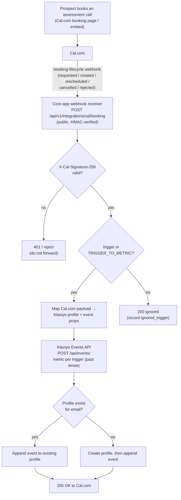

# Cal.com → Klaviyo — Assessment-Call Lead Events (v1)

**Status:** Draft (design session — no code in this session)
**Owner:** Tuncho

## Summary of decisions

- **Single corporate Klaviyo account.** These are GroLabs's *own* sales leads
  (GroLabs selling to merchants), not per-merchant data. Credentials are global
  (env vars), **not** the per-instance `integrations_config` + Vault pattern used
  by Algolia/GA4. This integration is effectively instance-agnostic / instance-0.
- **Event names are past tense.** This is the GroLabs standard for all Klaviyo
  metric names. The receiver maps each subscribed Cal.com booking-lifecycle
  trigger to its own metric:

  | Cal.com `triggerEvent` | Klaviyo metric |
  | --- | --- |
  | `BOOKING_REQUESTED` | `Requested Assessment Call` |
  | `BOOKING_CREATED` | `Booked Assessment Call` |
  | `BOOKING_RESCHEDULED` | `Rescheduled Assessment Call` |
  | `BOOKING_CANCELLED` | `Cancelled Assessment Call` |
  | `BOOKING_REJECTED` | `Rejected Assessment Call` |

  A verified delivery whose trigger is **not** in this map is acknowledged
  (`200`) but recorded as an `ignored_trigger` row in `backend_operation`, so a
  renamed or unexpected trigger surfaces instead of vanishing silently.
- **Create-if-absent, never dedupe the person.** The Klaviyo Events API upserts
  the profile from the email in one call: existing profile → event appended; no
  profile → profile created, then event appended. A single profile may hold many
  events, including many `Booked Assessment Call` events (someone can book more
  than once). We do **not** suppress repeat events.
- **The webhook receiver lives in the GroLabs core app** (Constitution Art. 2 —
  one core codebase). Cal.com → server-to-server webhook → core app route handler
  → Klaviyo. The Cal.com booking *widget* may be embedded on the landing site;
  that does not change the server flow.
- **Query capability (segment/list membership pull): confirmed feasible, not
  designed here.** See "Klaviyo read-path feasibility" below; the admin.grolabs.ai
  query path/UI is deferred to its own spec.

## Flow diagram



## Event model

**Klaviyo Create Event** (`POST https://a.klaviyo.com/api/events/`, header
`Authorization: Klaviyo-API-Key <KLAVIYO_PRIVATE_API_KEY>`, a pinned
`revision:` date, `Content-Type: application/json`). One request does both the
profile upsert and the event creation:

```jsonc
{
  "data": {
    "type": "event",
    "attributes": {
      "metric": { "data": { "type": "metric",
        "attributes": { "name": "Booked Assessment Call" } } },
      "profile": { "data": { "type": "profile",
        "attributes": {
          "email": "<prospect email>",
          "first_name": "<from Cal.com attendee>",
          "last_name": "<from Cal.com attendee>",
          "phone_number": "<if provided>"
        } } },
      "properties": {
        "booking_uid": "<Cal.com booking uid>",
        "event_type": "<Cal.com event-type title/slug>",
        "scheduled_start": "<ISO time>",
        "scheduled_end": "<ISO time>",
        "timezone": "<attendee tz>",
        "meeting_url": "<location/url if any>",
        "source": "cal.com",
        "responses": { "...": "intake answers from the booking form" }
      },
      "time": "<booking creation time, ISO>",
      "unique_id": "<Cal.com booking uid>",   // idempotency: safe retries
      "value": null
    }
  }
}
```

**Key behaviors to rely on:**

- **Profile identity = email** (minimum identifier). If the email matches an
  existing profile, Klaviyo associates the event with it; otherwise it creates a
  new profile. No separate "create profile" call is needed.
- **`unique_id` = `<triggerEvent>:<Cal.com booking uid>`** makes each call
  idempotent *per lifecycle event*: if Cal.com retries a delivery, re-POSTing the
  same `unique_id` is discarded, so we don't double-count. Scoping by trigger is
  deliberate — one booking legitimately produces several events over its life
  (requested → created → rescheduled → cancelled), and each must record. Two
  *different* bookings (different uids) correctly produce distinct events.
- **Past-tense metric names** are created automatically on first use; reused
  thereafter. A `trigger` property is also written on every event for filtering.

**All five booking-lifecycle triggers are implemented** (see the trigger→metric
table in *Summary of decisions*). Trigger-specific fields are forwarded when
present: `cancellation_reason` (cancelled), `rejection_reason` (rejected),
`reschedule_from_uid` (rescheduled), and `booking_status`.

## Webhook receiver — outline

- **Route:** `POST /api/v1/integrations/cal/booking` (core app, public — Cal.com
  is unauthenticated server-to-server). No Supabase session.
- **Auth:** verify Cal.com's `X-Cal-Signature-256` HMAC-SHA256 over the raw body
  using `CALCOM_WEBHOOK_SECRET`. Reject (401) on mismatch *before* calling
  Klaviyo. Constant-time compare.
- **Trigger filter:** map `triggerEvent` through `TRIGGER_TO_METRIC` (the five
  booking-lifecycle triggers). Unmapped-but-verified triggers are acknowledged
  `200` and recorded as an `ignored_trigger` row, never silently dropped.
- **Mapping:** pull attendee email/name/timezone, booking uid, event-type title,
  start/end, location, and intake `responses` from the Cal.com payload.
- **Forward:** call the Klaviyo Events API as above. On Klaviyo failure, return a
  5xx so Cal.com retries (Cal.com retries failed deliveries); the `unique_id`
  guard keeps retries safe.
- **Instance-agnostic:** no `instance_id` resolution — this is GroLabs corporate.

## Deployment & runtime (decided)

**The receiver is a Next.js route handler in the core app, deployed on Vercel
with the rest of the app — NOT a Supabase Edge Function.**

| | Chosen: Next.js route handler | Rejected: Supabase Edge Function |
|---|---|---|
| Deploy | Rides the existing Vercel deploy from `main` | New `supabase functions deploy` step + Deno toolchain |
| Convention | Matches the repo — `docs/state/modules.md`: *"there are no Supabase edge functions; all server logic is Next.js route handlers + RPCs"* | Would be the first edge function in the repo |
| Secrets | Vercel env vars (same store as everything else) | Separate Supabase function secrets store |
| DB proximity | N/A — no DB interaction in this flow | Closer to Postgres, but unused here |
| New surface | None | A separate runtime + deploy + logs to monitor |

**Rationale:** Klaviyo is the system of record, so this flow never touches
Postgres — the one real advantage of an Edge Function (DB proximity) does not
apply. Staying a route handler keeps it on the single existing deploy pipeline
and matches the established convention. Revisit only if a future variant needs
to run independently of the Next.js app lifecycle.

## Klaviyo read-path feasibility — "can admin.grolabs.ai pull a segment/list?"

**Yes.** Klaviyo's API exposes exactly this, server-side with the private key:

- **All members of a segment:** `GET /api/segments/{segment_id}/profiles/`
- **All members of a list:** `GET /api/lists/{list_id}/profiles/`
- **Enumerate segments / lists first:** `GET /api/segments/` and `GET /api/lists/`
  (so the admin UI can let you pick one).

Practical constraints to design around when the query path is built:

- **Pagination is mandatory.** Cursor-based (`page[cursor]`), `page[size]` up to
  **100** (default 20). You cannot get "all profiles" in one call — loop on the
  `next` cursor until exhausted.
- **Filtering/sorting** supported on `email`, `phone_number`, `push_token`,
  `joined_group_at` (e.g. only members who joined since a date).
- **Rate limits** (per the Get-Profiles endpoints): burst ~75/s, steady ~750/min
  (lower if requesting `additional-fields[profile]=predictive_analytics`). A
  full-segment export of many thousands must respect these.
- **Server-side only** — the private key must never reach the browser; the admin
  screen calls a GroLabs server action/route that holds the key.

This confirms feasibility. The actual admin.grolabs.ai screen (pick a
segment/list → view/export members) is **out of scope for this doc** and gets its
own spec.

## ERD for bold tables

**ERD: N/A — no GroLabs DB tables.** Klaviyo is the system of record for both the
profiles and the `Booked Assessment Call` events; v1 persists nothing in
Supabase. (If we later want a local audit/idempotency trail of received webhooks
— e.g. a `calcom_webhook_event` table — that is an explicit additive decision,
not part of v1; flagged in the plan as optional.)

## Related GroLabs modules / applications

- **admin.grolabs.ai (core app, `(admin)` route group)** — downstream consumer of
  the future read path; the surface from which segment/list queries will run
  (`rre-admin-split.md`).
- **landing site (`web-apps/landing`)** — likely host of the Cal.com booking embed
  (marketing entry point). Producer of bookings, but not of the webhook (Cal.com
  emits that server-side).
- **Integrations adapter pattern (core `CLAUDE.md` §7)** — *intentionally not
  followed here.* That pattern is for per-instance merchant integrations
  (Algolia/GA4) with Vault-backed credentials. This is a single corporate account,
  so credentials are global env vars instead. Called out so a reviewer doesn't
  "fix" it into the per-instance pattern.
- **Analytics / Funnel modules** — siblings only; no data dependency in v1. The
  sales funnel for *GroLabs's own* leads lives in Klaviyo, not in the GroLabs
  funnel-analysis tool.

## External applications & required credentials

| External app | Direction | Credential | Scope | Stored |
|---|---|---|---|---|
| Cal.com | in (webhook) | `CALCOM_WEBHOOK_SECRET` | HMAC signing secret for `X-Cal-Signature-256` | Vercel env var |
| Klaviyo (Events API, write) | out | `KLAVIYO_PRIVATE_API_KEY` | Private key, full server scope | Vercel env var (global, not per-instance) |
| Klaviyo (Segments/Lists/Profiles, read) | in | `KLAVIYO_PRIVATE_API_KEY` | Same key (read uses same private key) | Vercel env var |

Setup links: Cal.com webhooks — https://cal.com/docs (Settings → Developer →
Webhooks, BOOKING_CREATED + secret). Klaviyo Events API —
https://developers.klaviyo.com/en/reference/create_event . Klaviyo segment/list
members — https://developers.klaviyo.com/en/reference/get_segment_profiles and
https://developers.klaviyo.com/en/reference/get_list_profiles .

---

# Implementation plan (discrete prompts)

Execute in a **separate implementation session** after this design is confirmed.
Each prompt is independently executable; "Depends on" lists prerequisites.

### Prompt 1 — Provision Cal.com webhook + Klaviyo key (config, no app code)
- **What:** In Cal.com, add a webhook on the assessment-call event type:
  trigger `BOOKING_CREATED`, target the (to-be-deployed) receiver URL, set a
  signing secret. In Klaviyo, generate a private API key. Record both as Vercel
  env vars `CALCOM_WEBHOOK_SECRET` and `KLAVIYO_PRIVATE_API_KEY`.
- **Where:** Cal.com dashboard, Klaviyo dashboard, Vercel project settings (no
  repo change).
- **Why:** Credentials must exist before the receiver can verify signatures or
  call Klaviyo. Unblocks Prompts 2–3.
- **Depends on:** none.

### Prompt 2 — Klaviyo Events client helper
- **What:** Add a small server-side helper that POSTs to Klaviyo
  `POST /api/events/` with a pinned `revision`, building the metric/profile/
  properties/`unique_id` payload; returns success/failure. No dedup logic beyond
  passing `unique_id`. Pure function over inputs (testable in isolation).
- **Where:** `web-apps/app` (`src/lib/integrations/klaviyo/` — new).
- **Why:** Isolates the Klaviyo contract so the webhook route and any future
  caller share one implementation. Unblocks Prompt 3.
- **Depends on:** Prompt 1 (env var present for runtime; code can be written
  without it).

### Prompt 3 — Cal.com webhook receiver route
- **What:** Add `POST /api/v1/integrations/cal/booking`: read raw body, verify
  `X-Cal-Signature-256` (HMAC-SHA256, constant-time) against
  `CALCOM_WEBHOOK_SECRET`, filter to `BOOKING_CREATED`, map attendee/booking
  fields, call the Prompt-2 helper with metric name `Booked Assessment Call`.
  Return 2xx on success, 401 on bad signature, 5xx on Klaviyo failure (so Cal.com
  retries). No `instance_id` handling.
- **Where:** `web-apps/app` (`src/app/api/v1/integrations/cal/booking/route.ts`).
- **Why:** This is the core capture path — the whole feature. Unblocks Prompt 4.
- **Depends on:** Prompt 2.

### Prompt 4 — End-to-end verification
- **What:** Trigger a real Cal.com test booking (or replay a signed sample
  payload), confirm a `Booked Assessment Call` event appears on the correct
  Klaviyo profile, confirm a brand-new email creates a new profile, and confirm a
  duplicate delivery (same booking uid) does **not** create a second event.
- **Where:** `web-apps/app` (manual/local) + Cal.com + Klaviyo dashboards.
- **Why:** Confirms create-if-absent, past-tense naming, and idempotency actually
  work before relying on Klaviyo as the lead system of record.
- **Depends on:** Prompts 1–3.

### Prompt 5 (optional, not v1) — Reschedule/cancel events
- **What:** Extend the receiver to also handle `BOOKING_RESCHEDULED` /
  `BOOKING_CANCELLED`, emitting `Rescheduled Assessment Call` /
  `Cancelled Assessment Call` (past tense).
- **Where:** `web-apps/app` (same route).
- **Why:** Fuller lifecycle in Klaviyo for segmentation. Only if wanted.
- **Depends on:** Prompt 3.

### Prompt 6 (separate spec, deferred) — admin.grolabs.ai segment/list query
- **What:** Design + build the admin read path: enumerate segments/lists, pull
  members with cursor pagination, respect rate limits, render/export in the
  `(admin)` route group. Server-side key only.
- **Where:** `web-apps/app` `(admin)` route group + a new `docs/` spec first
  (this is its own design session per the design-session protocol).
- **Why:** Fulfills the "pull all customers in a segment/list from
  admin.grolabs.ai" request. Feasibility already confirmed above.
- **Depends on:** Prompt 1 (key). Independent of Prompts 2–5.

> **Note on locked docs:** this is a new `docs/design/` file (Draft) — no Active
> policy doc is amended. If we later ratify this and it needs to touch
> `rre-admin-split.md` (an Active doc) for the admin query screen, that amendment
> is its own sign-off-gated prompt, never inline.
