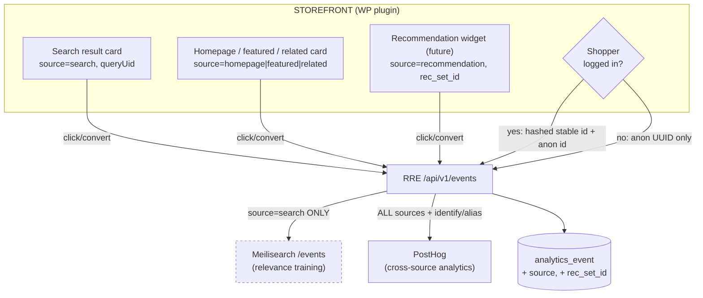
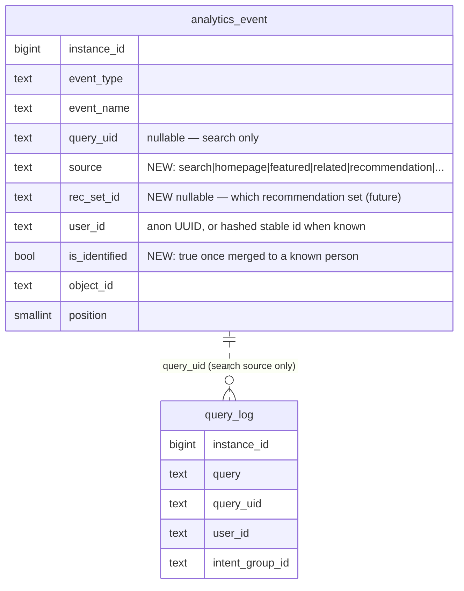

# Event Attribution v2 — Non-Search Sources + Identity Resolution

Status: **Plan — directional, not yet confirmed.** No code written. Produced under
[`design-session-protocol.md`](../policy/design-session-protocol.md).
Owner: Tuncho · Date: 2026-06-03

This builds directly on [`posthog-analytics-mvp.md`](posthog-analytics-mvp.md)
(shipped 2026-06-03) and the identity gap noted there.

## Why

Two real gaps surfaced while testing the MVP:

1. **Non-search conversions vanish.** A shopper added a product to cart that was
   shown on the homepage — it never came from a search, so there was no
   `queryUid`, so by rule R-5 in the locked
   [`search-events.md`](../policy/search-events.md) **no event was recorded**.
   That rule is correct *for search-relevance training*, but it means every
   homepage / featured / related / recommended conversion is invisible to our
   analytics. We want that signal — labeled by *where it came from*.
2. **Identity is browser-bound.** The anonymous `user_id` is a per-browser
   localStorage UUID. A returning *logged-in* shopper, or the same person on a
   second device, looks like a brand-new stranger. We can't stitch their history.

## Confirmed framing (to ratify)

- **Generalize `queryUid` → `source`.** A search is just one *source* of a click.
  Every surface that shows a product gets a stable `source` label; the event
  records which one drove it. `queryUid` stays for search; non-search events carry
  a `source` instead.
- **Hard boundary: non-search events go to RRE + PostHog ONLY, never Meilisearch.**
  Meilisearch's `/events` trains ranking and must stay search-pure — feeding it
  homepage conversions would poison relevance. This keeps the post-MVP direction
  intact: PostHog is the cross-event analytics store, Meilisearch stays search-only.
- **Identity = anonymous-by-default, merge-on-login.** Keep the anonymous UUID for
  logged-out traffic. When the shopper is authenticated, send a **hashed** stable
  id and have RRE call PostHog `identify`/alias so anonymous history merges into
  the known person. Never send raw account id or email (PII).

## Flow

## Affected data

## Part A — Non-search sources

- **Source taxonomy (DB-driven, not hardcoded).** Follow the GroLabs rule "DB is
  the source of truth": seed an allowlist of `source` values so new placements
  land without a deploy. Starter set: `search`, `homepage`, `featured`,
  `related`, `cross_sell`, `recommendation`.
- **Plugin tagging.** PHP that renders merchandised blocks adds a
  `data-grolabs-source` (and, for recs, `data-grolabs-rec-set`) attribute to each
  product card. The existing delegated click handler reads it; for non-search
  cards it writes attribution with `source` instead of a `queryUid`.
- **Relax R-5, carefully.** Today: "no `queryUid` → reject." New: "a conversion
  needs *either* a `queryUid` (search) *or* a `source` (non-search)." Truly
  un-attributed events (direct nav, no placement) are still dropped.
- **RRE.** `/api/v1/events` validates `source` against the allowlist, stores it on
  `analytics_event`, forwards to PostHog with a `source` property, and routes to
  Meilisearch **only when `source = search`**.

## Part B — Identity resolution

- **Logged-out:** unchanged — anonymous localStorage UUID.
- **Logged-in:** plugin computes `hash(GROLABS_IDENTITY_SALT + wp_user_id)` and
  sends it as `stable_id` alongside the anon `user_id`.
- **Merge:** on the first identified event, RRE calls PostHog
  `identify(distinct_id = stable_id, $anon_distinct_id = anonUUID)` so all prior
  anonymous events fold into the known person. Cross-device follows naturally
  (same `stable_id` from any browser once logged in).
- **PII:** only the salted hash leaves the storefront. Reverses R-10 / §6
  "no cross-device attribution" — needs sign-off.

## Related GroLabs modules

- [`posthog-analytics-mvp.md`](posthog-analytics-mvp.md) — the shipped base this extends.
- [`search-events.md`](../policy/search-events.md) — **locked**; R-5, R-10, §6 change here (sign-off).
- [`search-proxy-event-pipeline.md`](search-proxy-event-pipeline.md) — durable buffer becomes more important as non-search volume grows.
- `src/app/api/v1/events/route.ts`, `src/lib/analytics/posthog.ts` — RRE touch points.
- `wp-plugins/grolabs-wordpress-search` — card tagging + login signal.

## External apps & credentials

| App | Why | Credential | Where to get it |
|---|---|---|---|
| PostHog | cross-source analytics + identity merge | `POSTHOG_API_KEY` | PostHog → Settings → Project → API keys |
| WordPress/WooCommerce | exposes logged-in user id to the plugin | — (runtime) | n/a |
| (new) identity salt | hash WC user id → stable non-PII id | `GROLABS_IDENTITY_SALT` | generate once; set in RRE env **and** wp-config.php (must match) |

## Open questions (resolve before building)

1. **Does GroLabs currently generate recommendations on the storefront, or are
   these only WooCommerce/theme-merchandised blocks?** If no rec engine exists
   yet, ship `source` for merchandised placements now and leave
   `recommendation` + `rec_set_id` as a forward-compatible stub.
2. **Hash vs. pseudonymous mapping** — is a salted hash enough, or do we want a
   server-side anon↔known mapping table for reversibility/GDPR erasure?
3. **Where does login state come from** — WordPress user, WooCommerce customer, or
   a future GroLabs SSO identity?

## Sign-off gate

Amends the **locked** `search-events.md`: R-5 (attribution), R-10 (PII /
cross-device), §6 non-goals, and §2 (new non-search event rows). Requires owner
sign-off before any code, per `design-session-protocol.md`.

## Implementation prompts (plan — no code yet)

1. **P1 — Source taxonomy + schema.** Migration: `source`, `rec_set_id`,
   `is_identified` on `analytics_event`; seed the source allowlist table
   (instance-0 fallthrough). Apply + verify via Supabase MCP.
2. **P2 — RRE events route: accept `source`.** Validate against allowlist, store
   it, forward to PostHog with the property, gate the Meilisearch write to
   `source = search`. Relax R-5 to queryUid-OR-source.
3. **P3 — Plugin: tag non-search cards.** PHP adds `data-grolabs-source`
   (+ `data-grolabs-rec-set`) to merchandised cards; events.js writes non-search
   attribution. Version bump (cache-buster).
4. **P4 — Identity: logged-in hashed id + login signal.** Plugin sends
   `stable_id` when authenticated; `GROLABS_IDENTITY_SALT` wired in both places.
5. **P5 — RRE: identify/alias merge.** First identified event triggers PostHog
   `identify` with `$anon_distinct_id`; mark `is_identified`.
6. **P6 — Amend locked docs.** `search-events.md` R-5/R-10/§6/§2 (sign-off gated).
