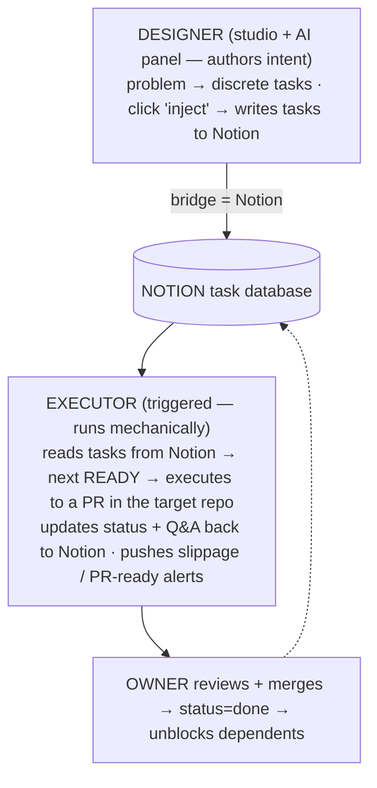
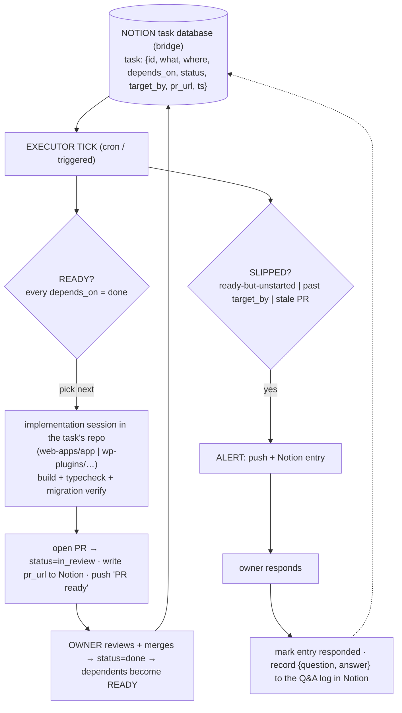

# Dev Studio — Designer + Executor (Notion-bridged) — design

Status: **Plan — confirmed direction, not yet executed. Being moved to its own Dev
Studio session for detailed design.** No code written.
Owner: Tuncho · Date: 2026-06-03

> **Handoff note.** This design is moving out of the PostHog design session into
> its own Dev Studio session (see the handoff prompt produced at the end of that
> session). This doc is the current snapshot; the Dev Studio session owns the
> detailed design from here, including reconciling any remaining "manifest"
> references with the Notion-as-bridge model below.

## Dev Studio — the umbrella application

**Dev Studio is one application with two halves — the Designer and the Executor —
bridged by Notion.**

- **Designer** — the studio/viewer (`grolabs-designer`) plus an **AI panel**. You
  open a spec, *visualize* it (rendered diagrams, structured sections), and refine
  it in conversation on the right. This very design session is the kind of
  conversation that should happen *inside* the Designer, with the open document as
  context. When the plan is agreed, a **button injects the tasks into Notion**.
- **Executor** — a separate trigger starts execution; the Executor **reads the
  tasks from Notion** and executes each to a reviewable PR (owner merges), tracks
  status, and flags slippage.
- **Notion is the bridge.** Whatever the Designer writes into Notion is exactly
  what the Executor reads and executes — Notion is the machine-to-machine contract.
  (This supersedes the earlier "repo manifest is the contract, Notion is a mirror"
  direction; the repo doc remains the human-authored *spec / intent*.)

## Nature — a separate, project-agnostic application

**Dev Studio is NOT a GroLabs module.** It is a standalone, domain-agnostic tool
that happens, in this case, to be *applied to* GroLabs. GroLabs is one consumer;
the same Dev Studio could drive any project's plan.

Consequences:

- **The Executor lives in its own repo** (separate, TBD) — not in `web-apps/app`.
  GroLabs's constitution/conventions govern the *code the Executor writes into
  GroLabs repos*, not the Executor's own internals.
- **Only the manifest (the GroLabs plan) lives in the GroLabs repo.** The Executor
  reads a manifest from whatever target project it's pointed at; the *format* is
  the Executor's, the *contents* belong to the project being executed.
- **When applying a plan to a target repo, the Executor respects that repo's
  gates** (build/typecheck/migration-verify, review, no-push-to-main) — it adapts
  to each target rather than assuming GroLabs's rules everywhere.

> **Why this exists.** A multi-prompt plan (e.g.
> [`posthog-analytics-mvp.md`](posthog-analytics-mvp.md), 6 prompts) is now a
> small project. We want it to run **without manually copy-pasting prompts between
> windows**, and we want to know when a prompt **runs later than it should**. This
> is an internal agent that reads the plan and advances it automatically.

## Two agents — Designer and Executor (separate concerns)

Authoring a plan and executing it are **two different agents**, not one. They have
different triggers, trust levels, and blast radius:

| | **Designer** (planning agent) | **Executor** (runner) |
|---|---|---|
| Identity | The design session itself (this protocol) | Scheduled, standalone, GroLabs-agnostic |
| Owns | *Intent* — what the plan is | *Mechanics* — running the next ready unit |
| Writes | repo **manifest** (truth) + creates Notion task rows | code (PRs) + status back to manifest + Notion row updates |
| Trust | low — docs + Notion only | high — repo credentials, opens PRs (carries the guardrails) |
| Trigger | interactive (when you design) | cron (autonomous ticks) |

**Notion is the contract between them (updated direction).** The Designer writes
the tasks into Notion; the Executor reads them from Notion and executes. The repo
doc remains the human-authored *spec* (the intent), but the machine-to-machine
handoff is **Notion**: the Designer **creates** the task rows; the Executor
**reads** them and **updates status** + Q&A back. (Earlier this doc made the repo
manifest the contract and Notion a mirror — the Notion-as-bridge model supersedes
that; the Dev Studio session will reconcile the remaining manifest references.)

## Confirmed decisions

- **Two separate agents — Designer (authors plan → manifest + Notion rows) and
  Executor (reads manifest → executes → status back).** The manifest is the
  contract; the Executor consumes it, not Notion. See "Two agents" above.
- **Autonomy = execute-to-PR, owner merges.** The Executor writes code and opens one
  PR per prompt, then stops. It never merges to `main` (respects build/review
  gates + the no-push-to-main guardrail). A merge unblocks the next prompt.
- **Plan store = repo manifest (truth) + Notion mirror.** The manifest in the repo
  is authoritative (Constitution Art. 10); the orchestrator mirrors status into a
  Notion board for readable, human-facing tracking.
- **Trigger = scheduled cron.** A routine runs on a cadence; each run advances the
  plan and reports slippage, so overdue items surface even when nobody's looking.
- **Alerts = push notification + Notion entry.** Every slippage flag / PR-ready
  event pings the owner *and* writes a Notion entry. **On the owner's response,
  the orchestrator marks that Notion entry `responded` and records the question
  asked + the answer given** (an auditable Q&A log).

## Flow

## The manifest

One structured file in the repo, the orchestrator's input and live state. Per
prompt:

| Field | Meaning |
|---|---|
| `id` | Stable prompt id (e.g. `posthog-mvp.p2`). |
| `what` | One-line description of the unit of work. |
| `where` | Repo / directory it runs in (`web-apps/app`, `wp-plugins/grolabs-wordpress-search`). |
| `depends_on` | Prompt ids that must be `done` first. |
| `status` | `pending → ready → in_review → done` (or `blocked`). |
| `target_by` | Optional date the prompt *should* have started/landed by — drives slippage. |
| `pr_url` | The PR opened for this prompt. |
| `created_at` / `updated_at` | Timestamps for slippage + audit. |

## The orchestrator run (each scheduled tick)

1. Read the manifest.
2. Recompute `ready` (deps done) and `slipped` (ready-but-unstarted, past
   `target_by`, or PR stale in review beyond a threshold).
3. For each `slipped` item → push notification + Notion entry.
4. Pick the next `ready` prompt; dispatch an implementation session **in its repo**
   that does the work, runs build/typecheck/migration-verify, and opens **one PR**.
5. Set that prompt `in_review`, write `pr_url` to the manifest and Notion, push a
   "PR ready to merge" alert.
6. Stop. The owner merges; the next tick sees the merge, sets the prompt `done`,
   and dependents flip to `ready`.

## Slippage — the definition

"Executed later than it should" is a **computed state**, flagged every tick:

- **Stalled-ready** — all deps `done` but `status` still `ready` past a grace
  window (no one picked it up).
- **Overdue** — `target_by` is in the past and `status` is not `done`.
- **Stale review** — a PR has sat `in_review` longer than a threshold.

## The Notion mirror + Q&A loop

**Write ownership** (so the two agents don't collide): the **Designer creates** the
task rows when it publishes a plan; the **Executor updates** status, PR link,
alerts, and the Q&A log as it runs. The repo manifest stays authoritative — on any
conflict, repo wins.

- **Board mirror:** each prompt is a row; status, PR link, and target date stay in
  sync with the manifest on every tick.
- **Alerts log:** slippage flags and PR-ready notices become Notion entries.
- **Response logging (owner request):** when the owner answers an alert/question,
  the orchestrator sets that entry to `responded` and records the **exact question
  asked and the answer given**, so every decision has an auditable trail in Notion.

## Guardrails

- Never merges; never pushes to `main`; one PR per prompt.
- A prompt only runs when its deps are `done` — no out-of-order execution.
- Build + typecheck + migration-verify must pass before a PR is opened (per
  `CLAUDE.md` §12, §15).
- Manifest is the truth; Notion is a mirror — on conflict, repo wins.

## ERD — the tables in bold

`ERD: N/A — no DB tables.` The Executor's state lives in a **repo manifest file**
(versioned, not a database) mirrored to a Notion board. No relational schema is
introduced by this module.

## Related GroLabs modules / applications

The Executor is GroLabs-agnostic; these are the GroLabs touch-points when it is
*applied to* GroLabs:

| Module / app | Relationship |
|---|---|
| Design-session protocol (`design-session-protocol.md`) | Produces the plans (discrete prompts) the Executor consumes. |
| PostHog Analytics MVP (`posthog-analytics-mvp.md`) | The first plan the Executor runs. |
| `grolabs-app` repo (`web-apps/app`) | A target repo the Executor opens PRs against. |
| `grolabs-wordpress-search` + other plugin repos | Additional target repos for plans that span them. |

## External applications & required credentials

| External app | In contact via | Credentials required | Stored |
|---|---|---|---|
| **GitHub** | opens one PR per prompt in each target repo | token / `gh` auth with repo + PR scope (no push to `main`) | Executor secrets |
| **Notion** | board mirror + Q&A log | Notion integration token, target database id | Executor secrets |
| Push-notification service | slippage + PR-ready alerts | channel token / endpoint (TBD) | Executor secrets |
| Scheduling platform | cron trigger for each tick | platform auth (the `/schedule` routine) | Executor secrets |

## Implementation plan — prompts to BUILD the Executor

| # | What | Where | Depends on |
|---|---|---|---|
| O1 | Define the manifest format + encode the PostHog MVP's 6 prompts as the first populated manifest | format → **Executor repo (TBD)**; populated manifest → `web-apps/app/docs` (GroLabs's plan) | — |
| O2 | Build the scheduled Executor routine (read manifest → ready/slippage → execute next to PR → update manifest) | **Executor repo (TBD)** + a `/schedule` routine | O1 |
| O3 | Notion mirror + Q&A response-logging (board sync, alert entries, mark-responded + record Q&A) | **Executor repo (TBD)** + Notion (MCP) | O1, O2 |
| O4 | Push-notification alerts (slippage + PR-ready) | **Executor repo (TBD)** | O2 |

### O1 — Manifest format + first manifest
**Where:** format in the Executor repo; the populated PostHog manifest in
`web-apps/app/docs` · **Purpose:** the format is the Executor's generic input
contract; the populated manifest (the 6 PostHog prompts) is GroLabs's plan and
lives with GroLabs. Data/docs only.

### O2 — Scheduled Executor routine
**Where:** Executor repo + a `/schedule` routine · **Purpose:** the cron agent that
advances a plan — computes ready/slippage, dispatches the next ready prompt to a PR
in the target repo, updates the manifest. Stops at PR (no merge).

### O3 — Notion mirror + Q&A loop
**Where:** Executor repo + Notion (via MCP) · **Purpose:** human-readable board
mirroring manifest status, alert entries, and the response log that marks entries
`responded` and records each question + answer.

### O4 — Push-notification alerts
**Where:** Executor repo · **Purpose:** ping the owner on slippage and when a PR is
ready to merge, alongside the Notion entry.

## Deferred / open

- **Executor home/repo — to decide.** Its own repo, separate and agnostic; name +
  location TBD.
- **How/where Notion stores the plan — to decide before execution (owner
  request).** Pin this down before the Executor starts running plans.
- On-merge (event-driven) triggering instead of cron — faster, needs CI/webhook
  wiring; revisit if cron latency becomes annoying.
- Generalizing the Q&A response-logging to *all* owner questions (not just
  Executor alerts).
- Multiple concurrent plans / cross-plan dependencies.
