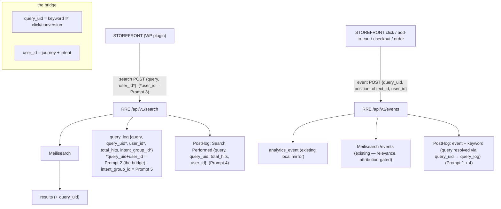
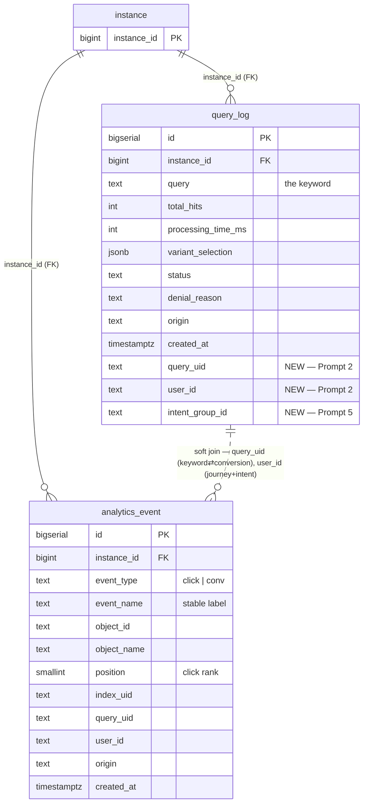

# PostHog Analytics MVP — implementation plan

Status: **Plan — confirmed, not yet executed.** No code written. Produced under
[`design-session-protocol.md`](../policy/design-session-protocol.md).
Owner: Tuncho · Date: 2026-06-03

## Confirmed decisions

- **"posthog" = the real PostHog product**, used as our analytics surface. This
  resolves the unresolved terminology flagged in
  [`search-proxy-event-pipeline.md`](search-proxy-event-pipeline.md) and
  [`unified-findings-and-monitoring.md`](unified-findings-and-monitoring.md).
- **MVP scope = connect + close the bridge** (not connect-only). Forward events
  to PostHog *and* add the join key that makes keyword conversion actually work.
- **Delivery = best-effort fire-and-forget** for the MVP (matches today's event
  model). The durable buffer from the proxy doc is a later hardening step.
- **Forward server-side**, from the two RRE endpoints we already own — never add
  `posthog-js` to the storefront plugin (would expose a key client-side and skip
  our enrichment).

## The core gap this plan closes

Two event streams exist today and **share no join key**:

- **Search** → `query_log` (has the **keyword**, no `query_uid`, no `user_id`).
- **Click + 4 conversions** → `analytics_event` (has `query_uid`, `position`,
  `user_id` — but **no keyword text**).

`query_uid` is the bridge: it's on events but missing from `query_log`. Until
`query_log` stores `query_uid` (+ `user_id` for journeys/intent), "conversion per
keyword" is uncomputable. Click **position** is already captured — no work needed
there.

## Flow

## ERD — the tables in bold

**Soft joins are NOT FK-enforced** — they are the analytics bridge this plan
creates. `(NEW)` columns: Prompt 2 adds `query_uid` + `user_id`; Prompt 5 adds
`intent_group_id`. Without `query_uid` on `query_log` there is no join from a
keyword to its conversions.

## Related GroLabs modules / applications

| Module / app | Relationship |
|---|---|
| RRE search proxy (`/api/v1/search`, **query_log**) | Upstream — produces `Search Performed` + the keyword; gains the bridge columns. |
| Search events (`search-events.md`, **analytics_event**) | The dual-write this plan extends with a PostHog forward. |
| `grolabs-wordpress-search` plugin | Emits the storefront events; Prompt 3 adds `user_id` to the search POST. |
| Unified findings & monitoring (`unified-findings-and-monitoring.md`) | Downstream consumer of these analytics. |
| GA4 integration (`ga4-integration.md`) | Sibling signal source feeding the same findings layer. |
| Dashboard (`docs/design/dashboard.md`) | Surfaces the analytics to merchants. |

## External applications & required credentials

| External app | In contact via | Credentials required | Stored | Setup / where to get it |
|---|---|---|---|---|
| **PostHog** (the product) | `posthog-node`, server-side `capture()` | `POSTHOG_API_KEY` (project key), `POSTHOG_HOST` | RRE env vars | Project key: PostHog → **Settings → Project → API keys**. Library usage: https://posthog.com/docs/libraries/node · Region host (`us`/`eu`): https://posthog.com/docs/getting-started/cloud |
| Meilisearch Cloud | existing proxy + event dual-write | tenant token (minted per-instance by RRE), master key (proxy) | Vault / env (existing) | Existing — Meilisearch Cloud dashboard |
| WooCommerce storefront (WP plugin) | POSTs to `/api/v1/search` + `/api/v1/events` | none — origin-validated against `instance.storefront_domains`; `instance_id` is public | n/a | n/a |

## Implementation plan — the prompts

| # | What | Where | Depends on |
|---|---|---|---|
| 1 | Connect PostHog + forward the 5 mirror events | `web-apps/app` | — |
| 2 | Bridge migration: `query_log` gains `query_uid` + `user_id` | `web-apps/app` | — |
| 3 | Plugin sends anonymous `userId` on the search POST | `wp-plugins/grolabs-wordpress-search` | 2 |
| 4 | Emit `Search Performed` + keyword-enrich click/conversion events | `web-apps/app` | 1, 2 |
| 5 | Intent skeleton module + storage | `web-apps/app` | 2, 3 |
| 6 | Amend the affected/locked docs | `web-apps/app/docs` | 1–5 |

### Prompt 1 — Connect PostHog (forward mirror events)
**Where:** `web-apps/app` · **Purpose:** the "connect" milestone you asked be
first. Add `posthog-node`, env wiring (`POSTHOG_API_KEY`, `POSTHOG_HOST`), and a
thin server util. In `src/app/api/v1/events/route.ts`, after the `analytics_event`
insert, fire-and-forget a `posthog.capture()` — `distinct_id = user_id`, event =
the stable event name, properties = `query_uid, position, object_id, object_name,
index_uid, event_type, instance_id`. The 5 events appear in PostHog with no new
data required. Failure is dropped (best-effort).

### Prompt 2 — Bridge migration + write the join keys
**Where:** `web-apps/app` · **Purpose:** the keystone. Migration adds
`query_uid text` + `user_id text` to `query_log`, plus an index on
`(instance_id, query_uid)`. Update `logRequest` in
`src/app/api/v1/search/route.ts` to persist `query_uid` (already computed in the
handler) and `user_id` (read from the request body). Apply + verify per
`CLAUDE.md` §12.

### Prompt 3 — Plugin sends the anonymous userId on search
**Where:** `wp-plugins/grolabs-wordpress-search` · **Purpose:** populate
`query_log.user_id` so no-result searches and query sequences can be stitched
into a journey. The plugin's **search** JS must read the *same* localStorage
session id `events.js` already mints (`grolabs_wordpress_search_session_id`) and
include it on the `/api/v1/search` POST body. One identity across search + click +
conversion.

### Prompt 4 — `Search Performed` event + keyword enrichment
**Where:** `web-apps/app` · **Purpose:** make keyword conversion answerable in
PostHog. (a) The search proxy forwards a `Search Performed` event
`{ query, query_uid, total_hits, user_id }` (including zero-result searches). (b)
With the bridge in place, the events endpoint resolves `query_uid → query` and
attaches the **keyword** as a property on every click/conversion event, so each
conversion self-describes its keyword and PostHog funnels/breakdowns work without
a warehouse.

### Prompt 5 — Intent skeleton module + storage
**Where:** `web-apps/app` · **Purpose:** capture intent *structure* now; keep it
deliberately simple (precision comes later). A small `assignIntent(recentQueries,
newQuery) → intentId` module using a shared head-noun / stem heuristic
(`ropa → ropa negra → ropa corta` = same intent; `zapatos` = new intent), plus an
`intent_group_id` on `query_log` written in the existing fire-and-forget log path.
Structure over accuracy — a future prompt can swap the heuristic for embeddings.

### Prompt 6 — Amend the affected docs
**Where:** `web-apps/app/docs` · **Purpose:** keep the repo the source of truth.
Amend the **locked** [`search-events.md`](../policy/search-events.md) (§4/§6
non-goals: PostHog forwarding now happens; aggregation lives outside Meilisearch)
and resolve the "posthog" terminology in both design docs to "the PostHog
product." Listed as its own prompt because `search-events.md` is Active/locked and
needs explicit sign-off before editing (per the protocol).

## What the MVP delivers in PostHog

- The 5 events + `Search Performed`, keyed by the anonymous `user_id`.
- **Conversion per keyword** (Search Performed → click → add-to-cart → order),
  with the keyword present on every event.
- **Click-position distribution** — are shoppers clicking result #2 or #7.
- **No-result searches** stitchable into journeys (via `user_id`).
- **Intent grouping** present in raw form (`intent_group_id`), ready to analyze.

## Notes / deferred

- **Synonyms — no special work (per owner).** We record that the user searched
  term *B*; we know *B* converts whether or not it's a synonym of *A*. A
  before/after read on *B*'s keyword (it had no results before the synonym, has
  results + conversions after) answers the question with the data this plan
  already produces.
- **Deferred:** durable buffer / accept-fast-process-async (proxy doc), separate
  proxy/ingest service, embeddings-based intent (v2), merchant-configurable
  thresholds. None block the MVP.
