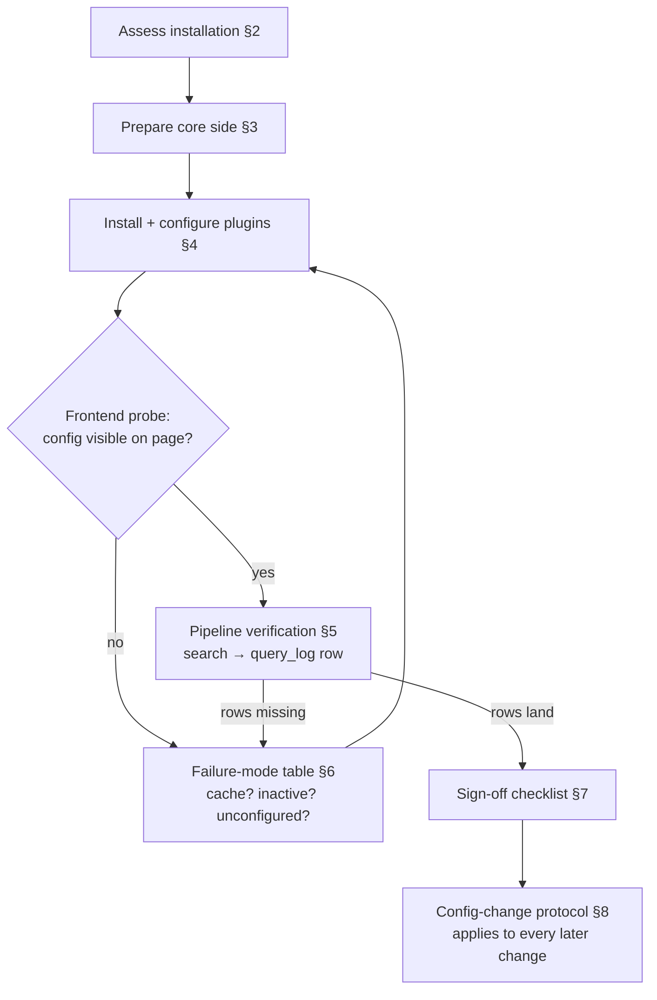
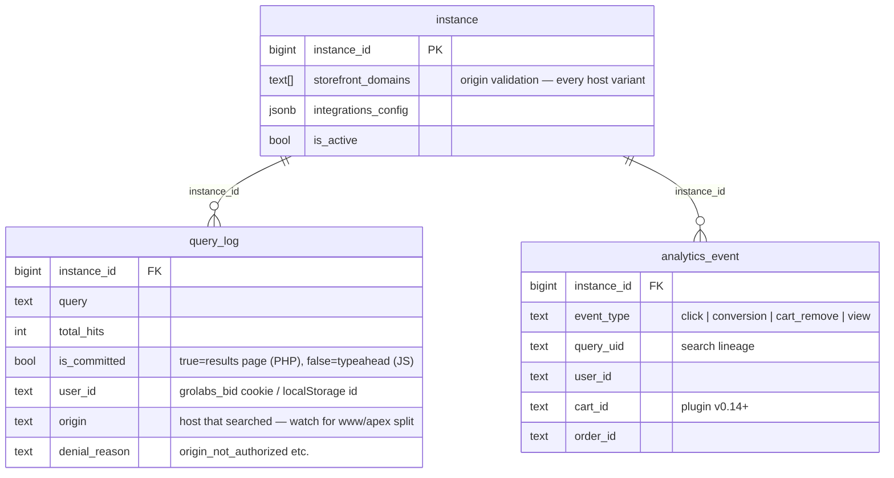

Status: Draft (directional — grows one entry per installation learned from)
Owner: Tuncho
Scope: How to assess, install, verify, and change GroLabs WordPress plugins on a customer's WordPress/WooCommerce site
Audience: Whoever onboards a WordPress merchant (human or agent), and future-us debugging a "plugin installed but nothing arrives" report

# WordPress customer implementation manual

## Why this doc exists

Installing our plugins is never just "upload zip, activate." Every WordPress
installation is a different environment — hosting stack, cache layer,
canonical-host setup, theme markup, and neighboring plugins all change how (or
whether) our pipeline collects data, **without ever throwing an error**. The
failure mode is silence: pages render, searches work, and nothing lands in
`query_log`.

This manual encodes the protocol: **assess the installation first, then
install against a checklist, then verify with probes — never assume.** Each
onboarding that surfaces a new variation must add it to §6.

Origin: the grolabs.io test-storefront onboarding (2026-07-12/13), which hit
four real variations before the first row landed — a stale page cache serving
plugin-less HTML, settings wiped by a delete-reinstall, a www/apex identity
split, and a theme whose "popup close" buttons are actually drawer toggles.

## 1. The implementation flow

## 2. Pre-install assessment (fill this in BEFORE touching wp-admin)

Run these from the outside — no credentials needed:

| Check | How | Why it matters |
|---|---|---|
| WordPress + WooCommerce present, REST reachable | `curl https://SITE/wp-json/` → namespaces list (`wc/v3`, active plugins leak here) | Confirms WooCommerce, reveals cache/SSO/marketing plugins before anyone tells you |
| Canonical host: www vs apex | `curl -D- https://www.SITE/` AND `curl -D- 'https://www.SITE/?s=x&post_type=product'` | WP 301s normal pages to the canonical host **but serves `?s=` searches in place on the other host** (`redirect_canonical()` bails on search). Both hosts must be in `instance.storefront_domains`, and shopper identity can split across them (§6-V4) |
| Cache layer | Response headers: `x-litespeed-cache`, `cf-cache-status`, `x-cache`; plugin list from wp-json | Page caches serve the **inline plugin config** (including `instanceId`) stale for up to `max-age` — a cached page from before configuration emits nothing, or worse, events to a stale instance (§6-V1) |
| Theme + search UX | View source: theme slug, search form markup, whether header search is a drawer/popup | The typeahead binds by CSS selector list; a theme whose search form isn't covered needs a selector added in settings. Drawer-style search affects E2E and shopper behavior |
| Competing live-search plugins | Page source for `dgwt-wcas`, `searchwp`, `relevanssi`, theme-core ajax search | Their dropdowns must be suppressed via the plugin's hide-selectors or they fight ours visually |
| Marketing popups / consent banners | Load the homepage cold, wait 10 s | Overlays steal clicks; also a signal the merchant has scripts that may conflict |
| Login/SSO plugins | wp-json namespaces (`grolabs-sso/v1` etc.) | Never run `grolabs-sso` and `grolabs-wordpress-login` together — pick one |
| Product mix | Browse shop page: variable vs simple products, out-of-stock share | Ajax add-to-cart (the conversion event source on PLPs) exists only on **simple, in-stock, purchasable** products; a mostly-variable catalog moves conversions to the PDP path |
| Hosting quirks | Host from DNS/headers (Hostinger, Kinsta, Cloudflare proxy…) | Host-level caches and WAFs exist **outside** wp-admin and purge separately |

Record the answers in the customer's onboarding note before proceeding.

## 3. Core-side preparation (our side, before wp-admin)

1. `instance` row exists and `is_active = true`.
2. **`storefront_domains` includes every host variant** the site answers on —
   apex AND www at minimum. Origin validation 403s anything else, silently
   from the shopper's perspective.
3. Meilisearch index `inst_<instance_id>` exists and is seeded (WC import) —
   searches "work" without it but return zero hits everywhere.
4. Know the instance id you will type. **`0` is a valid id** — the plugin
   treats it correctly; humans reading "0" as "unset" is the hazard.

## 4. Install + configure (wp-admin)

1. Upload the release zip → activate. **A delete-then-reinstall wipes all
   settings** — the repo ships an `uninstall.php` that removes options. Update
   in place (or via the "replace current with uploaded" flow) to keep them.
2. Settings → GroLabs Search → **Instance ID** → Save. The plugin renders
   NOTHING on the frontend until an instance id is saved — active-but-
   unconfigured is visually identical to not installed. This is by design.
3. **Purge every cache layer** (wp-admin cache plugin AND host panel). On a
   test/dev site, prefer disabling page cache entirely; on a production
   merchant, purge and then spot-check a cold URL.
4. GA4 plugin (if in scope): needs the Measurement ID from the property the
   merchant (or we) control. Traffic-only by design — no ecommerce events.
5. Login: install **either** `grolabs-wordpress-login` (stable, 6 providers)
   **or** `grolabs-sso` (v0, Google-only) — never both.

## 5. Verification probes (run ALL of them; each catches a different silence)

From outside, in order:

1. **Config on page:** `curl -s https://SITE/ | grep -o '"instanceId":"[0-9]*"'`
   → must print the expected id. Missing → plugin inactive, unconfigured, or
   cached page (§6).
2. **Asset version:** `grep -o 'grolabs-wordpress-search[^"]*ver=[0-9.]*'` on
   the same HTML → matches the release you installed.
3. **Search API reachability with the site's origin:**
   `curl -X POST https://app.grolabs.ai/api/v1/search -H 'Origin: https://SITE' -H 'Content-Type: application/json' -d '{"instance_id":<ID>,"query":"<known term>"}'`
   → 200 with hits. A 403 `instance_not_found_or_origin_not_authorized` means
   the origin isn't in `storefront_domains` (or wrong id).
4. **Committed search lands:** browse to
   `https://SITE/?s=<unique term>&post_type=product`, then check `query_log`
   for the row (`is_committed=true`, correct `instance_id`, `origin`).
   **Use a unique term** — the plugin caches identical searches in a
   5-minute transient and a cache hit makes NO API call and NO row.
5. **Typeahead lands:** type ≥ 2 chars into the storefront search box; check
   for the `is_committed=false` row.
6. **Identity present:** the committed row's `user_id` must be non-null after
   the shopper has loaded any page once (events.js mints the `grolabs_bid`
   cookie at load from v0.10.0). Null user_id with a warm browser → §6-V4.
7. **Automated equivalent:** the core repo's E2E tier runs probes 1–6 as
   specs — `npm run test:e2e` (preflight `00-plugin-wiring.spec.ts` + journey
   `01-search-journey.spec.ts`) with `STOREFRONT_URL=https://SITE`. Point it
   at the canonical host.

## 6. Known variations & failure modes (grow this table)

| # | Symptom | Cause | Fix |
|---|---|---|---|
| V1 | No GroLabs scripts in HTML, files exist on disk (`.../assets/js/...js` returns 200) | **Stale page cache** serving pages rendered while the plugin was inactive/unconfigured (LiteSpeed `max-age` was 7 days on grolabs.io); OR plugin active but **no instance id saved** (renders nothing by design); OR plugin not activated after zip install | Purge/disable page cache; save instance id; activate. Verified in this order — each state looks identical from outside |
| V2 | Settings empty after a plugin update | Update done as delete → install new zip; `uninstall.php` wiped options | Re-enter settings; prefer in-place update flow |
| V3 | Search works, repeated test search writes no row | 5-minute results transient — cache hit skips the API call entirely | Unique test terms, or wait out the TTL |
| V4 | Committed searches have `user_id = null` while typeahead rows carry one; or one shopper appears as two user_ids | **www/apex origin split**: WP serves `?s=` on the non-canonical host without redirecting; `grolabs_bid` cookie is host-only and localStorage is per-origin | Both hosts in `storefront_domains` (data still lands, identity splits). Plugin fix pending: mint cookie with `Domain=.<registrable domain>` — careful with multi-label TLDs (`www.hpcenlinea.com.gt`). Until then, prefer forcing a canonical-host redirect for ALL URLs at the host level |
| V5 | E2E/automation clicks "popup close" and the page gets worse | Theme's `.popup-toggle-close` elements are drawer **toggles**, present at all times (PetPaw/templatemela) | Dismiss overlays with Escape; only click close buttons that exist inside an open overlay |
| V6 | No conversion events from listing pages | Catalog is mostly variable/out-of-stock products — no ajax `add_to_cart_button` on the loop | Expected; conversions come from the PDP path. Check product mix in §2 |
| V7 | Zero hits for every search | Meilisearch `inst_<id>` index empty or doesn't match the WP catalog | Run the WC import + index sync before judging search quality |
| V8 | Searches land, conversions land, but NO click events and conversions carry no `query_uid` lineage | **Theme overrides the WooCommerce loop templates** — the plugin's attributed card markup hooks `woocommerce_after_shop_loop_item`, which custom loops (templatemela/PetPaw…) never fire; the click listener has nothing to bind to | Check the results page for `.grolabs-wordpress-search-product-card`; zero means this theme. Plugin fix pending: theme-agnostic fallback that attributes clicks from a PHP-localized queryUid/position map |
| V9 | Typeahead/search rows land intermittently (some 200-with-hits requests write no `query_log` row) | Core-app bug: the search route's `query_log` write raced the serverless freeze (`void logRequest` after response) | Fixed in core (route now schedules the write via `after()`), 2026-07-13. If it recurs, compare API 200s against row counts |

## 7. Sign-off checklist (installation is DONE when…)

- [ ] Inline config on a cold page load shows the right `instanceId` + version
- [ ] Committed + typeahead + zero-result searches each produced a `query_log` row
- [ ] `user_id` present on committed rows (warm browser)
- [ ] A result click produced an `analytics_event` `click` row with `query_uid`
- [ ] An add-to-cart produced a `conversion` row (PLP or PDP path per product mix)
- [ ] Cache behavior decided and recorded: disabled (test sites) or purge
      protocol agreed (production)
- [ ] Assessment answers + any NEW variation appended to §6

## 8. Config-change protocol (forever after)

Any change to plugin settings, plugin version, or `storefront_domains`:
**purge the page cache** (all layers), then re-run probes 1 and 4. A cached
page carries the OLD inline `instanceId` for up to its `max-age` — events flow
to the wrong instance with no error anywhere.

## 9. Data model touched

## Related GroLabs modules

- **M9/M11 Search Engine** — search proxy (`/api/v1/search`), origin
  validation against `storefront_domains`, per-instance `inst_<id>` indexes.
- **M12/M13 Analytics** — `/api/v1/events` ingestion, `query_log` /
  `analytics_event`, `metric_daily` derivation (what silent collection
  failures ultimately starve).
- **WP plugin suite** — `grolabs-wordpress-search` (the subject),
  `grolabs-wordpress-ga4`, `grolabs-wordpress-login` / `grolabs-sso` (pick
  one), `grolabs-wordpress-aeo`.
- **M1/M2 Identity & Tenancy** — the `instance` row and domain claims that
  §3 prepares.

## External apps & credentials

| System | What | Credential |
|---|---|---|
| Merchant WordPress | wp-admin for install/settings/cache purge | Merchant-provided admin account |
| Merchant hosting panel | Host-level cache purge, redirect rules (V4) | Merchant-provided (e.g. Hostinger) |
| WooCommerce REST | Catalog import (§3.3 seed) | WC consumer key/secret (read-only), generated in wp-admin |
| Supabase `scout` | Row verification (`query_log`, `analytics_event`) | Service-role / MCP access |
| GA4 | Traffic plugin Measurement ID + property access | Google account owning the property |
