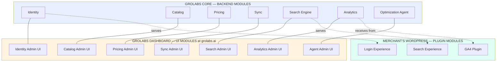
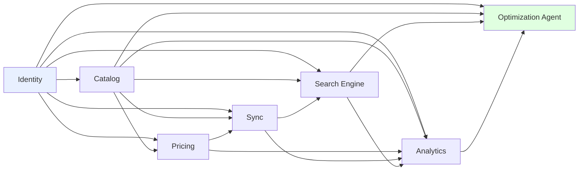

# GroLabs — Module Map (v1.0)

**Status:** Ratified
**Date:** 2026-05-16
**Author of record:** Tuncho (with Claude as scribe)

---

## Purpose

This document defines the **internal modular decomposition** of GroLabs Core, plus the plugin-side modules that run on the merchant's WordPress site. Each module has a clear ownership boundary: what it owns, what it does NOT own, and which other modules it depends on.

Modules are conceptual groupings of related entities, logic, and UI surfaces. The implementation may organize the code differently (e.g., a single Next.js app may render multiple UI modules), but the conceptual boundaries described here are the source of truth for what belongs where.

Specs (feature-level documents) reference one or more modules and explicitly declare which module owns each piece of the feature.

---

## The 17 modules at a glance



---

## Module 1 — Identity (Backend)

**Owns:**
- The `tenants` table
- The `users` table
- The `instances` table and the concept of an instance
- The `tenant_member` table (org-level membership)
- The `instance_member` table (operational membership)
- Role definitions (instance roles: viewer/editor/supervisor/admin; tenant roles: owner/admin/billing/member)
- Per-member flags including `financial_data_visible` (Constitution Article 6)
- The entitlement schema (Constitution Article 7) — modeled, not enforced in Phase 1
- The collaborator model for cross-tenant access (Constitution Article 3)
- RLS policy enforcement
- JWT claims and authentication

**Does NOT own:**
- Products, prices, catalog content, analytics — these belong to their respective modules
- The login UI on the merchant's site (that's Login Experience)

**Depends on:** nothing (foundational module)
**Depended on by:** every other backend module (everything is tenant-scoped)

---

## Module 2 — Identity Admin UI

**Owns:**
- Tenant settings page
- User invitation flow
- Role assignment UI
- Collaborator management (granting users access to other tenants)
- Per-member `financial_data_visible` toggle UI
- Entitlement display (when Phase 2 entitlement enforcement ships)

**Does NOT own:**
- Authentication flows (sign-up, sign-in, password reset) — handled by GroLabs Admin (Module 16) using Identity
- Plugin-side login UI on merchant's site (that's Login Experience)

---

## Module 3 — Catalog (Backend)

**Owns:**
- The `products` table
- The `categories` table (with hierarchy)
- The `attributes` table (definitions: Color, Size, etc.)
- The `attribute_values` table (values: Red, Medium, etc.)
- The `variants` / `variations` table
- Product-image relationships
- Vertical templates (pet-shop, electronics, clothing seed data for new tenants — per Constitution Article 1, agnostic templates)
- Catalog enhancement logic (AI suggestions for variant grouping, attribute extraction, missing-image detection)

**Does NOT own:**
- Pricing — referenced from Catalog entities but defined in Pricing module
- Search index — Catalog publishes changes; Search Engine builds the index
- WC sync logic — Catalog is the source of truth; Sync delivers it

**Depends on:** Identity
**Depended on by:** Pricing, Sync, Search Engine, Analytics, Agent

---

## Module 4 — Catalog Admin UI

**Owns:**
- Product editing screens (form, list, bulk operations)
- Category management UI (tree, drag-to-reorder)
- Attribute definition UI
- Variant grouping UI (manual and AI-assisted)
- Image upload and management
- Vertical template selection at tenant creation
- Bulk import/export interfaces

**Does NOT own:**
- The Optimization Agent's recommendations about catalog quality — that's Agent Admin UI; this module displays them inline as needed
- Pricing entry — when a product page shows price, it's reading from Pricing Admin UI components

---

## Module 5 — Pricing (Backend)

**Status:** Demo-scoped for Phase 1. Full WC parity tracked in `backlog.md`.

**Owns (Phase 1 demo scope):**
- The `prices` table (base price per product/variant)
- Pricing rules — markup rules, margin rules by category
- Cognitive-bias price rounding (.95, .99, etc. configurable per tenant)
- Rule violation detection (when a manually-set price violates an active rule)
- Authorization workflow (out-of-rule exception → admin approval before sync)
- Audit log (who set what, who approved what, when)

**Owns (full scope, deferred):**
- Tax rules
- Shipping classes
- Scheduled / time-windowed sales
- Coupons, BOGO, combos, dynamic pricing
- Multi-currency
- Role-based pricing
- Tiered / quantity-based pricing
- All other items in the pricing-parity backlog entry

**Does NOT own:**
- Sync push to WC — Pricing produces the final price; Sync delivers it
- In Phase 1: tax computation (WC remains authoritative until tax management ships in Pricing)

**Depends on:** Identity, Catalog
**Depended on by:** Sync, Analytics

---

## Module 6 — Pricing Admin UI

**Owns:**
- Rule authoring UI (rule builder for margin, markup, rounding)
- Margin configuration per category
- Exception approval queue (the table with per-row checkboxes, Select All, bulk approve/reject, per-row audit notes)
- Audit log viewer
- Price-drift alerts display (when WC differs from GroLabs)

**Does NOT own:**
- The price field on the product editor — that's a Catalog Admin UI component reading Pricing data
- Promotional pricing UI (deferred with the backend feature)

---

## Module 7 — Sync (Backend)

**Owns:**
- The mapping between GroLabs entity UUIDs and external system IDs (Constitution Article 8)
- The WC REST API client (calls, retries, rate limiting, error handling)
- The queue / jobs that process bulk changes
- Change-detection logic (which entities changed since last sync)
- Drift-detection logic (Constitution Article 9: WC data differs from GroLabs)
- Non-destructive restructuring logic (Constitution Article 8: preserve WC IDs when converting simples to variants)
- The GA4 Data API ingest path (calls GA4, writes to Analytics)

**Does NOT own:**
- The data itself — pulls from Catalog and Pricing, pushes to WC
- The search index — notifies Search Engine of catalog changes; Search Engine updates its own index

**Depends on:** Identity, Catalog, Pricing
**Depended on by:** Analytics (for GA4-sourced data), Search Engine (for catalog changes)

---

## Module 8 — Sync Admin UI

**Owns:**
- Sync status dashboard (last sync time, items synced, errors)
- Drift alert display and resolution actions
- Manual sync trigger buttons
- Error log viewer
- WC API key configuration
- GA4 OAuth connection management

**Does NOT own:**
- Individual product status — that lives in Catalog Admin UI's product list with a sync-state indicator

---

## Module 9 — Search Engine (Backend)

**Owns:**
- MeiliSearch index configuration per tenant (indexed fields, searchable, filterable for facets)
- Synonym dictionary per tenant
- Typo tolerance settings per tenant
- Relevance tuning (field weights in ranking)
- Zero-result-query log (feeds Agent's "suggest a synonym" loop)
- Ingestion of search events from search-plugin (queries, clicks, when Article 5 toggle is on)
- The query API that the search-plugin calls

**Does NOT own:**
- The underlying product data — pulls catalog snapshots via Sync
- Commerce events (add to cart, purchase) — those flow to Analytics, even though search-plugin captures both
- The search UI on the merchant's site — that's Search Experience

**Depends on:** Identity, Catalog, Sync
**Depended on by:** Search Experience, Analytics, Agent

---

## Module 10 — Search Experience (Plugin)

**Implementation:** the search-plugin codebase on WordPress.

**Owns:**
- Search box UI on the merchant's site (replaces WC default search box)
- Search results page rendering
- Facet display and filter UX
- Autocomplete / typeahead suggestions
- Variant handling in results — one-click add-to-cart for variants, color/size pickers in result cards
- Mobile responsiveness for search UI
- Result page templates / compatibility with the merchant's WP theme
- Reading the Article 5 toggle state from GroLabs and respecting it (search-only vs full tracking mode)
- Emitting search events and commerce events to GroLabs when toggle is on

**Does NOT own:**
- The search relevance, synonyms, or index — that's Search Engine
- WP login UI — that's Login Experience

---

## Module 11 — Search Admin UI

**Owns:**
- Synonym editor
- Relevance tuning controls (field-weight sliders)
- Zero-result query review and resolution
- Typo tolerance settings
- Index configuration per tenant
- The Article 5 search-plugin toggle (search-only vs full mode)

**Does NOT own:**
- Search analytics (search-event reports, conversion-from-search reports) — those are in Analytics Admin UI

---

## Module 12 — Analytics (Backend)

**Owns:**
- Event ingestion from search-plugin (search events + commerce events when Article 5 toggle is on)
- GA4 data aggregation (data pulled by Sync from GA4 Data API)
- Time-series event storage
- Threshold-based alert engine (Constitution: alerts not dashboards)
- KPI computation (sessions, conversions, AOV, search performance metrics, etc.)

**Does NOT own:**
- The agent's recommendations based on analytics data — that's the Optimization Agent
- The dashboard charts and tables — that's Analytics Admin UI

**Depends on:** Identity, Catalog, Pricing, Sync (for GA4 ingest), Search Engine (for search events)
**Depended on by:** Optimization Agent

---

## Module 13 — Analytics Admin UI

**Owns:**
- Alert configuration UI (threshold authoring: "alert me if traffic varies more than 5% day-over-day")
- Active alerts display
- KPI tile dashboards (used sparingly per the alerts-first philosophy)
- Trend charts (when `financial_data_visible` is false, currency is blanked; trends remain visible per Article 6)
- Search performance reports
- Conversion funnel reports

**Does NOT own:**
- Recommendation queues — that's Agent Admin UI

---

## Module 14 — Optimization Agent (Backend)

**Owns:**
- The detection logic ("which catalog items have no images?", "which search queries return zero results?", "which products have variant patterns that aren't grouped?")
- The proposal logic (what to suggest when a gap is detected)
- The measurement logic (after a change is applied, did the metric improve?)
- The agent's working memory per tenant (what it has already proposed, what's been accepted/rejected, what to try next)
- The probe-the-store flow that runs on tenant creation

**Does NOT own:**
- The data it reads from — Catalog, Search Engine, Analytics are the sources
- Approval / rejection workflow UI — that's Agent Admin UI
- The act of *applying* an accepted recommendation — it delegates to the relevant backend module (e.g., accepted "add synonym" recommendation calls Search Engine to update synonyms)

**Depends on:** Catalog, Pricing, Search Engine, Analytics
**Depended on by:** nothing (agent is a top-of-stack consumer)

---

## Module 15 — Agent Admin UI

**Owns:**
- The recommendation review queue (list of proposed changes awaiting decision)
- Accept / reject / defer actions per recommendation
- Recommendation history and audit
- Agent activity log (what the agent has proposed, when, with what reasoning)
- Configuration of agent behavior per tenant (auto-apply low-risk recommendations vs. always require human approval)

**Does NOT own:**
- Cross-module changes themselves — once accepted, the change is enacted by the relevant backend module

---

## Module 16 — GroLabs Admin

**Implementation:** the Next.js app at grolabs.ai (the merchant's dashboard).

**Owns:**
- Top-level navigation across all Admin UI modules
- Authentication flows (sign-up, sign-in, password reset, OAuth)
- Onboarding wizards (tenant creation, plugin install flow, integration connection flow)
- Global notification center
- Account / billing pages (billing integration deferred per Article 7)
- The shell that hosts all module-specific Admin UIs (modules 2, 4, 6, 8, 11, 13, 15)

**Does NOT own:**
- Any module-specific UI — those are their own modules. GroLabs Admin is the chassis.
- The marketing site (separate concern, not in this map)

---

## Module 17 — Login Experience (Plugin)

**Implementation:** the login-plugin codebase on WordPress.

**Owns:**
- Social SSO buttons on WC login and checkout pages (Google, Microsoft, others to be defined)
- OAuth flow with each identity provider
- The local mapping between WC users and the social identities they signed in with
- The "Configure in GroLabs" link to the dashboard

**Does NOT own:**
- The GroLabs user/tenant record — that's Identity in Core
- Any UI in the GroLabs dashboard

---

## Module 18 — GA4 Plugin

**Implementation:** the ga4-plugin codebase on WordPress. **Optional** — only installed if the merchant has no existing GA4 capture.

**Owns:**
- Installation of the GA4 tag on the merchant's WP site
- Configuration of which events to send to GA4
- The "Configure in GroLabs" link

**Does NOT own:**
- The merchant's GA4 property (that's in Google's infrastructure)
- The ingestion of GA4 data into GroLabs (that's the ga4-integration in Sync)

---

## Cross-cutting dependency map



**Reading this:** an arrow from A to B means "B reads from A or depends on A's data." Identity is at the bottom (everything depends on it). The Optimization Agent is at the top (it reads from almost everything and produces recommendations, which are consumed by Admin UIs but not by other backend modules).

---

## How specs reference modules

Every feature spec written from this point forward must declare which modules it touches. Format suggestion (to be enforced in the Discussion Protocol when next updated):

```yaml
modules_affected:
  - Catalog: adds new column `default_currency`
  - Catalog Admin UI: adds currency selector to product edit page
  - Sync: extends WC mapping to include currency code
```

This makes the module map a queryable index — "show me every spec that touches Pricing" becomes a grep, not an interpretation.

---

## Phase 1 build implications

The Phase 1 investor-demo priorities (Vision §9) hit the following modules:

| Priority | Primary modules touched |
|---|---|
| 1. Stabilize Catalog | Catalog, Catalog Admin UI, Sync |
| 2. Pricing rule engine + authorization + role-aware UI | Pricing, Pricing Admin UI, Identity (role flag), Identity Admin UI |
| 3. GroLabs↔WC sync (catalog + base price pass-through) | Sync, Catalog, Pricing |
| 4. Search and analytics (post-demo) | Search Engine, Search Experience, Analytics |

Modules NOT in the Phase 1 demo build but designed in this document:
- Login Experience (post-demo)
- GA4 Plugin (post-demo)
- Optimization Agent and its UI (post-demo — though agent infrastructure may be scaffolded)
- Full Pricing scope beyond demo (post-demo, gated by pricing-parity Discussion)

---

**End of Module Map v1.0.**
