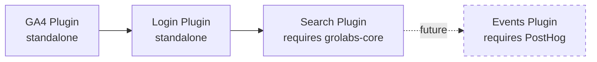
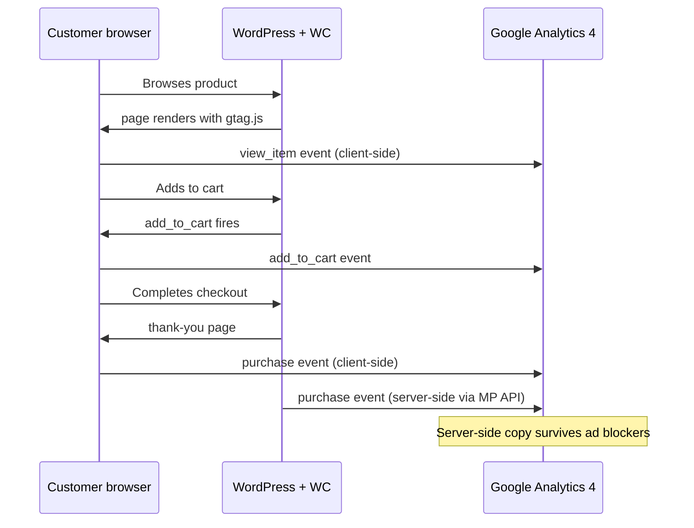
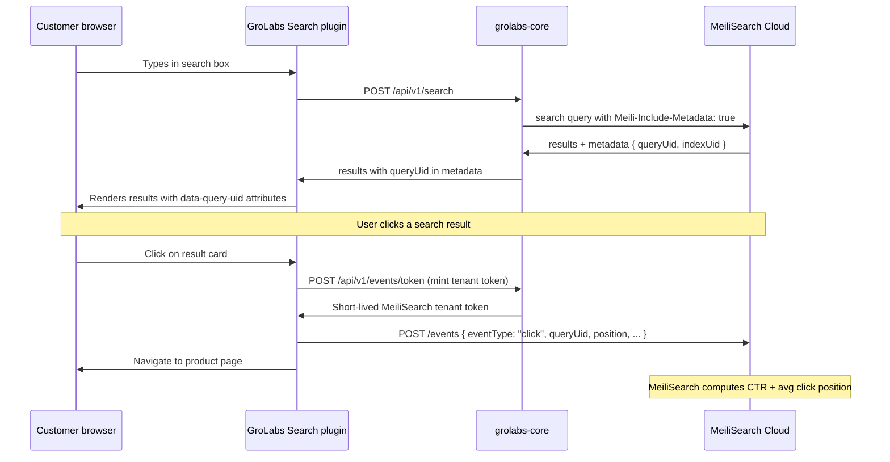
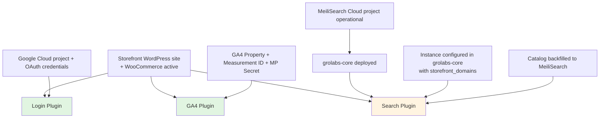

# GroLabs WordPress Plugin Install Runbooks

**Audience:** GroLabs operators and engineering colleagues installing the GroLabs plugin suite on a WordPress + WooCommerce test or production site.

**Last updated:** 2026-05-18

---

## Overview

GroLabs operates as four separate WordPress plugins. Each does one job. A complete install layers them in order so that any breakage during install is easy to isolate.

The four plugins in install order:

| Order | Plugin | Purpose | Depends on |
|---|---|---|---|
| 1 | **GroLabs GA4** | Standard ecommerce tracking to a GA4 property | Nothing (standalone) |
| 2 | **GroLabs Login** | Google SSO at WooCommerce checkout to reduce friction | Google Cloud OAuth credentials |
| 3 | **GroLabs Search** | Search box overlay + click analytics to MeiliSearch | grolabs-core deployed; MeiliSearch Cloud project; instance configured |
| 4 | **GroLabs Events** | _(Future — separate spec)_ User behavior events to PostHog | Not yet built |

This runbook covers plugins 1, 2, and 3. Plugin 4 will get its own runbook when its spec is implemented.



---

## Prerequisites

Before starting, you'll need:

- **Admin access** to the WordPress site you'll install on
- **WooCommerce installed and activated** on that site (required by all three plugins)
- **WordPress 6.0+** and **PHP 8.0+**
- **A built test product catalog** with at least 10 products, ideally with images, categories, and prices set — so you can verify each plugin produces visible behavior
- **Access to Google Cloud Console** (https://console.cloud.google.com) for the Login plugin
- **Access to Google Analytics** (https://analytics.google.com) for the GA4 plugin
- **The three plugin `.zip` files** built locally — paths listed in each runbook section below
- **For the Search plugin only:** grolabs-core must already be deployed with the feature/search-click-events branch merged, environment variables set, and the MeiliSearch Cloud project configured

---

## Runbook A — GroLabs GA4 Plugin

### What this installs

A GA4 tracking tag on the storefront. The plugin injects `gtag.js` and fires standard WooCommerce ecommerce events (`view_item`, `add_to_cart`, `begin_checkout`, `purchase`) plus a server-side purchase event via Measurement Protocol to survive ad blockers.

This plugin has **no integration with grolabs-core**. Events go directly to Google Analytics. Install it independently from anything else.

### Plugin file location

```
/Users/sasu/code/grolabs-wordpress-ga4/build/grolabs-wordpress-ga4-0.2.0.zip
```

### Event flow



### Step 1 — Create a GA4 property

Skip if you already have a property to use.

1. Go to https://analytics.google.com and sign in.
2. Click **Admin** (gear icon, bottom left).
3. In the **Account** column, select an existing account or create one ("GroLabs Testing" is fine).
4. In the **Property** column, click **Create property**.
5. Property name: descriptive (e.g., "Wazú Test Site").
6. Reporting time zone: your local time zone.
7. Currency: whatever the storefront uses (GTQ, USD, etc.).
8. Click **Next**, fill in business size and category, accept terms.

### Step 2 — Create a Web Data Stream and capture the Measurement ID

1. In Admin, under **Property**, click **Data Streams**.
2. Click **Add stream** → **Web**.
3. Website URL: the storefront's URL.
4. Stream name: descriptive (e.g., "Wazú Test Site Web").
5. Leave **Enhanced measurement** ON.
6. Click **Create stream**.
7. On the stream details page, **copy the Measurement ID** at top right. Format: `G-XXXXXXXXXX`. Save it.

### Step 3 — Create a Measurement Protocol API Secret

1. On the same stream details page, scroll to find **Measurement Protocol API secrets**. Click it.
2. Click **Create**.
3. Nickname: "GroLabs GA4 Plugin".
4. Click **Create**.
5. **Copy the Secret Value immediately.** Google only shows it once. Save it securely.

### Step 4 — Install the plugin

1. In WordPress admin, go to **Plugins** → **Add New** → **Upload Plugin**.
2. Upload the `.zip` from the path above.
3. Click **Install Now**, then **Activate Plugin**.

### Step 5 — Configure the plugin

1. Go to **Settings** → **GroLabs WordPress GA4** in WordPress admin.
2. Paste the **Measurement ID** from Step 2.
3. Paste the **MP API Secret** from Step 3.
4. Toggle settings:
   - **Track traffic** — ON
   - **Track ecommerce** — ON
   - **Test mode** — OFF (turn ON only if you want test events prefixed with `test_` for filtering)
5. Click **Save**.
6. Click **Probar conexión** (Test Connection). It fires a diagnostic event and reports success/failure.

### Step 6 — Verify

1. Browse the storefront as a customer in a fresh browser session: view a product, add to cart, complete a test purchase.
2. In GA4, go to **Reports** → **Realtime**.
3. Within 30-60 seconds, events should appear: `page_view`, `view_item`, `add_to_cart`, `begin_checkout`, `purchase`.

### Common issues

| Symptom | Likely cause | Fix |
|---|---|---|
| No events appearing | Wrong Measurement ID format | Verify it starts with `G-` |
| Events appearing for some but not purchases | MP API Secret missing or wrong | Re-paste the secret, save again |
| Nothing tracking in your own browser | Ad blocker active | Test in private window with ad blockers off |
| Plugin settings page not found | Plugin not activated | Plugins → check status |

---

## Runbook B — GroLabs Login Plugin

### What this installs

Google SSO on the WooCommerce checkout page. When a customer reaches checkout, they can sign in with their Google account instead of typing a password or registering a new account. Reduces checkout friction.

### Plugin file location

```
/Users/sasu/code/grolabs-wordpress-login/build/grolabs-wordpress-login-1.1.0.zip
```

### OAuth flow

```mermaid
sequenceDiagram
    participant User as Customer
    participant WP as WordPress checkout
    participant Plugin as GroLabs Login plugin
    participant Google as Google OAuth

    User->>WP: Reaches checkout
    WP->>User: Shows "Sign in with Google" button
    User->>Plugin: Clicks button
    Plugin->>Google: Redirect to Google sign-in
    User->>Google: Approves with Google account
    Google->>Plugin: Redirect back to callback URL with auth code
    Plugin->>Google: Exchanges code for tokens (server-side)
    Google->>Plugin: Returns user profile (name, email)
    Plugin->>WP: Creates or matches WC customer; auto-fills checkout
    WP->>User: Checkout form pre-filled with name + email
```

The "callback URL" in this diagram is the most error-prone setting. It must be configured **identically** in two places: Google Cloud Console and the plugin's settings. The plugin tells you exactly what URL to use.

### Step 1 — Create a Google Cloud project and OAuth credentials

1. Go to https://console.cloud.google.com and sign in.
2. At top, click the project selector → **New Project**.
3. Project name: "GroLabs Login Test" (or similar).
4. Click **Create**. Wait for provisioning. Ensure it's selected.

### Step 2 — Configure the OAuth consent screen

1. Left menu → **APIs & Services** → **OAuth consent screen**.
2. User Type: **External**. Click **Create**.
3. Fill required fields:
   - **App name**: "GroLabs Login Test"
   - **User support email**: your email
   - **Developer contact information**: your email
4. Click **Save and Continue** through Scopes (defaults are fine).
5. On **Test users**, add the Google email(s) you'll log in with during testing. Click **Save and Continue**.

### Step 3 — Create OAuth client credentials

1. Go to **APIs & Services** → **Credentials**.
2. Click **+ Create Credentials** → **OAuth client ID**.
3. Application type: **Web application**.
4. Name: "GroLabs Login WP Test".
5. **Authorized JavaScript origins**: add your WP site URL, e.g., `https://wazu-test.example.com`.
6. **Authorized redirect URIs**: add a placeholder for now — `https://wazu-test.example.com/?grolabs_wordpress_login_cb=google`. The plugin's callback URL follows the `?grolabs_wordpress_login_cb=<provider>` pattern, but the exact URL appears on the plugin Settings page after install — copy it from there rather than guessing. We'll correct this placeholder in Step 5.
7. Click **Create**.
8. A dialog shows your **Client ID** and **Client Secret**. **Copy both immediately.**

### Step 4 — Install the plugin

1. In WordPress admin → **Plugins** → **Add New** → **Upload Plugin**.
2. Upload the `.zip` from the path above.
3. Install and Activate.

### Step 5 — Configure the plugin (and correct the redirect URI)

1. Find the plugin's settings page in WordPress admin (under **Settings** or as its own top-level menu item).
2. Locate the **Google** provider section.
3. **Find the displayed "Redirect URI" or "Callback URL" the plugin generates.** This is the exact URL Google needs.
4. Copy that URL.
5. Go back to Google Cloud Console → **APIs & Services** → **Credentials** → click your OAuth client.
6. Under **Authorized redirect URIs**, **replace** the Step 3 placeholder with the exact URL from the plugin. Click **Save**.
7. Back in the WordPress plugin:
   - Paste the **Client ID** from Step 3
   - Paste the **Client Secret** from Step 3
   - **Enable Google login** (toggle on)

### Step 6 — Choose placement

The plugin supports configurable placement of the "Sign in with Google" button. Options:

| Placement | When to use | Visibility |
|---|---|---|
| **Above the checkout form** | Demo, high-conversion sites | Highest — first thing shown |
| **Above billing details** | Sites where checkout has multiple sections | Medium — visible early but inside the form |
| **Below form / before submit** | Sites where you want it as a secondary option | Lower — most customers will already be filling in the form |
| **At the login prompt only** | Sites where customers usually create accounts | Lowest — only shown when "Login" is clicked |
| **Via shortcode** | Custom theme placements | You choose — put `[grolabs_login]` (or current shortcode name) anywhere |

**Recommendation for the GroLabs demo:** "Above the checkout form". This demonstrates the friction reduction at the moment a customer would otherwise face a full registration form.

### Step 7 — Block-based vs classic checkout

WooCommerce now ships two checkout UIs:

- **Block-based checkout** (newer, since ~WC 8.x)
- **Classic checkout** (the legacy `[woocommerce_checkout]` shortcode)

Plugin v1.1.0 supports both. No special action needed — the plugin detects which is active and adjusts. If your test site uses a custom checkout (e.g., CheckoutWC or a heavily themed alternative), test placement carefully; some custom checkouts override the standard hooks.

### Step 8 — Verify

1. Open the storefront in a **private/incognito window** (so you're not already logged in as admin).
2. Add a product to cart.
3. Proceed to checkout.
4. The "Sign in with Google" button should appear in the configured location.
5. Click it. Google's OAuth screen opens.
6. Use one of the Google emails you added as a test user.
7. After approving, you should be redirected back to checkout with the form pre-filled (name, email).
8. Complete the test order.

### Common issues

| Symptom | Likely cause | Fix |
|---|---|---|
| `redirect_uri_mismatch` error | The redirect URI in Google Cloud doesn't exactly match what the plugin sends | Copy the URL from the plugin settings page exactly, paste it into Google Cloud Console |
| "This app isn't verified" warning | OAuth consent screen still in Testing mode | Click "Advanced" → "Go to [app name] (unsafe)" to bypass. Skip Google verification for the demo |
| Button doesn't appear at checkout | Placement misconfigured or theme overrides hooks | Try the shortcode placement as a fallback |
| User signs in but no order can be created | Plugin's user-creation setting disabled | In plugin settings, ensure "automatically create users" is enabled |
| Sign-in works but form not pre-filled | Plugin's profile-mapping setting missing | Check that the plugin's "fill checkout with profile data" toggle is on |

---

## Runbook C — GroLabs Search Plugin v0.3.0

### What this installs

The search box overlay that replaces WooCommerce's native search experience. Plus click event tracking on search results, which feeds MeiliSearch's analytics so we can measure search quality and tune relevancy over time.

### Plugin file location

```
/Users/sasu/code/grolabs-wordpress-search/build/grolabs-wordpress-search-0.3.0.zip
```

### Prerequisites specific to this plugin

Unlike the GA4 and Login plugins, this one **depends on grolabs-core being deployed and operational**:

- grolabs-core's `feature/search-click-events` branch is merged to `main` and deployed
- grolabs-core's environment variables include the MeiliSearch host and master key
- The MeiliSearch Cloud project (`scout-production`) is operational
- A grolabs-core "instance" exists for this storefront with:
  - The storefront's hostname listed in `storefront_domains`
  - `is_active = true`
- The product catalog has been backfilled to MeiliSearch (run the "Reindex All" from `/configuration/search` in grolabs-core admin)

If any of these are missing, the plugin will install but search won't work.

### Event flow



### Critical pre-deployment validation

**Before installing the plugin, validate the `events.add` action constant against the live MeiliSearch cluster.** This was flagged during implementation as unverified.

To validate: try minting an events parent key via grolabs-core's deployment. If it returns an `invalid_api_key_actions` error, the action constant needs to change from `events.add` to `search` (the docs show event submission works with the `search` action). Update `src/lib/search/meilisearch-client.ts` accordingly.

Run this validation **once during deployment** before the plugin ever sees production. If `events.add` works, everything is fine; if it doesn't, the fix is a one-line change to the grolabs-core source.

### Step 1 — Verify grolabs-core deployment

1. Open the grolabs-core admin (deployed URL, e.g., `https://app.grolabs.ai`).
2. Navigate to **Configuration** → **Search**.
3. Verify:
   - MeiliSearch connection status: connected
   - The active instance for this storefront: visible
   - Document count: matches expected product count
4. If the document count is zero or partial, click **Reindex All** and wait for completion.

### Step 2 — Install the plugin

1. WordPress admin → **Plugins** → **Add New** → **Upload Plugin**.
2. Upload the `.zip` from the path above.
3. Install and Activate.

### Step 3 — Configure the plugin

1. Go to **Settings** → **GroLabs WordPress Search** in WordPress admin.
2. Configure:
   - **GroLabs Core API host**: the deployed grolabs-core URL (e.g., `https://app.grolabs.ai`)
   - **Instance ID**: the numeric ID of the storefront's instance in grolabs-core (visible in grolabs-core admin under the storefront's instance page)
3. Click **Save**.
4. Click **Test Connection** (if available). The plugin should report a successful connection.

### Step 4 — Verify search works end-to-end

1. Open the storefront in a fresh browser window.
2. Use the search box or trigger the search overlay (depending on theme integration).
3. Type a known product name or keyword.
4. Verify results appear and match what's in the MeiliSearch index.
5. Open browser DevTools → **Network** tab.
6. Confirm a `POST /api/v1/search` request to grolabs-core, returning 200 with `metadata.queryUid` populated.

### Step 5 — Verify click event tracking

1. With DevTools Network tab open, click a search result.
2. Verify two requests fire:
   - `POST /api/v1/events/token` to grolabs-core, returning a token
   - `POST /events` to the MeiliSearch host, returning 204 or similar success
3. In the MeiliSearch Cloud dashboard, navigate to the project's **Analytics** tab.
4. After a few minutes, the click event should appear, contributing to:
   - **Click-through rate** (clicks ÷ searches)
   - **Average click position**
   - **Per-product click frequency**

### Step 6 — Repeat with more queries

Run 10-15 different searches and click several results across them. This gives the MeiliSearch analytics enough volume to compute meaningful metrics. Use queries that match real customer language ("dog food", "cat toy", "shampoo for puppies") rather than admin-y test strings.

### Common issues

| Symptom | Likely cause | Fix |
|---|---|---|
| Search returns no results when there should be matches | Catalog not indexed or wrong instance ID | Run reindex from grolabs-core; verify instance ID in plugin settings |
| Search returns 500 from grolabs-core | grolabs-core can't reach MeiliSearch | Check grolabs-core env vars; check MeiliSearch project status |
| Search works but no events fire on click | Events token endpoint failing | Check browser console for `GroLabs:` messages; verify `events.add` action validation |
| Events token endpoint returns 403 | Storefront origin not in `instance.storefront_domains` | Update the instance in grolabs-core admin |
| Events fire but never appear in MeiliSearch analytics | `events.add` action invalid on this cluster | Apply the fallback: change action to `search` in grolabs-core source |
| `metadata.queryUid` empty in search response | Older MeiliSearch SDK or missing header | Verify `Meili-Include-Metadata: true` header is being sent (check grolabs-core code, not deployed) |

---

## Install dependency map

The full picture of what needs to be ready before each plugin can be installed:



Green plugins have no GroLabs infrastructure dependencies. The Search plugin (yellow) depends on the grolabs-core deployment chain.

---

## Settings quick-reference

When you need to find a specific setting fast:

| Setting | Where it lives | Used by |
|---|---|---|
| GA4 Measurement ID (`G-XXXXXXXXXX`) | GA4 Admin → Data Streams → stream details (top right) | GA4 plugin |
| GA4 MP API Secret | GA4 Admin → Data Streams → stream → Measurement Protocol API secrets | GA4 plugin |
| Google OAuth Client ID + Secret | Google Cloud Console → APIs & Services → Credentials | Login plugin |
| OAuth Authorized Redirect URI | Plugin settings page (read it from there) → paste into Google Cloud Console | Login plugin |
| OAuth Test Users | Google Cloud Console → APIs & Services → OAuth consent screen → Test users | Login plugin |
| grolabs-core API host | Where grolabs-core is deployed (e.g., `https://app.grolabs.ai`) | Search plugin |
| Instance ID | grolabs-core admin → Instances list (or instance detail page) | Search plugin |
| MeiliSearch project URL | MeiliSearch Cloud dashboard → project details | grolabs-core env vars |
| MeiliSearch master key | MeiliSearch Cloud dashboard → project → API Keys | grolabs-core env vars |

---

## Disclosure to merchant

White-label is non-negotiable: vendor names never appear in plugin UI or storefront output. However, in compliance with the GroLabs Constitution Article 4 (frictionless value through disclosure), the plugin settings pages and the storefront privacy policy should communicate that data is collected.

Standard disclosure language for the plugin settings pages:

> **Search and analytics**
> Your store's search queries, search-result clicks, and customer interactions are recorded by GroLabs to improve search relevance and provide analytics. Aggregate behavioral data is stored in GroLabs infrastructure and may be processed by trusted service providers.

No vendor names mentioned. The storefront DOM exposes nothing identifying. Browser console messages are namespaced as `GroLabs:` rather than vendor-specific.

---

## What's not in this document

- **The future Events plugin** (Plugin B, PostHog integration) — gets its own runbook when implemented
- **PR review process** for the plugin code itself — separate document
- **Tenant onboarding** (creating a new instance in grolabs-core, configuring a new merchant) — separate document
- **MeiliSearch project setup** (creating the project, choosing region, configuring API keys at the Cloud level) — separate document
- **GroLabs Constitution and architecture** — see `docs/vision.md`, `docs/constitution.md`, `docs/module-map.md`

---

*This runbook lives at `docs/onboarding/install-runbooks.md` in the grolabs-core repository and travels with the codebase. Update it whenever any of the three plugins materially change their install or configuration flow.*
