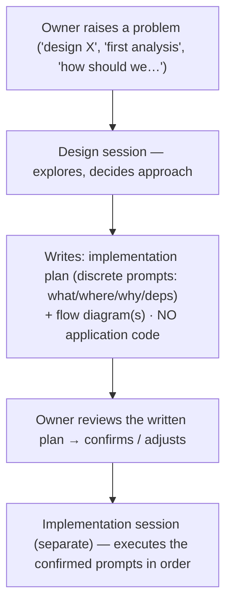

# Design-Session Protocol — plans, not code

Status: Active policy
Owner: Tuncho

A **design session** explores a problem and decides an approach. It does **not**
write application code. Its single deliverable is an **implementation plan** the
owner can read and confirm before any code is written.

## Rules

1. **No code is written during a design session.** No edits to `src/**`,
   migrations, plugin assets, or config. Writing or amending **docs** (this plan,
   policy/design docs) is allowed — that *is* the deliverable.

2. **The deliverable is an implementation plan expressed as discrete prompts.**
   For each prompt the plan must state:
   - **What** — the unit of work (one coherent, independently-executable change).
   - **Where** — the repo / directory it runs in (e.g. `web-apps/app`,
     `wp-plugins/grolabs-wordpress-search`).
   - **Why** — the purpose, and what it unblocks.
   - **Depends on** — which prior prompts must land first.

3. **The plan is written down so it can be reviewed.** It lives in `docs/design/`
   (or `docs/policy/` once ratified), not buried in chat. The owner confirms the
   plan before execution; only then does a separate *implementation* session run
   the prompts.

4. **Locked docs are not amended during design.** If the plan requires amending a
   locked policy doc (Status: Active), that amendment is listed as its own prompt
   pending explicit sign-off — it is not done inline.

5. **Every document includes a flow diagram.** Each policy/design doc carries at
   least one diagram as a ```mermaid``` fenced block (so it renders in the Dev
   Studio viewer) showing the flow it describes — data flow, process flow, or
   dependency flow. A doc without a diagram is incomplete. Add it before
   considering the doc done.

6. **ERD for every table in bold (mandatory).** Whenever a doc references database
   tables (written in **bold**), it must include an Entity-Relationship Diagram of
   those tables as a ```mermaid``` `erDiagram` block — primary keys, key columns,
   foreign keys, and the relationships/joins between them. Include soft joins
   (logical links that aren't FK-enforced) explicitly. If the doc references no DB
   tables, state `ERD: N/A — no DB tables`.

7. **"Related GroLabs modules / applications" section (mandatory).** Each doc lists
   the GroLabs modules or applications it relates to — upstream producers,
   downstream consumers, siblings — with a one-line note on each relationship. If
   genuinely none, state `N/A`.

8. **"External applications & required credentials" section (mandatory).** Each doc
   lists every external application that will be in contact with the module and the
   credentials required from each (key/token name, scope, where stored). If none,
   state `N/A`.

## Process flow



## Why

Separating "decide" from "build" keeps decisions visible and reversible, lets the
owner catch a wrong premise before code exists, and turns each agreed plan into a
checklist of self-contained prompts that any later session can execute cleanly.
