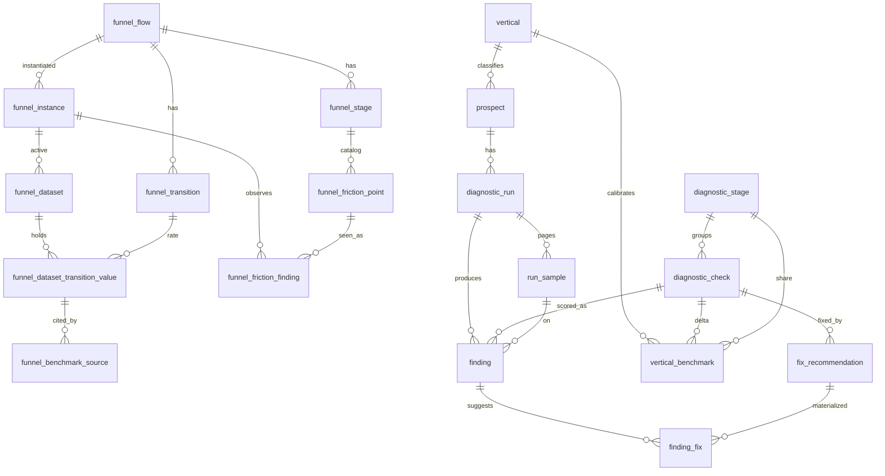
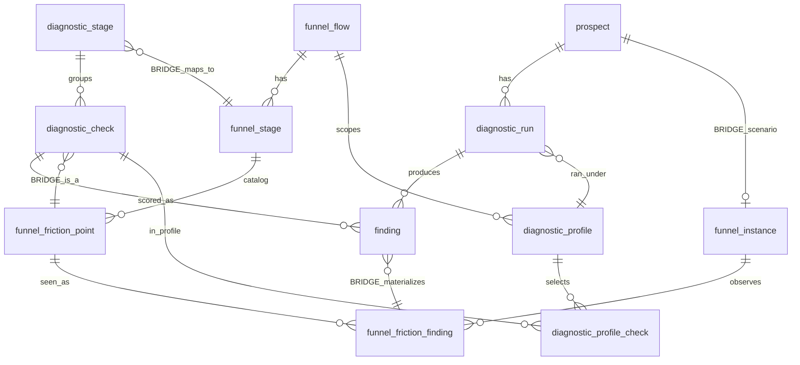
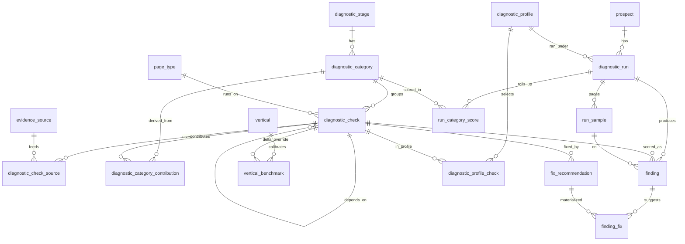

# Prospectos — policy

> ⚠️ **WORKING DRAFT — not the source of truth.** This is a scratch copy of
> `prospectos.md` for an in-progress design discussion: the landing-page
> assessment rework and its reconciliation with the existing **funnel object**.
> Nothing here is committed. Approved changes fold back into `prospectos.md`;
> until then read the original as authoritative. New/under-discussion material
> is concentrated in the **"Relationship to the funnel object"** section at the
> end.

A diagnostic that takes a URL, scores the storefront against a
DB-driven rubric, computes annual revenue uplift, and surfaces a report
+ specific fix recommendations. Used from the RRE admin (authenticated)
**and** from the GroLabs landing page (anonymous), backed by the same
runner.

This doc covers v1 (shipped: schema + catalog UI), v2 (shipped: public
API + Playwright + test vocab + revenue formula), v3 (shipped: vertical
auto-detection + sample auto-discovery + CWV + returns + locale-aware
tests + brand/synonym DOM extraction). The roadmap is at the bottom.

---

## 1. The funnel model

Every check ties to one funnel stage and one revenue lever:

| Stage | What it covers | Example checks |
|---|---|---|
| **Discovery** | How visitors arrive: SEO, AI/LLM citations, social, page speed | Product JSON-LD complete, llms.txt + robots policy, sitemap hygiene, Core Web Vitals, OG cards |
| **On-site nav** | Internal search + category browse + faceting | Search engine identified, typo tolerance, synonym coverage, empty-state behavior, brand-query relevance, faceting depth |
| **PDP evaluation** | Does the product page convert a visitor → add-to-cart | Image count + alt quality, variant clarity, structured attribute table, reviews, cross-sell, stock + delivery clarity |
| **Returns risk** | Attribute completeness as a leading indicator of "didn't match" returns | Per-vertical expected-attribute coverage |

A run produces a 0–100 score per stage (weighted average of its checks)
and an overall score (average of stages).

---

## 2. Two-service architecture

```
RRE (Next.js, this repo)              ASE (Python, grolabsai/grolabs-ASE — formerly GLPIM)
─────────────────────────────           ───────────────────────────────────
• Orchestrator + rubric                 • POST /tools/pdp-signals
• Public API + report viewer            • POST /tools/site-signals
• Playwright probe (browser)            • (existing) POST /tools/pdp-scan
• PSI (Core Web Vitals)                   for AEO scoring — separate use
• Revenue formula
• Persistence (Supabase)
```

ASE owns the static-HTML extraction primitives (selector fallbacks,
JSON-LD flattening, alt-text filtering, platform + engine fingerprints).
RRE calls them, runs its own browser + CWV probes alongside, and
scores everything against the catalog in DB.

**Why split:** the signal extraction is brittle and hand-tested
(WC/Shopify/Magento quirks); RRE doesn't want to maintain a second
parser. Scoring lives in RRE because the rubric is editable per
instance via the UI — coupling the two services to one rubric would
prevent that.

---

## 3. Schema — two layers

### Catalog (rarely changes; editable via UI)

| Table | Purpose |
|---|---|
| `diagnostic_stage` | Funnel stages (Discovery, On-site nav, PDP, Returns) |
| `vertical` | Business verticals (pet_retail, fashion, electronics, …) + `detection_keywords[]` |
| `diagnostic_check` | The catalog of checks. `check_code` is the stable identifier the scorer registry keys on |
| `fix_recommendation` | Markdown fixes per check, with `trigger_condition` JSONB (`result_status`, `score_below`, `score_at_or_below`) |
| `vertical_benchmark` | Per-vertical inputs for the revenue formula (`baseline_cr`, `stage_share`, `delta_rate`, `default_aov_usd`). Specificity: check > stage > vertical |
| `vertical_synonym_pair` | Per-vertical synonym terms for the Playwright probe's synonym test |
| `vertical_test_query` | Canonical category / empty_state / brand queries per vertical+locale |
| `vertical_expected_attribute` | Per-vertical "well-merchandised PDP should have these" list — powers the returns scorer |

All catalog tables use the **prompt_template pattern**: per-instance
rows with instance-0 fallthrough on SELECT. GroLabs ships the canonical
rubric in instance 0; customers override or extend without touching it.

### Run layer (written per diagnostic)

| Table | Purpose |
|---|---|
| `prospect` | The diagnosed site. Unique by `(instance_id, url)` for authenticated; unique on `url` alone when `instance_id IS NULL` |
| `diagnostic_run` | One run = one snapshot. UUID primary key is the share token for anon access |
| `run_sample` | Which homepage / PDP / category / search queries we actually hit (reproducibility) |
| `finding` | One row per check per run with score + result_status + evidence (jsonb) + per-finding uplift |
| `finding_fix` | Materialized fixes per finding (derived from each fix's trigger_condition) |
| `diagnostic_rate_limit` | Per-IP request log — only accessible via the `record_diagnostic_request` RPC |

---

## 4. RLS + access model

| Caller | Catalog reads | Run reads | Run writes |
|---|---|---|---|
| `authenticated` (RRE admin) | Own instance ∪ instance 0 | Own instance | Own instance |
| `anon` (landing page) | Instance 0 only | Anonymous runs (`instance_id IS NULL`) by uuid token | Via service-role through `/api/v1/diagnostic/runs` |

Anonymous writes never go through Supabase from the browser — the
public API route uses the service-role client and is gated by the
`record_diagnostic_request` SECURITY DEFINER RPC (5 req/hour, 20/day
per IP). The unguessable `run_id` UUID is the only auth token a public
report viewer needs.

---

## 5. Runner flow

`src/lib/diagnostic/runner.ts` — both authenticated and anonymous
flows funnel through a single `runDiagnostic(opts)`. Sequence:

1. **Pre-flight: `discoverSamples(rootUrl)`**
   - Fetches the homepage once, returns:
     - PDP candidate (featured-block selectors first, then any
       `/product/`-style link)
     - Category candidate (`/category/`, `/collections/`, …)
     - Homepage snippet (title + H1/H2 + JSON-LD product types) for
       the vertical classifier
2. **Vertical classification** (when not supplied)
   - Layer 1: keyword scorer using `vertical.detection_keywords[]`.
     Picks a winner when top score ≥ 3 and beats #2 by ≥ 25%.
   - Layer 2: Claude Haiku tie-breaker on the homepage snippet. Only
     fires when keywords are inconclusive AND `ANTHROPIC_API_KEY` is set.
   - Result persisted on `prospect.vertical_id`.
3. **Locale detection** — Spanish keyword count from the homepage text.
4. **Vocabulary + benchmark + expected-attribute load** scoped to the
   resolved vertical (with template-instance 0 fallthrough).
5. **Probes run in parallel:**
   - `probeSiteWide(rootUrl)` — HTTP fetches for llms.txt, robots.txt,
     sitemap.xml (8s timeout, AI-bot policy detection)
   - ASE `/tools/pdp-signals` — PDP signals
   - ASE `/tools/site-signals` — platform + engine fingerprint + facets
   - `runBrowserProbe(...)` — Playwright (only when
     `PROSPECTOS_BROWSER_PROBE_ENABLED=1`)
   - `fetchCoreWebVitals(pdpUrl)` — Google PSI (only when
     `PROSPECTOS_PSI_ENABLED !== "0"`)
6. **Score each active check** via the `SCORERS` registry. Checks with
   no scorer get `result_status='na'`. Per-finding uplift computed inline
   using `resolveFactors` + `computeFindingUplift`.
7. **Materialize `finding_fix`** by evaluating each fix's
   `trigger_condition` against the finding's status/score.
8. **Rollup**: weighted stage scores → overall → maturity tier
   (`low < 45 ≤ medium < 75 ≤ high`); sum uplift → run total.
9. **Update prospect**: `platform_detected`, `engine_detected`
   (network fingerprint from browser probe wins over static-HTML guess).

---

## 6. Where test inputs come from (the demo answer)

This question got asked early; this is the locked answer.

| Probe needs | Source |
|---|---|
| **Typo tolerance** test words | **Discovered live** from the prospect's homepage — product names extracted from `Product` JSON-LD (with heuristic fallback to `.product-card__title` text). Mutated by transposing two adjacent chars in the middle of the longest word. No DB lookup. |
| **Synonym** pairs | `vertical_synonym_pair` rows scoped to the prospect's detected vertical + locale. Editable at `/prospects/rubric/vocabulary`. Template seeds cover pet + fashion (ES+EN). |
| **Empty-state** queries | `vertical_test_query` rows where `intent='empty_state'`. Locale-filtered. Same editor screen. |
| **Brand-relevance** brand | First `Brand` value from homepage `Product` JSON-LD. Falls back to first text inside a brand-named element. No DB lookup. |
| **Returns-risk** expected attrs | `vertical_expected_attribute` rows per vertical + locale (e.g. pet_retail: weight, ingredients, life_stage, breed_size, brand). Scorer matches `match_keywords[]` against PDP description + schema fields. |

Customers can add/edit/disable rows per instance; the template
instance's rows act as the global fallback.

---

## 7. Revenue formula

Per finding:

```
uplift = traffic × stage_share × baseline_cr × aov × delta_rate × (1 − score/100)
```

Factor resolution (most specific wins):

```
stage_share, baseline_cr, delta_rate:
  vertical_benchmark by (vertical, check)
  ↓ fallback
  vertical_benchmark by (vertical, stage)
  ↓ fallback
  vertical_benchmark by (vertical, NULL, NULL)
  ↓ fallback (delta_rate only)
  diagnostic_check.default_delta_rate

aov:        prospect.est_aov_usd → vertical_benchmark.default_aov_usd
traffic:    prospect.est_annual_traffic → null (uplift unscored)
```

NA / error findings contribute 0. Passing checks (score=100) contribute
0 (no headroom). Sum across findings → run total; confidence is the
lowest tier across contributing findings.

---

## 8. Scoring policies (per check)

The full set lives in `src/lib/diagnostic/scorers.ts`. Highlights:

- **Product JSON-LD complete** — 5 required fields = 80pts, 3 bonus
  fields = 20pts. Pass ≥ 90, partial 60–89, fail < 60.
- **llms.txt / AI policy** — llms.txt present (60pts) + robots AI-bot
  policy: allow (40), unmentioned (10), block (0).
- **Typo tolerance** — % of mutated product-name queries returning
  results (uses 1-2 discovered names). Pass ≥ 99%, partial ≥ 50%.
- **Synonyms** — 50pts both terms return, +30pts overlap > 0, +20pts
  overlap ≥ 3 (strong coverage).
- **Empty state** — graceful (no hard error, no results, 50pts) +
  fallback content present (50pts).
- **Brand relevance** — results came back (50pts) + brand name in top
  3 results (50pts). Null brand_in_top → half credit if results present.
- **Returns attribute completeness** — weighted coverage of
  `vertical_expected_attribute` keywords against PDP text + schema
  fields. Pass ≥ 80%, partial ≥ 50%.

---

## 9. Public API surface

For the landing-page diagnostic widget and third-party callers:

| Method | Path | Purpose |
|---|---|---|
| POST | `/api/v1/diagnostic/runs` | Start an anonymous run. Returns `{ run_id, report_url }` |
| GET | `/api/v1/diagnostic/runs/{runId}` | Fetch JSON report (anonymous runs only) |
| GET | `/{locale}/diagnostics/{runId}` | Public HTML report — embed-friendly, no auth |

Rate-limited via `record_diagnostic_request(p_ip, 5, 20)`. CORS open
(`*`). Synchronous execution today (~5–60s per run depending on which
probes are enabled).

---

## 10. Feature flags + env

| Env | Purpose | Default |
|---|---|---|
| `ASE_API_URL` | Required for PDP + site signals to score | unset → those scorers degrade to `error` |
| `ANTHROPIC_API_KEY` | Enables Haiku tie-breaker for vertical classification | unset → classifier returns no LLM result |
| `PROSPECTOS_BROWSER_PROBE_ENABLED` | Enables Playwright probe (used together with `BROWSERLESS_HOST` + `BROWSERLESS_TOKEN`) | unset → browser-based scorers report `na` |
| `BROWSERLESS_HOST` | Browserless host without protocol (e.g. `production-sfo.browserless.io`, or `chrome.browserless.io` for enterprise) | required on Vercel for the browser probe to run |
| `BROWSERLESS_TOKEN` | Browserless API token | required on Vercel for the browser probe to run |
| `PROSPECTOS_PSI_ENABLED` | Set to `0` to disable Core Web Vitals fetching | enabled by default |
| `GOOGLE_PSI_API_KEY` | Lifts PSI free-tier throttle | optional |
| `SUPABASE_SERVICE_ROLE_KEY` | Required for the public API + landing-page report | required for anon flow |

---

## 11. Deployment notes for Playwright

**Current production setup: Browserless via CDP.** RRE connects to a
managed Chromium pool by setting two env vars:

- `BROWSERLESS_HOST` — host without protocol (e.g. `production-sfo.browserless.io`,
  `production-lon.browserless.io`, `production-ams.browserless.io`, or
  `chrome.browserless.io` for an enterprise private fleet).
- `BROWSERLESS_TOKEN` — the API token from the Browserless dashboard.

RRE assembles `wss://<host>?token=<token>` at runtime, so region or
fleet swaps are an env-var change, not a code change. The probe uses
`chromium.connectOverCDP(...)` to attach to a pre-warmed browser, so
there's no cold-start launch cost and the Vercel deploy bundle stays
small (no Chromium binary).

**Local dev**: leave both vars unset — the probe falls back to
`chromium.launch()` and uses the locally-installed Chromium
(`npx playwright install chromium`).

**Why not the alternatives**:
- Self-hosted Playwright on Railway/Fly: works, but adds a service
  to monitor for no real upside vs. Browserless.
- `@sparticuz/chromium` on Vercel: strips ~half of Chromium to fit
  the 50MB bundle limit; some sites detect+block the stripped fingerprint.

Until both `PROSPECTOS_BROWSER_PROBE_ENABLED=1` *and*
`BROWSERLESS_WS_URL` are set, **the diagnostic still runs end-to-end** —
browser-based scorers just report `result_status='na'` with reason
`browser_probe_disabled`. Other 12+ scorers all score fine.

---

## 12. Roadmap (not committed)

- **Async runs + progress streaming** — current sync execution blocks
  the request for ~30s when Playwright is on. SSE or polling for the
  landing-page UX.
- **Multi-PDP / multi-category sampling** — currently 1 of each. Sample
  3 and take the median to dodge outliers.
- **Traffic estimation** — auto-pull from SimilarWeb / Semrush rather
  than asking on the form. Paid APIs.
- **Real synonym index comparison** — current scorer measures overlap
  by product name text; could compare by URL or SKU for stronger signal.
- **Engine-specific deep tests** — once we know it's Algolia, probe
  `typoTolerance` config via the search API directly.
- **Vertical-aware fix copy** — `fix_recommendation` is currently
  per-check, locale-neutral. Could split per-vertical for more
  prescriptive recommendations.
- **Screenshot evidence on browser-probe findings** (phase 2) — the
  browser probe runs through Browserless, which can capture
  `page.screenshot()` PNGs alongside the existing assertions. Goal: make
  the report read as "here's what we tried, here's what we found,
  here's a *picture* of it" — empty-state screen, top-3 search
  results, broken faceting, missing variant selector, etc.
  Implementation sketch:
  1. In `browser-probe.ts`, capture `page.screenshot({ fullPage: false })`
     at each evidence moment (post-search, empty state, faceting panel)
     and return Buffer + intended filename per finding.
  2. Upload to a new `prospect-evidence` Supabase Storage bucket
     (path: `<run_id>/<finding_id>.png`, public-read with the same
     unguessable-uuid pattern as the run-share token).
  3. Persist the storage path on `finding.evidence.screenshot_url`.
  4. Page-detail UI + public report render the image inline. Phase 3
     could add an "annotate / circle the broken area" affordance —
     either manual (canvas overlay in the report) or AI-assisted
     (Claude vision pass that highlights the failure region).
  Cost: 4 screenshots × ~150KB = ~600KB per run. Browserless free
  tier covers screenshots. Supabase Storage at this volume is free.
- **Visual categorization of checks** (next iteration, user feedback
  2026-05-27) — every check should carry a category, an icon (Lucide,
  via the existing `<Icon>` wrapper — same family used everywhere
  else in RRE), and an accent color so the user can scan a report
  and immediately know what kind of problem each row is about.
  Concretely: add `category` + `icon_name` columns on
  `diagnostic_check` (FK to a small `check_category` lookup table with
  name + Lucide icon name + color); render the icon + chip alongside
  the check name in the run detail, page detail, comparison table,
  and search-tests card. Locked-in mapping (Lucide names):
  * `internal_search` — `Search` — sky blue — typo/synonym/empty-state/brand relevance/search engine ID
  * `seo_aeo` — `Globe` — purple — llms.txt, sitemap, canonical, OG cards, Product JSON-LD
  * `data_completeness` — `ListChecks` — orange — attribute table, returns-risk attribute coverage
  * `page_performance` — `Gauge` — yellow — Core Web Vitals
  * `pdp_quality` — `Package` — teal — image count, variant clarity, cross-sell, reviews, stock/delivery
  * `returns_risk` — `Undo2` — coral — per-vertical expected attributes
  * `site_trust_signals` — `ShieldCheck` — green — placeholder for future checks (payment trust, return policy, security badges, ratings/reviews)
  * `authentication` — `LogIn` — slate — **new check needed**: detects when
    a site forces email+password auth before browsing or buying.
    Scored as a friction signal (sites that gate browsing behind auth
    lose conversion). Icon picked because it directly says "this test is
    about being forced to log in." Backup options: `KeyRound`,
    `UserLock`, `LockKeyhole`.
  Synchronize the color palette with the GroLabs landing-page styleguide
  before locking in — that's the source of truth for our palette.
- **Cut over legacy on_site_nav scorers to entry-based testing** —
  once `search_test_entry` coverage is good across verticals, retire
  `on_site_nav.typo_tolerance` / `synonyms` / `empty_state` /
  `relevance_brand` as standalone scorers. They become summaries
  derived from the entry results (e.g. "typo tolerance: X/Y entries
  returned results for their typo variants").
- **Surface the entry-based Search Tests card on page detail too** —
  currently only the run detail renders it. Page detail should also
  show entries that target the homepage (where the search box lives).

---

## Relationship to the funnel object (draft — under discussion)

> Status: **proposal, not decided.** This section reconciles the diagnostic /
> prospectos stack with the pre-existing `funnel_*` object. The current-state
> facts are verified from the migrations; the bridge is a proposal.

### The finding

The app already has a **funnel object** (`funnel_*` tables, migration
`20260430000001_funnel_schema.sql`) that independently implements the exact
mechanics the landing-assessment rework needs:

- **Industry defaults → learned instance numbers:**
  `funnel_dataset_transition_value.source_type` is an enum
  (`benchmark` → `customer_actual` → `api_extraction`, plus `manual_estimate`).
  The same row's provenance evolves as we learn — "default rate now, real rate
  later" without changing the criteria.
- **Different stages per specificity:** `funnel_flow` → `funnel_stage`. Each
  flow is its own stage structure; a `funnel_short_electronics` flow already
  exists.
- **Per-subject model with revenue inputs:** `funnel_instance` carries
  `monthly_traffic`, `average_order_value`, `average_cart_skus`; its
  `funnel_instance_type` enum is already `template | customer | scenario`.
- **Catalog vs observed:** `funnel_friction_point` (catalog) /
  `funnel_friction_finding` (observed), instance-0 fallthrough, severity +
  evidence.

**The problem:** the diagnostic stack rebuilds all of this in parallel, with
**no foreign key linking the two**. They model the same domain twice:

| Concept | Funnel object | Diagnostic / prospectos | Linked? |
|---|---|---|---|
| Funnel stage | `funnel_stage` | `diagnostic_stage` | none |
| Catalog of problems | `funnel_friction_point` | `diagnostic_check` | none |
| Observed problem | `funnel_friction_finding` | `finding` | none |
| Default → learned rates | `funnel_dataset_transition_value` (`source_type`) | `vertical_benchmark` (`baseline_cr`, `delta_rate`) | none |
| Subject + traffic/AOV | `funnel_instance` | `prospect` | none |

So the north star — "project funnels and predictions from the assessment, same
infrastructure benchmark→real in monitoring, criteria never change" — is
currently unreachable: the funnel-projection engine and the evidence engine
don't know about each other.

### Current state — two disconnected stacks



_Two clusters, no edge between them — the funnel object (left) and the diagnostic stack (right) model the same domain with zero shared keys._

### Proposed bridge (option B) — add the missing edges, keep both stacks

Keep the shipped prospectos stack; add the edges that let diagnostic evidence
drive funnel projection. A diagnostic check **is** a friction point on a stage;
a diagnostic run materializes a `scenario` `funnel_instance` for the prospect,
writes `funnel_friction_finding`s, and seeds its transition values as
`benchmark` — which monitoring later flips to `customer_actual` on the same
funnel. The new `diagnostic_profile` selects *which* checks run in a given
context (landing vs monitoring), scoped to a flow (the stage structure).



_Edges labelled `BRIDGE_*` are the proposed additions; `diagnostic_profile` /
`diagnostic_profile_check` are new. The profile selects which checks run in a
context (landing / monitoring), scoped to a `funnel_flow`; pure membership for v1._

### Open decision

- **B (bridge)** — recommended: reuse the funnel projection engine, no rewrite
  of the live diagnostic runner.
- **C (unify)** — fold `diagnostic_check`→`funnel_friction_point` and
  `finding`→`funnel_friction_finding`, retire the duplicates. Cleanest, but a
  heavy refactor of shipped code.
- Secondary: does the **landing audit** create a `scenario` `funnel_instance`
  per prospect from day one (funnel projection drives the "revenue you're
  losing" number), or keep the landing number on the simpler `vertical_benchmark`
  formula for v1 and bridge later?

---

## Atomic evaluation rubric (check → finding → fix → progress)

> Status: **draft / under discussion.** Replaces the coarse "uploaded table".
> Grain principle: **one atomic `check_code` = one row = one `finding` per run =
> one `fix` = one progress series.** No composites in a box. **Scoring is
> credit-from-zero** (see below). Quality is split from presence via a real
> `depends_on` relation — if the prerequisite isn't met, the dependent **earns 0
> credit** (it is *not* `na`/excluded). `returns_risk` is a *derived* score over
> existing findings, not new rows (see end).

**Traceability chain (already in the schema):**
`diagnostic_check (check_code)` → `finding` (one per check per run) →
`fix_recommendation` (triggered by finding status) → `finding_fix` → **progress**
= the same `check_code` re-measured across `diagnostic_run`s.

**`check_code` convention:** dotted + stable — `category.subject[.aspect]`.
**Class:** `leak` / `ux` / `vp` (value_prop); lever in parens when not
conversion (`traffic` / `AOV` / `returns`). **Scale:** `Y/N` or `1–10`.
**Depends:** the prerequisite `check_code` — a `depends_on` self-FK on
`diagnostic_check`. If it isn't satisfied, the dependent **scores 0** (credit not
earned) and isn't probed. Distinct from genuine `na` (the check doesn't apply to
this entity — e.g. a variant selector on a single-variant product → excluded,
not zeroed).
**Source:** `ASE-PDP` / `ASE-SITE` / `BROWSER` / `FETCH` / `PSI` / `LLM` / `DB`.

Hierarchy: **Stage → Category (scored) → Page → atomic Item.**

### Scoring model — credit-from-zero

Every metric **starts at 0 and accrues credit** toward its full potential — it is
never "start at 100 and deduct." A category's 100 is the sum of its atomic
checks' earned credits (weighted); absent/missing ⇒ credit simply not earned ⇒
that slice is 0 (not a penalty). Dependencies are a **first-class relation**
(`diagnostic_check.depends_on_check_id`, self-FK):

- A failed prerequisite **zeroes its dependents** — e.g. no `search.box.present`
  ⇒ every `search.*` check is 0 (the whole search opportunity is unrealized);
  no `aeo.llms_txt.present` ⇒ `aeo.llms_txt.quality` is 0.
- `na` is reserved for **does-not-apply** (entity lacks the concept, page absent,
  probe disabled) and is the **only** status excluded from the average — so it
  never drags the score.
- Uplift is unchanged: `(1 − score/100) × max` per finding, so a 0 carries full
  headroom = full recoverable opportunity.

### Discovery › `seo`

| check_code | Page | Item | Class | Scale | Depends | Source | Grading |
|---|---|---|---|---|---|---|---|
| `seo.jsonld.present` | PDP | Product JSON-LD present | leak (traffic) | Y/N | — | ASE-PDP | present → 100/0 |
| `seo.jsonld.required_complete` | PDP | JSON-LD required fields complete | leak (traffic) | 1–10 | `seo.jsonld.present` | ASE-PDP | 5 required fields, pro-rata |
| `seo.jsonld.bonus` | PDP | JSON-LD bonus fields | vp (traffic) | 1–10 | `seo.jsonld.present` | ASE-PDP | 3 bonus fields, pro-rata |
| `seo.sitemap.present` | SITE_WIDE | sitemap.xml present | leak (traffic) | Y/N | — | FETCH | present → 100/0 |
| `seo.sitemap.valid` | SITE_WIDE | sitemap valid + fresh | leak (traffic) | 1–10 | `seo.sitemap.present` | FETCH | well-formed + recent lastmod *(TBD)* |
| `seo.og.title` | SITE_WIDE/PDP | og:title present | leak (traffic) | Y/N | — | FETCH/ASE-PDP | present → 100/0 |
| `seo.og.description` | SITE_WIDE/PDP | og:description present | leak (traffic) | Y/N | — | FETCH/ASE-PDP | present → 100/0 |
| `seo.og.image` | SITE_WIDE/PDP | og:image present | leak (traffic) | Y/N | — | FETCH/ASE-PDP | present → 100/0 |
| `seo.canonical.present` | PDP | canonical tag present + self-referential | leak (traffic) | Y/N | — | ASE-PDP | present+self → 100/0 |

### Discovery › `aeo`

| check_code | Page | Item | Class | Scale | Depends | Source | Grading |
|---|---|---|---|---|---|---|---|
| `aeo.llms_txt.present` | SITE_WIDE | llms.txt present | leak (traffic) | Y/N | — | FETCH | present → 100/0 |
| `aeo.llms_txt.quality` | SITE_WIDE | llms.txt quality (coverage/structure/freshness) | leak (traffic) | 1–10 | `aeo.llms_txt.present` | FETCH+LLM | rubric *(TBD)* |
| `aeo.robots.ai_policy` | SITE_WIDE | robots AI-bot policy | leak (traffic) | 1–10 | — | FETCH | allow major AI crawlers 40 / unmentioned 10 / block 0 |
| `aeo.faq_schema.present` | SITE_WIDE/PDP | FAQ / Q&A schema present | vp (traffic) | Y/N | — | ASE-PDP | present → 100/0 |
| `aeo.answerable.structure` | PDP | answer-structured content | vp (traffic) | 1–10 | — | ASE-PDP+LLM | *(TBD)* |

### Discovery › `page_performance`

| check_code | Page | Item | Class | Scale | Depends | Source | Grading |
|---|---|---|---|---|---|---|---|
| `perf.cwv.lcp` | PDP | Largest Contentful Paint | leak (traffic) | 1–10 | — | PSI | good/NI/poor vs Google thresholds |
| `perf.cwv.inp` | PDP | Interaction to Next Paint | leak (traffic) | 1–10 | — | PSI | good/NI/poor |
| `perf.cwv.cls` | PDP | Cumulative Layout Shift | leak (traffic) | 1–10 | — | PSI | good/NI/poor |

### Internal search › `internal_search`

| check_code | Page | Item | Class | Scale | Depends | Source | Grading |
|---|---|---|---|---|---|---|---|
| `search.box.present` | HOME | search box present/visible | ux | Y/N | — | ASE-SITE | present → 100/0 |
| `search.speed.latency` | HOME | search response latency | leak | 1–10 | `search.box.present` | BROWSER | latency buckets *(TBD)* |
| `search.typo.tolerance` | HOME | typo tolerance | leak | 1–10 | `search.box.present` | BROWSER+DB | % mutated queries returning results; pass ≥99 / partial ≥50 |
| `search.synonym.coverage` | HOME | synonym coverage | leak | 1–10 | `search.box.present` | BROWSER+DB | overlap: 50 both return, +30 >0, +20 ≥3 |
| `search.autocomplete.present` | HOME | autocomplete present | leak | Y/N | `search.box.present` | BROWSER | present → 100/0 |
| `search.autocomplete.quality` | HOME | autocomplete relevance | vp | 1–10 | `search.autocomplete.present` | BROWSER | *(TBD)* |
| `search.semantic.present` | HOME | semantic search capability | vp | Y/N | `search.box.present` | BROWSER+LLM | detection *(TBD)* |
| `search.conversational.present` | HOME | conversational search | vp | Y/N | `search.box.present` | BROWSER | *(TBD)* |
| `search.image.present` | HOME | image-based search | vp | Y/N | — | ASE-SITE/BROWSER | present → 100/0 |
| `search.recent.persistence` | HOME | recent-search persistence | vp | Y/N | `search.box.present` | BROWSER | present → 100/0 |
| `search.empty_state` | SEARCH_RESULTS | empty-state handling | leak | 1–10 | `search.box.present` | BROWSER+DB | graceful 50 + fallback content 50 |
| `search.brand_relevance` | SEARCH_RESULTS | brand-query relevance | leak | 1–10 | `search.box.present` | BROWSER | results 50 + brand in top-3 50 |
| `facet.present` | SEARCH_RESULTS | facet filtering present | ux | Y/N | — | ASE-SITE | present → 100/0 |
| `facet.depth` | SEARCH_RESULTS | facet depth/usefulness | ux | 1–10 | `facet.present` | ASE-SITE | # useful facets *(TBD)* |
| `nav.category.usability` | CATEGORY | category-nav usability | ux | 1–10 | — | ASE-SITE/BROWSER | *(TBD)* |
| `nav.tags.present` | PDP | product tags present | ux | Y/N | — | ASE-PDP | present → 100/0 |
| `nav.breadcrumb.present` | PDP | breadcrumb present | ux | Y/N | — | ASE-PDP | present → 100/0 |
| `reco.home.present` | HOME | product recommendations present | vp | Y/N | — | ASE-SITE/PDP | present → 100/0 |
| `reco.home.quality` | HOME | recommendation relevance | vp | 1–10 | `reco.home.present` | ASE+LLM | *(TBD)* |

### Decision › `pdp_quality`

| check_code | Page | Item | Class | Scale | Depends | Source | Grading |
|---|---|---|---|---|---|---|---|
| `pdp.images.present` | PDP | has product images | leak | Y/N | — | ASE-PDP | ≥1 → 100/0 |
| `pdp.images.count` | PDP | sufficient image count | leak | 1–10 | `pdp.images.present` | ASE-PDP | ≥N images *(TBD)* |
| `pdp.images.alt_quality` | PDP | image alt-text quality | leak | 1–10 | `pdp.images.present` | ASE-PDP | alt coverage/quality |
| `pdp.variants.present` | PDP | variant selector present | leak | Y/N | — | ASE-PDP | present → 100/0 (na if single-variant) |
| `pdp.variants.clarity` | PDP | variant clarity | leak | 1–10 | `pdp.variants.present` | ASE-PDP | *(TBD)* |
| `pdp.description.present` | PDP | descriptive paragraph present | leak | Y/N | — | ASE-PDP | present → 100/0 |
| `pdp.description.quality` | PDP | description richness | leak | 1–10 | `pdp.description.present` | ASE-PDP+LLM | length/structure *(TBD)* |
| `pdp.reviews.present` | PDP | reviews present | leak | Y/N | — | ASE-PDP | present → 100/0 |
| `pdp.stock.clarity` | PDP | stock + delivery clarity | leak | 1–10 | — | ASE-PDP | *(TBD)* |
| `pdp.crosssell.present` | PDP | cross-sell present | vp (AOV) | Y/N | — | ASE-PDP | present → 100/0 |
| `pdp.upsell.present` | PDP | upsell present | vp (AOV) | Y/N | — | ASE-PDP | present → 100/0 |

### Decision › `data_completeness`

| check_code | Page | Item | Class | Scale | Depends | Source | Grading |
|---|---|---|---|---|---|---|---|
| `pdp.attributes.present` | PDP | structured attribute table present | leak | Y/N | — | ASE-PDP | present → 100/0 |
| `pdp.attributes.completeness` | PDP | expected-attribute coverage | leak | 1–10 | — | ASE-PDP+DB | weighted coverage of `vertical_expected_attribute`; pass ≥80 / partial ≥50 |

### Cart / Checkout

_Canonical stages — **not evaluated in the landing profile** (can't transact
anonymously). Present in the model; excluded by the Anonymous Landing Audit
profile._

### Authentication › `authentication`

| check_code | Page | Item | Class | Scale | Depends | Source | Grading |
|---|---|---|---|---|---|---|---|
| `auth.sso.google` | LOGIN | SSO Google present | leak | Y/N | — | ASE-SITE/BROWSER | present → 100/0 |
| `auth.sso.microsoft` | LOGIN | SSO Microsoft present | leak | Y/N | — | ASE-SITE/BROWSER | present → 100/0 |
| `auth.sso.apple` | LOGIN | SSO Apple present | leak | Y/N | — | ASE-SITE/BROWSER | present → 100/0 |
| `auth.sso.meta` | LOGIN | SSO Meta present | leak | Y/N | — | ASE-SITE/BROWSER | present → 100/0 |
| `auth.mobile.login_overlay` | LOGIN | mobile login button not obscured by keyboard | leak | Y/N | — | BROWSER (mobile) | visible → 100 / obscured → 0 |
| `auth.gating.browse` | SITE_WIDE | does **not** force login before browsing/buying | leak | Y/N | — | BROWSER | open → 100 / gated → 0 |

### Return risk › `returns_risk` (derived — no new rows)

`returns_risk` is a **derived score**, not measured rows. It re-weights existing
atomic findings through the **returns lever**:

| Contributing finding (reused) | Weight |
|---|---|
| `pdp.description.quality` | *(TBD)* |
| `pdp.images.alt_quality` | *(TBD)* |
| `pdp.attributes.completeness` | *(TBD)* |

This avoids probing the same PDP DOM twice and double-counting loss.

### Open grain calibrations

- OG split **per tag** (title/description/image) — keep, or collapse to one
  `seo.og.complete`?
- JSON-LD split `present` / `required_complete` / `bonus` — right grain?
- `returns_risk` as a derived roll-up (above) — agreed, vs separate measured checks?

---

## Robust data structure (atomic rubric schema)

> Status: **proposal.** Extends the shipped catalog/run tables to carry the
> atomic rubric: categories, page types, evidence sources, **dependencies**,
> credit-from-zero scoring, **derived** categories, profiles, and normalized
> score rollups. All catalog tables keep the prompt_template pattern
> (per-instance rows + instance-0 fallthrough). "exists" = already shipped;
> "new" / "+col" = proposed.

### Catalog (rubric definition)

| Table | Change | Purpose |
|---|---|---|
| `diagnostic_stage` | exists, + rows | add Cart, Checkout, Authentication → the full 7-stage funnel |
| `diagnostic_category` | **new** | the **scored** category. Cols: `category_code`, `name`, `diagnostic_stage_id` FK, `default_finding_class`, `default_revenue_lever`, `icon_name`, `color`, `is_derived`, `weight`, `sort_order`. Seeds: seo, aeo, page_performance, internal_search, pdp_quality, data_completeness, returns_risk, authentication, site_trust |
| `page_type` | **new** lookup | SITE_WIDE · HOME · SEARCH_RESULTS · CATEGORY · PDP · LOGIN · CART · CHECKOUT — *where* a check runs + how the runner discovers that page |
| `evidence_source` | **new** lookup | ASE_PDP · ASE_SITE · BROWSER · FETCH · PSI · LLM · DB — *how* a check is measured |
| `diagnostic_check` | exists, + cols | **new:** `diagnostic_category_id` FK, `page_type_id` FK, **`depends_on_check_id` self-FK**, `metric_kind` (binary/graded/derived), `scoring_rubric` JSONB (credit components, sum→100), `capability_tier` (1–3), `finding_class`. **existing:** `weight`, `revenue_lever` (→ enum traffic/conversion/aov/returns), `default_delta_rate` (max recoverable), `evidence_schema` |
| `diagnostic_check_source` | **new** M2M | check ↔ `evidence_source` (a check can draw on several, e.g. OG = FETCH + ASE_PDP) |
| `diagnostic_category_contribution` | **new** | **derived** categories: `(category_id, source_check_id, weight, lever_override)` — models `returns_risk` reusing PDP findings, **no duplicate rows** |
| `diagnostic_copy` | **new** | **report-facing, localized, editable** copy — `(instance_id, scope[stage\|category\|check], ref_code, locale, label, summary, grading_note, result_band?)`. Separates *communicating* from *measuring*; instance-0 fallback |
| `fix_recommendation` | exists | per-check fixes (remediation), `trigger_condition` JSONB |

### Run layer & profile

| Table | Change | Purpose |
|---|---|---|
| `finding` | exists, + status | add `result_status='blocked'` — prerequisite unmet → score **0**, fix the prereq first; distinct from `fail` (probed) and `na` (excluded) |
| `run_category_score` | **new** | normalized per-category rollup `(run_id, category_id, score, est_uplift, confidence)` — queryable SEO/AEO/… scores across prospects + over time (progress) |
| `diagnostic_profile` | **new** | context bundle (Anonymous Landing Audit, Continuous Monitoring): `anonymous`, `interactive`, `cadence`, `data_source` |
| `diagnostic_profile_check` | **new** M2M | which checks run in a profile (pure membership, v1) |
| `diagnostic_run` | exists, + col | `profile_id` FK (which profile executed); `category_scores` move to `run_category_score` |

### Communication layer — measure / explain / fix

The rubric tables above **measure** — codes + numbers, no prose. Report copy is a
separate, **localized (es/en), editable** layer (prompt_template pattern), so the
internal `check_code` (`aeo.llms_txt.present`) never reaches the report:

- **Measure** → `diagnostic_check` (+ `scoring_rubric`) — the score.
- **Explain** → `diagnostic_copy` — per stage/category/check: `label` (display
  name), `summary` (what it measures / why it matters), `grading_note` (what the
  score means + what full credit looks like). Localized, instance-0 fallback.
- **Fix** → `fix_recommendation` — the remediation, triggered by result band.

Result-band narrative ("you're invisible to AI answer engines") rides on the
`fix_recommendation` trigger or a `diagnostic_copy` row scoped to a `result_band`.

### ERD — the atomic rubric schema



### Dependency seed edges (`depends_on_check_id`)

- `*.quality → *.present` — llms.txt, autocomplete, reco, images alt, description, facet depth, sitemap valid, jsonld required/bonus
- `search.* → search.box.present`
- `pdp.images.{count,alt_quality} → pdp.images.present`
- `pdp.variants.clarity → pdp.variants.present`

### Open reconciliations

- `page_type` / `evidence_source` as **lookup tables** (extensible) vs the
  existing `diagnostic_probe_type` / `sample_type` enums, which conflate
  *page* with *probe*. Recommend migrating to the lookups.
- Normalize scores (`run_category_score`) vs today's `diagnostic_run.stage_scores`
  JSONB. Recommend normalize for queryability + progress tracking.
- `blocked` finding status vs reusing `fail` with score 0.
- How this set bridges/unifies with the `funnel_*` object — **B vs C still open**
  (see "Relationship to the funnel object" above). `diagnostic_category` ≈
  another grouping under `funnel_stage`; `depends_on` has no funnel equivalent.
