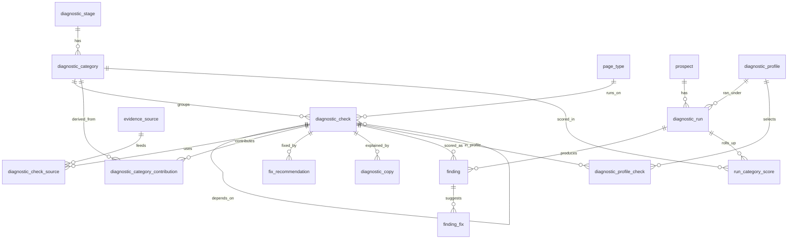

# Prospectos — policy

A diagnostic that takes a URL, scores the storefront against a
DB-driven rubric, computes annual revenue uplift, and surfaces a report
+ specific fix recommendations. Used from the RRE admin (authenticated)
**and** from the GroLabs landing page (anonymous), backed by the same
runner.

This doc covers v1 (shipped: schema + catalog UI), v2 (shipped: public
API + Playwright + test vocab + revenue formula), v3 (shipped: vertical
auto-detection + sample auto-discovery + CWV + returns + locale-aware
tests + brand/synonym DOM extraction), and v4 (shipped: page-centric model).
**v5 (in progress): the atomic-rubric refactor — see §13.** The roadmap is at
the bottom.

---

## 1. The funnel model

Every check ties to one funnel stage and one revenue lever:

| Stage | What it covers | Example checks |
|---|---|---|
| **Discovery** | How visitors arrive: SEO, AI/LLM citations, social, page speed | Product JSON-LD complete, llms.txt + robots policy, sitemap hygiene, Core Web Vitals, OG cards |
| **On-site nav** | Internal search + category browse + faceting | Search engine identified, typo tolerance, synonym coverage, empty-state behavior, brand-query relevance, faceting depth |
| **PDP evaluation** | Does the product page convert a visitor → add-to-cart | Image count + alt quality, variant clarity, structured attribute table, reviews, cross-sell, stock + delivery clarity |
| **Returns risk** | Attribute completeness as a leading indicator of "didn't match" returns | Per-vertical expected-attribute coverage |

A run produces a 0–100 score per stage (weighted average of its checks)
and an overall score (average of stages).

---

## 2. Two-service architecture

```
RRE (Next.js, this repo)              ASE (Python, grolabsai/grolabs-ASE — formerly GLPIM)
─────────────────────────────           ───────────────────────────────────
• Orchestrator + rubric                 • POST /tools/pdp-signals
• Public API + report viewer            • POST /tools/site-signals
• Playwright probe (browser)            • (existing) POST /tools/pdp-scan
• PSI (Core Web Vitals)                   for AEO scoring — separate use
• Revenue formula
• Persistence (Supabase)
```

ASE owns the static-HTML extraction primitives (selector fallbacks,
JSON-LD flattening, alt-text filtering, platform + engine fingerprints).
RRE calls them, runs its own browser + CWV probes alongside, and
scores everything against the catalog in DB.

**Why split:** the signal extraction is brittle and hand-tested
(WC/Shopify/Magento quirks); RRE doesn't want to maintain a second
parser. Scoring lives in RRE because the rubric is editable per
instance via the UI — coupling the two services to one rubric would
prevent that.

---

## 3. Schema — two layers

### Catalog (rarely changes; editable via UI)

| Table | Purpose |
|---|---|
| `diagnostic_stage` | Funnel stages (Discovery, On-site nav, PDP, Returns) |
| `vertical` | Business verticals (pet_retail, fashion, electronics, …) + `detection_keywords[]` |
| `diagnostic_check` | The catalog of checks. `check_code` is the stable identifier the scorer registry keys on |
| `fix_recommendation` | Markdown fixes per check, with `trigger_condition` JSONB (`result_status`, `score_below`, `score_at_or_below`) |
| `vertical_benchmark` | Per-vertical inputs for the revenue formula (`baseline_cr`, `stage_share`, `delta_rate`, `default_aov_usd`). Specificity: check > stage > vertical |
| `vertical_synonym_pair` | Per-vertical synonym terms for the Playwright probe's synonym test |
| `vertical_test_query` | Canonical category / empty_state / brand queries per vertical+locale |
| `vertical_expected_attribute` | Per-vertical "well-merchandised PDP should have these" list — powers the returns scorer |

All catalog tables use the **prompt_template pattern**: per-instance
rows with instance-0 fallthrough on SELECT. GroLabs ships the canonical
rubric in instance 0; customers override or extend without touching it.

### Run layer (written per diagnostic)

| Table | Purpose |
|---|---|
| `prospect` | The diagnosed site. Unique by `(instance_id, url)` for authenticated; unique on `url` alone when `instance_id IS NULL` |
| `diagnostic_run` | One run = one snapshot. UUID primary key is the share token for anon access |
| `run_sample` | Which homepage / PDP / category / search queries we actually hit (reproducibility) |
| `finding` | One row per check per run with score + result_status + evidence (jsonb) + per-finding uplift |
| `finding_fix` | Materialized fixes per finding (derived from each fix's trigger_condition) |
| `diagnostic_rate_limit` | Per-IP request log — only accessible via the `record_diagnostic_request` RPC |

---

## 4. RLS + access model

| Caller | Catalog reads | Run reads | Run writes |
|---|---|---|---|
| `authenticated` (RRE admin) | Own instance ∪ instance 0 | Own instance | Own instance |
| `anon` (landing page) | Instance 0 only | Anonymous runs (`instance_id IS NULL`) by uuid token | Via service-role through `/api/v1/diagnostic/runs` |

Anonymous writes never go through Supabase from the browser — the
public API route uses the service-role client and is gated by the
`record_diagnostic_request` SECURITY DEFINER RPC (5 req/hour, 20/day
per IP). The unguessable `run_id` UUID is the only auth token a public
report viewer needs.

---

## 5. Runner flow

`src/lib/diagnostic/runner.ts` — both authenticated and anonymous
flows funnel through a single `runDiagnostic(opts)`. Sequence:

1. **Pre-flight: `discoverSamples(rootUrl)`**
   - Fetches the homepage once, returns:
     - PDP candidate (featured-block selectors first, then any
       `/product/`-style link)
     - Category candidate (`/category/`, `/collections/`, …)
     - Homepage snippet (title + H1/H2 + JSON-LD product types) for
       the vertical classifier
2. **Vertical classification** (when not supplied)
   - Layer 1: keyword scorer using `vertical.detection_keywords[]`.
     Picks a winner when top score ≥ 3 and beats #2 by ≥ 25%.
   - Layer 2: Claude Haiku tie-breaker on the homepage snippet. Only
     fires when keywords are inconclusive AND `ANTHROPIC_API_KEY` is set.
   - Result persisted on `prospect.vertical_id`.
3. **Locale detection** — Spanish keyword count from the homepage text.
4. **Vocabulary + benchmark + expected-attribute load** scoped to the
   resolved vertical (with template-instance 0 fallthrough).
5. **Probes run in parallel:**
   - `probeSiteWide(rootUrl)` — HTTP fetches for llms.txt, robots.txt,
     sitemap.xml (8s timeout, AI-bot policy detection)
   - ASE `/tools/pdp-signals` — PDP signals
   - ASE `/tools/site-signals` — platform + engine fingerprint + facets
   - `runBrowserProbe(...)` — Playwright (only when
     `PROSPECTOS_BROWSER_PROBE_ENABLED=1`)
   - `fetchCoreWebVitals(pdpUrl)` — Google PSI (only when
     `PROSPECTOS_PSI_ENABLED !== "0"`)
6. **Score each active check** via the `SCORERS` registry. Checks with
   no scorer get `result_status='na'`. Per-finding uplift computed inline
   using `resolveFactors` + `computeFindingUplift`.
7. **Materialize `finding_fix`** by evaluating each fix's
   `trigger_condition` against the finding's status/score.
8. **Rollup**: weighted stage scores → overall → maturity tier
   (`low < 45 ≤ medium < 75 ≤ high`); sum uplift → run total.
9. **Update prospect**: `platform_detected`, `engine_detected`
   (network fingerprint from browser probe wins over static-HTML guess).

---

## 6. Where test inputs come from (the demo answer)

This question got asked early; this is the locked answer.

| Probe needs | Source |
|---|---|
| **Typo tolerance** test words | **Discovered live** from the prospect's homepage — product names extracted from `Product` JSON-LD (with heuristic fallback to `.product-card__title` text). Mutated by transposing two adjacent chars in the middle of the longest word. No DB lookup. |
| **Synonym** pairs | `vertical_synonym_pair` rows scoped to the prospect's detected vertical + locale. Editable at `/prospects/rubric/vocabulary`. Template seeds cover pet + fashion (ES+EN). |
| **Empty-state** queries | `vertical_test_query` rows where `intent='empty_state'`. Locale-filtered. Same editor screen. |
| **Brand-relevance** brand | First `Brand` value from homepage `Product` JSON-LD. Falls back to first text inside a brand-named element. No DB lookup. |
| **Returns-risk** expected attrs | `vertical_expected_attribute` rows per vertical + locale (e.g. pet_retail: weight, ingredients, life_stage, breed_size, brand). Scorer matches `match_keywords[]` against PDP description + schema fields. |

Customers can add/edit/disable rows per instance; the template
instance's rows act as the global fallback.

---

## 7. Revenue formula

Per finding:

```
uplift = traffic × stage_share × baseline_cr × aov × delta_rate × (1 − score/100)
```

Factor resolution (most specific wins):

```
stage_share, baseline_cr, delta_rate:
  vertical_benchmark by (vertical, check)
  ↓ fallback
  vertical_benchmark by (vertical, stage)
  ↓ fallback
  vertical_benchmark by (vertical, NULL, NULL)
  ↓ fallback (delta_rate only)
  diagnostic_check.default_delta_rate

aov:        prospect.est_aov_usd → vertical_benchmark.default_aov_usd
traffic:    prospect.est_annual_traffic → null (uplift unscored)
```

NA / error findings contribute 0. Passing checks (score=100) contribute
0 (no headroom). Sum across findings → run total; confidence is the
lowest tier across contributing findings.

---

## 8. Scoring policies (per check)

The full set lives in `src/lib/diagnostic/scorers.ts`. Highlights:

- **Product JSON-LD complete** — 5 required fields = 80pts, 3 bonus
  fields = 20pts. Pass ≥ 90, partial 60–89, fail < 60.
- **llms.txt / AI policy** — llms.txt present (60pts) + robots AI-bot
  policy: allow (40), unmentioned (10), block (0).
- **Typo tolerance** — % of mutated product-name queries returning
  results (uses 1-2 discovered names). Pass ≥ 99%, partial ≥ 50%.
- **Synonyms** — 50pts both terms return, +30pts overlap > 0, +20pts
  overlap ≥ 3 (strong coverage).
- **Empty state** — graceful (no hard error, no results, 50pts) +
  fallback content present (50pts).
- **Brand relevance** — results came back (50pts) + brand name in top
  3 results (50pts). Null brand_in_top → half credit if results present.
- **Returns attribute completeness** — weighted coverage of
  `vertical_expected_attribute` keywords against PDP text + schema
  fields. Pass ≥ 80%, partial ≥ 50%.

---

## 9. Public API surface

For the landing-page diagnostic widget and third-party callers:

| Method | Path | Purpose |
|---|---|---|
| POST | `/api/v1/diagnostic/runs` | Start an anonymous run. Returns `{ run_id, report_url }` |
| GET | `/api/v1/diagnostic/runs/{runId}` | Fetch JSON report (anonymous runs only) |
| GET | `/{locale}/diagnostics/{runId}` | Public HTML report — embed-friendly, no auth |

Rate-limited via `record_diagnostic_request(p_ip, 5, 20)`. CORS open
(`*`). Synchronous execution today (~5–60s per run depending on which
probes are enabled).

---

## 10. Feature flags + env

| Env | Purpose | Default |
|---|---|---|
| `ASE_API_URL` | Required for PDP + site signals to score | unset → those scorers degrade to `error` |
| `ANTHROPIC_API_KEY` | Enables Haiku tie-breaker for vertical classification | unset → classifier returns no LLM result |
| `PROSPECTOS_BROWSER_PROBE_ENABLED` | Enables Playwright probe (used together with `BROWSERLESS_HOST` + `BROWSERLESS_TOKEN`) | unset → browser-based scorers report `na` |
| `BROWSERLESS_HOST` | Browserless host without protocol (e.g. `production-sfo.browserless.io`, or `chrome.browserless.io` for enterprise) | required on Vercel for the browser probe to run |
| `BROWSERLESS_TOKEN` | Browserless API token | required on Vercel for the browser probe to run |
| `PROSPECTOS_PSI_ENABLED` | Set to `0` to disable Core Web Vitals fetching | enabled by default |
| `GOOGLE_PSI_API_KEY` | Lifts PSI free-tier throttle | optional |
| `SUPABASE_SERVICE_ROLE_KEY` | Required for the public API + landing-page report | required for anon flow |

---

## 11. Deployment notes for Playwright

**Current production setup: Browserless via CDP.** RRE connects to a
managed Chromium pool by setting two env vars:

- `BROWSERLESS_HOST` — host without protocol (e.g. `production-sfo.browserless.io`,
  `production-lon.browserless.io`, `production-ams.browserless.io`, or
  `chrome.browserless.io` for an enterprise private fleet).
- `BROWSERLESS_TOKEN` — the API token from the Browserless dashboard.

RRE assembles `wss://<host>?token=<token>` at runtime, so region or
fleet swaps are an env-var change, not a code change. The probe uses
`chromium.connectOverCDP(...)` to attach to a pre-warmed browser, so
there's no cold-start launch cost and the Vercel deploy bundle stays
small (no Chromium binary).

**Local dev**: leave both vars unset — the probe falls back to
`chromium.launch()` and uses the locally-installed Chromium
(`npx playwright install chromium`).

**Why not the alternatives**:
- Self-hosted Playwright on Railway/Fly: works, but adds a service
  to monitor for no real upside vs. Browserless.
- `@sparticuz/chromium` on Vercel: strips ~half of Chromium to fit
  the 50MB bundle limit; some sites detect+block the stripped fingerprint.

Until both `PROSPECTOS_BROWSER_PROBE_ENABLED=1` *and*
`BROWSERLESS_WS_URL` are set, **the diagnostic still runs end-to-end** —
browser-based scorers just report `result_status='na'` with reason
`browser_probe_disabled`. Other 12+ scorers all score fine.

---

## 12. Roadmap (not committed)

- **Async runs + progress streaming** — current sync execution blocks
  the request for ~30s when Playwright is on. SSE or polling for the
  landing-page UX.
- **Multi-PDP / multi-category sampling** — currently 1 of each. Sample
  3 and take the median to dodge outliers.
- **Traffic estimation** — auto-pull from SimilarWeb / Semrush rather
  than asking on the form. Paid APIs.
- **Real synonym index comparison** — current scorer measures overlap
  by product name text; could compare by URL or SKU for stronger signal.
- **Engine-specific deep tests** — once we know it's Algolia, probe
  `typoTolerance` config via the search API directly.
- **Vertical-aware fix copy** — `fix_recommendation` is currently
  per-check, locale-neutral. Could split per-vertical for more
  prescriptive recommendations.
- **Screenshot evidence on browser-probe findings** (phase 2) — the
  browser probe runs through Browserless, which can capture
  `page.screenshot()` PNGs alongside the existing assertions. Goal: make
  the report read as "here's what we tried, here's what we found,
  here's a *picture* of it" — empty-state screen, top-3 search
  results, broken faceting, missing variant selector, etc.
  Implementation sketch:
  1. In `browser-probe.ts`, capture `page.screenshot({ fullPage: false })`
     at each evidence moment (post-search, empty state, faceting panel)
     and return Buffer + intended filename per finding.
  2. Upload to a new `prospect-evidence` Supabase Storage bucket
     (path: `<run_id>/<finding_id>.png`, public-read with the same
     unguessable-uuid pattern as the run-share token).
  3. Persist the storage path on `finding.evidence.screenshot_url`.
  4. Page-detail UI + public report render the image inline. Phase 3
     could add an "annotate / circle the broken area" affordance —
     either manual (canvas overlay in the report) or AI-assisted
     (Claude vision pass that highlights the failure region).
  Cost: 4 screenshots × ~150KB = ~600KB per run. Browserless free
  tier covers screenshots. Supabase Storage at this volume is free.
- **Visual categorization of checks** (next iteration, user feedback
  2026-05-27) — every check should carry a category, an icon (Lucide,
  via the existing `<Icon>` wrapper — same family used everywhere
  else in RRE), and an accent color so the user can scan a report
  and immediately know what kind of problem each row is about.
  Concretely: add `category` + `icon_name` columns on
  `diagnostic_check` (FK to a small `check_category` lookup table with
  name + Lucide icon name + color); render the icon + chip alongside
  the check name in the run detail, page detail, comparison table,
  and search-tests card. Locked-in mapping (Lucide names):
  * `internal_search` — `Search` — sky blue — typo/synonym/empty-state/brand relevance/search engine ID
  * `seo_aeo` — `Globe` — purple — llms.txt, sitemap, canonical, OG cards, Product JSON-LD
  * `data_completeness` — `ListChecks` — orange — attribute table, returns-risk attribute coverage
  * `page_performance` — `Gauge` — yellow — Core Web Vitals
  * `pdp_quality` — `Package` — teal — image count, variant clarity, cross-sell, reviews, stock/delivery
  * `returns_risk` — `Undo2` — coral — per-vertical expected attributes
  * `site_trust_signals` — `ShieldCheck` — green — placeholder for future checks (payment trust, return policy, security badges, ratings/reviews)
  * `authentication` — `LogIn` — slate — **new check needed**: detects when
    a site forces email+password auth before browsing or buying.
    Scored as a friction signal (sites that gate browsing behind auth
    lose conversion). Icon picked because it directly says "this test is
    about being forced to log in." Backup options: `KeyRound`,
    `UserLock`, `LockKeyhole`.
  Synchronize the color palette with the GroLabs landing-page styleguide
  before locking in — that's the source of truth for our palette.
- **Cut over legacy on_site_nav scorers to entry-based testing** —
  once `search_test_entry` coverage is good across verticals, retire
  `on_site_nav.typo_tolerance` / `synonyms` / `empty_state` /
  `relevance_brand` as standalone scorers. They become summaries
  derived from the entry results (e.g. "typo tolerance: X/Y entries
  returned results for their typo variants").
- **Surface the entry-based Search Tests card on page detail too** —
  currently only the run detail renders it. Page detail should also
  show entries that target the homepage (where the search box lives).

---

## 13. v5 — Atomic rubric (current model)

v5 refactors the rubric to an **atomic** model. The **seed migrations are the
source of truth for the 55 checks + weights** (DB-as-truth, Constitution
Art. 10): `supabase/migrations/20260605000001_prospectos_v5_atomic_rubric.sql`
(schema) + `…_seed.sql`. Detailed working notes + the per-stage weighted tables
live in `prospectos.draft.md`.

**Principles (locked):**

- **Atomic unit** — one `diagnostic_check` (`check_code`) → one `finding` per
  run → one `fix` → one progress series. Hierarchy **Stage → Category(scored) →
  Page → Item**.
- **Credit-from-zero** — scores accrue earned credit to a weighted full
  potential (item weights sum to 100 per stage); never start-at-100-and-deduct.
- **Dependencies** — `depends_on_check_id`; an unmet prerequisite scores the
  dependent `0` (`blocked`), distinct from `na` (excluded from the average).
- **Measure / explain / fix** — `diagnostic_check` measures; `diagnostic_copy`
  (localized) explains (label / summary / grading_note); `fix_recommendation`
  remediates. `check_code`s never reach the report.
- **Bridge, not unify** — `diagnostic_*` stays independent of `funnel_*`; FKs
  deferred to a later bridge migration.

**Schema (additive, bridge mode).** New: `diagnostic_category`, `page_type`,
`evidence_source`, `diagnostic_check_source`, `diagnostic_category_contribution`
(derived `returns_risk`), `diagnostic_copy`, `diagnostic_profile(+_check)`,
`run_category_score`. New `diagnostic_check` columns: `diagnostic_category_id`,
`page_type_id`, `depends_on_check_id`, `metric_kind`, `scoring_rubric`,
`capability_tier`, `finding_class`, `revenue_lever_kind`. Plus
`diagnostic_run.profile_id` and `finding_status += 'blocked'`.



**Status:** migrations **APPLIED to live** (project `ixbbhwtpnebrhquunege`,
2026-06-06) via Supabase MCP — `20260605000005` (schema) + a follow-up widen of
`diagnostic_check.weight` `numeric(4,3)→(6,3)` (folded into the 000005 file; the
legacy column was too narrow for v5 integer point-weights) + `20260605000006`
(seed). Verified: 9 new tables, `finding_status += 'blocked'`, 8 new
`diagnostic_check` columns, 9 categories + 55 checks at instance 0, 20 dependency
edges, 55 primary evidence sources, 3 returns-risk contributions, the
`anonymous_landing_audit` profile (55 members, cart/checkout excluded), 3 example
copy rows.

**BRIDGE decision:** the 55 v5 checks are seeded **`is_active = false`** so the
live legacy widget (selects `diagnostic_check WHERE is_active = true`) ignores
them — the running landing widget stays at its **18 active** instance-0 checks.
The v5 profile-driven runner loads the new checks via `diagnostic_profile_check`,
not `is_active`. Flip to active only at the legacy **cutover** (a later prompt),
once the per-check scorers exist.

**API routing (Prompt 6):** `POST /api/v1/diagnostic/runs` now accepts an
optional `"version": "v5"` body param (or `PROSPECTOS_V5_ENABLED=1` env flag).
When present, the route runs `runV5Diagnostic` (`src/lib/diagnostic/v5/run.ts`)
in addition to the legacy runner — both execute, the response includes the legacy
fields unchanged plus a top-level `"v5": { stages, categories, profile, run_id }`
extension. Rate-limit check happens before either runner is invoked. `GET
/diagnostics/[runId]` now also queries `run_category_score` and renders a v5
category-scores section when rows exist (additive, legacy view unchanged).

Open / TBD: per-check `scoring_rubric` JSONB, full es/en `diagnostic_copy`,
weight tuning, and the legacy-check cutover (old checks stay active until then).

**Backend build = 6 prompts (COMPLETE):**
1. ✅ **DONE** — apply + verify the v5 migrations on **live** (branching is
   broken; applied directly via MCP, see Status above); regenerated types.
2. ✅ **DONE** — atomic check loader + scorer registry.
3. ✅ **DONE** — scoring engine: dependency-ordered, credit-from-zero,
   category/stage rollup, `persistScoredRun`.
4. ✅ **DONE** — PDP-first navigation + page discovery (engine-ID; missing pages → na).
5. ✅ **DONE** — fetch-based scorers (`seo.*`, `aeo.*`) for real end-to-end signal.
6. ✅ **DONE** — public API + `diagnostic_copy` rendering (profile-driven run,
   category scores). Branch: `feat/prospectos-v5-api`.

**v5 backend complete (Prompts 1–6).** The landing widget can be unhidden against
the v5 contract pending real scorer coverage for `perf.*`, `search.*`, `pdp.*`,
and `auth.*` (currently return `na` stubs). Follow-ons: ASE scorers,
browser/PSI scorers, then the legacy cutover.
