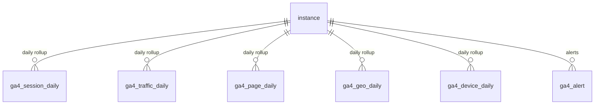

# Data model — Analytics (GA4)

The [[GA4]] analytics tables. Each daily rollup is scoped to an [[Instance]] with
a PK of `instance_id` + `date` + its dimensions; `ga4_alert` tracks an alert
lifecycle (`firing → acknowledged → cleared`). There are no FKs between the
rollup tables — they all hang off the instance. The OAuth refresh token lives in
[[Supabase Vault]].

> Table-level only — relationships are derived from `state/schema.md`; FK
> directions are indicative, not column-exact.

