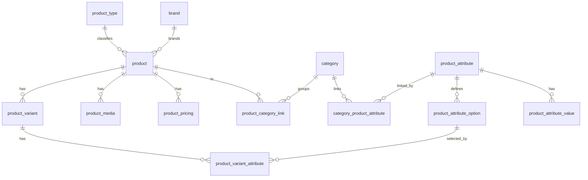

# Data model — Catalog

The [[Catalog]] tables and their relationships. A [[Product]] belongs to a
`product_type` and a `brand`, links to [[Category|categories]], and has
[[Product variant|variants]], media, and pricing. An [[Attribute]] is defined
once and linked from a category through `category_product_attribute` (which
carries the `is_variant_axis` flag); a variant selects one
`product_attribute_option` per [[Variant axis]].

> Table-level only — relationships are derived from `state/schema.md`; FK
> directions are indicative, not column-exact. Translation tables are omitted
> for legibility.

