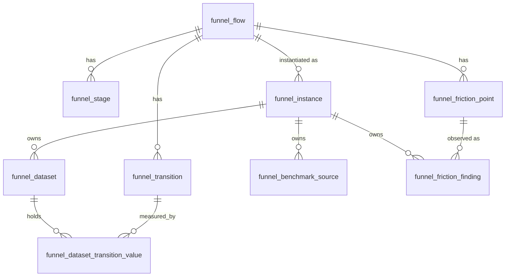

# Data model — Funnel

The [[Funnel]] tables split into a shared definition layer and a per-instance
layer. A `funnel_flow` has stages, transitions, and [[Friction point|friction
points]]; a [[Funnel instance]] binds a flow to one [[Instance]] and owns its
datasets, benchmark sources, and friction findings. Per-instance tables derive
`instance_id` by trigger from the parent `funnel_instance`.

> Table-level only — relationships are derived from `state/schema.md`; FK
> directions are indicative, not column-exact.

