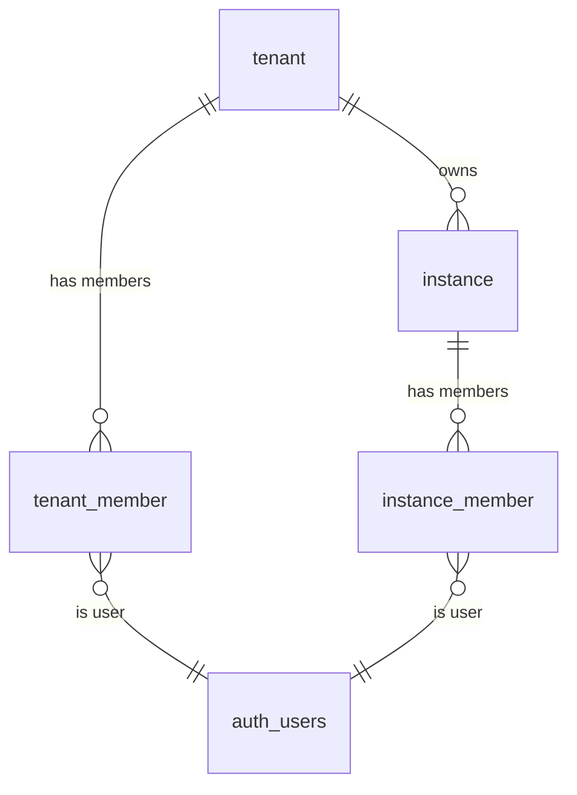

# Data model — Identity & tenancy

The four identity tables and their relationships. A [[Tenant]] owns one or more
[[Instance|instances]] and has its own members; each instance also has members.
The tenancy/[[Row-Level Security|RLS]] boundary column is `instance_id`. A
trigger requires an active `tenant_member` before any `instance_member` insert.

> Table-level only — relationships are derived from `state/schema.md`; FK
> directions are indicative, not column-exact. `auth_users` is Supabase's
> `auth.users`, shown as a referenced table.

