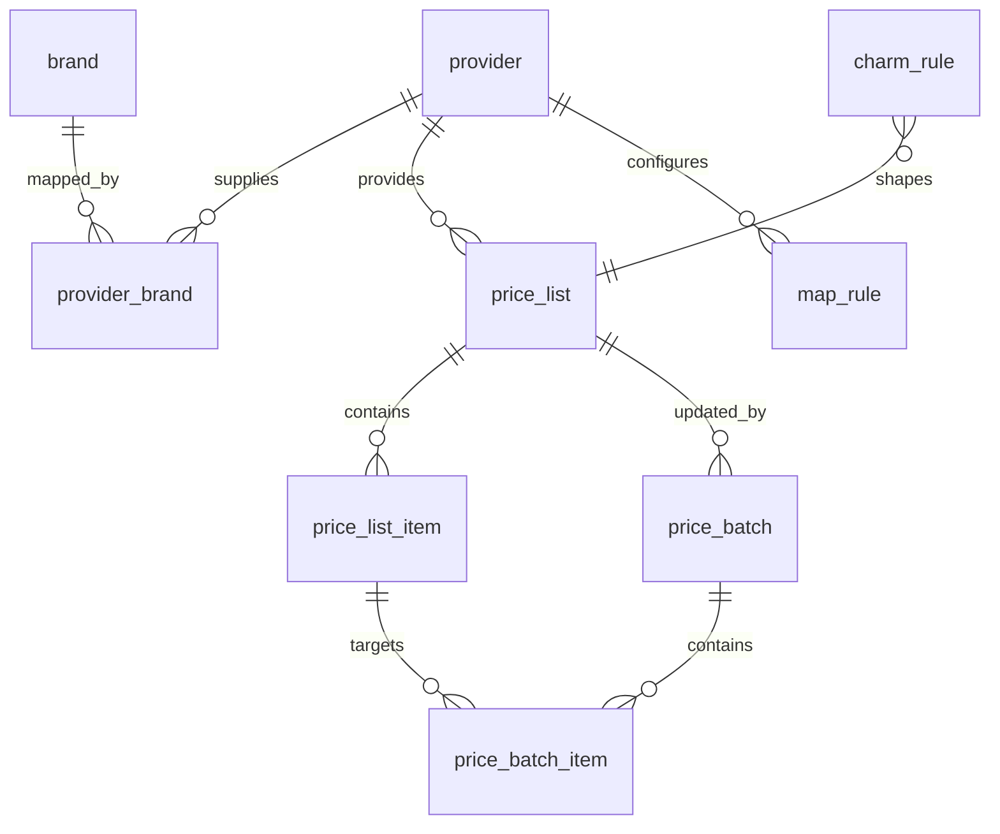

# Data model — Pricing

The GroLabs-native [[Pricing]] tables and their relationships. A [[Provider]]
supplies brands and price lists; [[Map rule|map rules]] translate provider
columns into `price_list_item` rows. A [[Price batch]] applies changes to a
[[Price list]] and carries its own syncing state, while [[Charm rule|charm
rules]] shape final price endings.

> Table-level only — relationships are derived from `state/schema.md`; FK
> directions are indicative, not column-exact. `brand` is a catalog table,
> referenced here by `provider_brand`.

