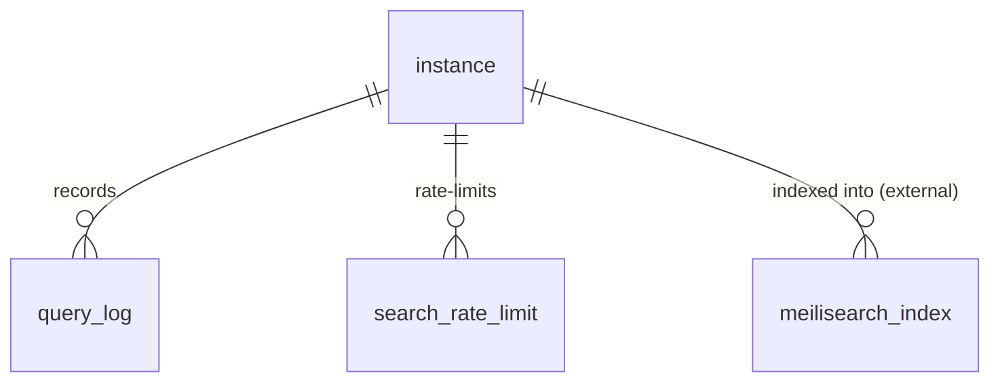

# Data model — Search

The [[Search Engine]] keeps very little in Postgres: a `query_log` and a
`search_rate_limit`, both scoped to the [[Instance]], plus `storefront_domains`
on the instance row. The actual index lives in [[Meilisearch]] as a per-instance
`inst_<instance_id>` index, not a Postgres table.

> Table-level only — relationships are derived from `state/schema.md`; FK
> directions are indicative. The Meilisearch index is shown as an external store,
> not a Postgres table.

