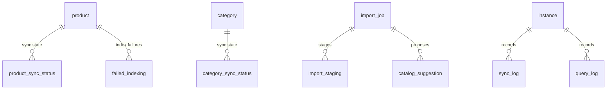

# Data model — Sync & Import

The [[Sync]] status tables and the [[Import job|import]] pull tables. Sync status
is tracked per [[Product]] and [[Category]] alongside a `sync_log`;
`failed_indexing` and `query_log` record search-side outcomes. An import job
stages raw [[WooCommerce]] rows and emits catalog suggestions.

> Table-level only — relationships are derived from `state/schema.md`; FK
> directions are indicative, not column-exact. `product`/`category` are catalog
> tables, referenced here as the things whose sync state is tracked.

