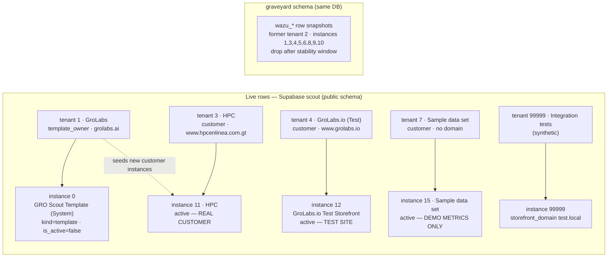
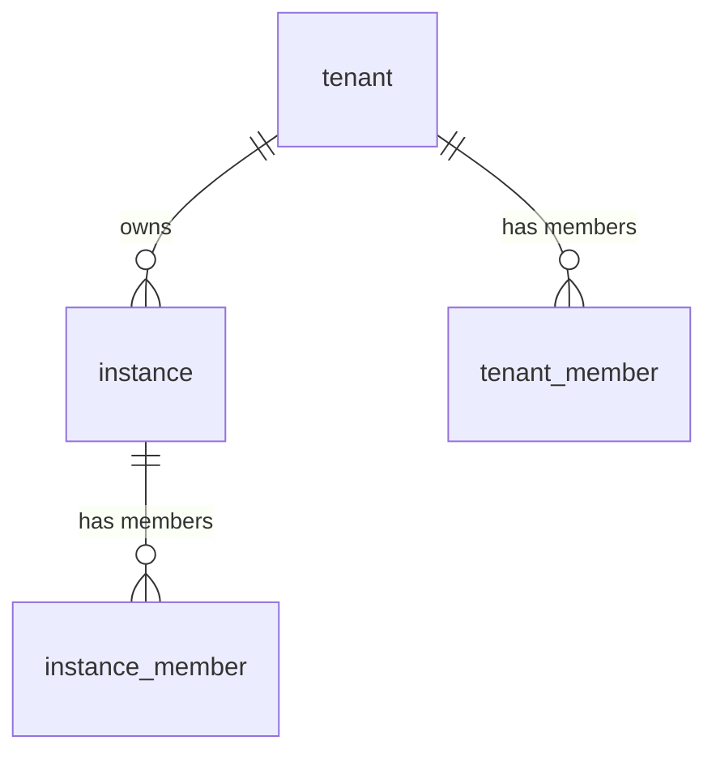

# GroLabs — Instances & tenants (canonical map)

**Ratified & applied:** 2026-07-04, production Supabase DB — project `scout`
(`ixbbhwtpnebrhquunege`).
**Method:** the map below was ratified (MVP testing plan, Task 1) and applied
to the live DB the same day; the live DB remains authoritative (Constitution
Article 10) — this doc records what each row *is for*, which the DB cannot say.

> Table shapes, columns, and RLS for `tenant` / `tenant_member` / `instance` /
> `instance_member` live in [`schema.md`](schema.md). This doc is the row-level
> inventory only.

---

## Map

## Summary table

| Tenant | Kind | Domain | Instance | Instance name | Active | Purpose |
|---|---|---|---|---|---|---|
| 1 · GroLabs | `template_owner` | `grolabs.ai` | **0** | GRO Scout Template (System) | no | **TEMPLATE** — seeds new customer instances |
| 3 · HPC | `customer` | `www.hpcenlinea.com.gt` | **11** | HPC | yes | **REAL CUSTOMER** |
| 4 · GroLabs.io (Test) | `customer` | `www.grolabs.io` | **12** | GroLabs.io Test Storefront | yes | **TEST SITE** — live WordPress |
| 4 · GroLabs.io (Test) | `customer` | `www.grolabs.io` | **13** | SDK Test (TestEcomSite) | yes | **SDK / PROPRIETARY-TRACK TEST** — BYO API + JS SDK |
| 7 · Sample data set | `customer` | — | **15** | Sample data set | yes | **DEMO** — seeded metric_daily only, no raw events |
| 99999 · Integration tests (synthetic) | — | — | **99999** | Integration tests (synthetic) | — | **VITEST FIXTURE** — never repurpose |

## Tenant 1 — GroLabs → instance 0 (template)

- `tenant.kind = template_owner`, `domain = grolabs.ai`.
- Instance 0 **"GRO Scout Template (System)"**: `kind = template`,
  `is_active = false`. It exists to be copied when seeding a new customer
  instance; it is never a customer-facing surface and never appears active.
- Owner account: `tuncho@grolabs.ai`.
- Being the `template_owner` tenant is also what makes a user GroLabs staff
  for the admin gate ([`user-management.md`](../policy/user-management.md),
  SEC-001 in CLAUDE.md §17).

### The `instance_id = 0` falsy trap

Instance 0 is a real, meaningful, queryable id — and JavaScript treats `0` as
falsy. `if (!instanceId)` silently misbehaves for any user on the template
instance. **Always use null checks** — `instanceId == null` (covers `null` and
`undefined`), never truthiness, never `instanceId || fallback` (collapses 0 to
the fallback). Full rule with examples: `CLAUDE.md` §2 "Instance ID checking".

## Tenant 3 — HPC → instance 11 (real customer)

- `tenant.kind = customer`, `domain = www.hpcenlinea.com.gt`.
- Instance 11 **"HPC"**, active. This is a **real customer** — do not use it
  for testing, demos, or throwaway data.
- Members: `tgranados@hpc.com.gt` (owner), `edullerena1603@gmail.com` (admin).

## Tenant 4 — GroLabs.io (Test) → instance 12 (test site)

- `tenant.kind = customer`, `domain = www.grolabs.io`.
- Instance 12 **"GroLabs.io Test Storefront"**, active.
  `storefront_domains = {www.grolabs.io, grolabs.io}` — the live WordPress
  storefront ONLY, and sole claimer of both; storefront-domain → instance
  resolution (search proxy, events) depends on that uniqueness. The SDK/BYO
  test surface that briefly shared this instance was split out to
  **instance 13** on 2026-07-18 (catalog, index docs, and SDK-era
  events/orders all moved; the WC-imported catalog and `inst_12` index carry
  only real WordPress products now).
- Instance 12 also carries the **synthetic demo dataset** (2026-05-01→07-17,
  ~14.7k events / 443 orders) seeded 2026-07-18 for dashboard timelines —
  markers: `origin = 'demo.grolabs.io'`, synthetic order ids `8xxxxx`.
  Filter on that origin to separate demo history from real plugin traffic.
- Owner: `tunchog@gmail.com` — a **pure-Gmail Google SSO test account** (no
  GroLabs/HPC domain), which also **owns the GA4 property for grolabs.io**.
- Purpose: a **live WordPress install** used to exercise the Meilisearch
  search/events plugins end-to-end, and the target for future Playwright E2E
  runs (MVP testing plan chose Playwright over Browserless for this).
- **Analytics on 12 are real-plugin-only since 2026-07-18**: the 2.5-month
  synthetic analytics seed (origin `demo.grolabs.io`, 2026-07-18 morning) was
  wiped the same day and `metric_daily` rebuilt from raw sources; longitudinal
  demo data now lives on instance 15, not here.

## Tenant 4 — instance 13 (SDK / proprietary-track test)

- **"SDK Test (TestEcomSite)"**, active, same tenant as instance 12; split
  out 2026-07-18 so WordPress-plugin testing and BYO API/SDK testing stop
  sharing one instance (they had polluted each other's catalog and index —
  duplicate docs, mixed dashboards).
- `storefront_domains = {demo.grolabs.io, testecomsite.vercel.app,
  localhost, 127.0.0.1}` — dev/demo origins live HERE, never on 12.
  `default_currency = USD` (TestEcomSite presents USD).
- Catalog: the 6 synthetic products (ids 1001–1006), ingested through the
  public BYO `/catalog/documents` endpoint into the `inst_13` index; a BYO
  write key is issued (rotate it from Configuration → External platform to
  take ownership of the plaintext).
- Carries the SDK-era analytics history (2026-07-04..06) moved from 12.
- Doubles as the working prototype of the **merchant sandbox instance**
  model (mode-by-credential, dev origins allowed) from the external-platform
  design discussion.

## Tenant 7 — Sample data set → instance 15 (demo metrics)

- `tenant.kind = customer`, no domain; instance 15 **"Sample data set"**,
  active, timezone `America/Guatemala`, currency USD.
- Created + seeded **2026-07-18** to demo the **Signals** dashboard: 12 closed
  Mon–Sun weeks + the then-current partial week (2026-04-20 → 07-17) of
  `metric_daily` rows across 12 metric keys, with a curated narrative —
  sessions improving, **conversion declining via slow drift** (every WoW drop
  under 5%, CUSUM + limit signals fire), no-result rate improving, CTR stable.
- **Seeded directly into `metric_daily` — there are NO raw events behind it.**
  Consequences: the Overview users donut and Carts tab are empty here, and any
  `refresh_metric_daily(day)` touching a seeded day erases that day for this
  instance permanently (the function rebuilds ALL instances per day from raw
  sources). The nightly cron refreshes only the trailing 3 days, so the closed
  weeks persist; trailing partial-week days evaporate naturally.
- Member: `tunchog@gmail.com` (owner). Reached via the instance switcher.

## Tenant/instance 99999 — Integration tests (synthetic)

- Reserved exclusively for the **vitest integration suite**;
  `storefront_domain = test.local`.
- The suite asserts against this id. **Never repurpose it** for real, demo,
  or manual-test data — doing so corrupts the suite.

## Deleted: Wazú (former tenant 2)

- Tenant 2 "Wazú" (instances **1, 3, 4, 5, 6, 8, 9, 10**; users
  `tuncho@wazu.test` / `tuncho@wazu.gt`) was **deleted on 2026-07-04**
  (MVP testing plan, Task 1).
- A row snapshot of everything deleted lives in the **`graveyard.wazu_*`**
  schema in the same DB. It is a recovery net, not live data — RLS and the
  app never read it. **Drop after a stability window**; until then, ids
  1–10 (minus 0) should be treated as burned, not reused.
- Older docs that still say "Wazú owns instances 1 and 3"
  ([`schema.md`](schema.md) seed notes, [`tenant-model.md`](../policy/tenant-model.md))
  describe pre-deletion history — this doc supersedes them for current rows.

## Related GroLabs modules

- **M1 Identity / M2 Identity Admin UI** — the tenant/instance layer these
  rows live in (`src/lib/instance.ts`, `src/lib/actions/instance.ts`).
- **M9 Search Engine** — per-instance Meilisearch indexes `inst_<instance_id>`;
  storefront-domain resolution for instance 12.
- **M12 Analytics** — the GA4 property for grolabs.io is owned by the
  instance-12 test account (`tunchog@gmail.com`).
- **Admin surface** (`admin.grolabs.ai`) — customer creation flows write new
  `tenant` + `instance` rows seeded from instance 0
  ([`user-management.md`](../policy/user-management.md)).

## External apps & credentials

| System | What | Credential / account |
|---|---|---|
| Supabase | Production DB, project `scout` (`ixbbhwtpnebrhquunege`) — live `public` rows + `graveyard` schema | Supabase MCP / dashboard access |
| Google (SSO + GA4) | Instance-12 owner login and the GA4 property for grolabs.io | `tunchog@gmail.com` (pure-Gmail Google SSO test account) |
| WordPress | Live test storefront at www.grolabs.io running the GroLabs plugins | Managed by GroLabs (test tenant) |

## Update protocol

Any change to tenant/instance rows in the production DB (new customer, deleted
tenant, domain claim change, graveyard drop) must be reflected here in the same
PR, per the [state-docs update protocol](README.md).
