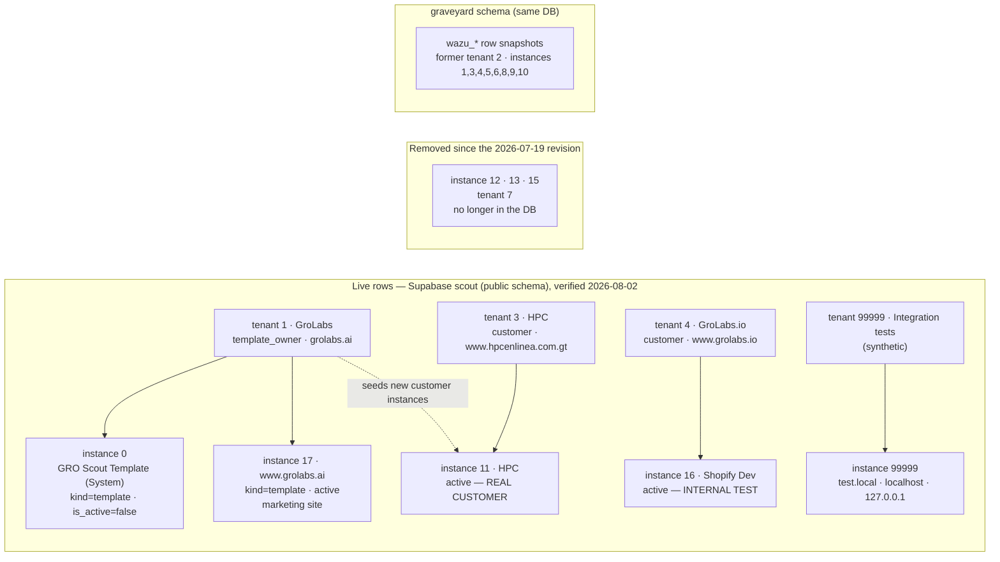

# GroLabs — Instances & tenants (canonical map)

**Re-verified against the live DB:** 2026-08-02, production Supabase project
`scout` (`ixbbhwtpnebrhquunege`), read with the service-role key (bypasses RLS,
so this is the complete row set — `select count(*) from instance` = **5**).

**Method:** every row, member and column value below was read from the live
database, not carried forward from the previous revision. Where this doc and
the live DB disagreed, the **live DB won** (Constitution Article 10) and the
discrepancy is recorded under [Open questions](#open-questions).

> Table shapes, columns, and RLS for `tenant` / `tenant_member` / `instance` /
> `instance_member` live in [`schema.md`](schema.md). This doc is the row-level
> inventory only.

---

## Customer list (who is actually on the platform)

| # | Tenant | Kind | Domain | Instances | Status |
|---|---|---|---|---|---|
| 1 | **GroLabs** | `template_owner` | `grolabs.ai` | 0 (template), 17 (marketing site) | Internal — this is us |
| 3 | **HPC** | `customer` | `www.hpcenlinea.com.gt` | 11 | ✅ **The only real paying-track customer** |
| 4 | **GroLabs.io** | `customer` | `www.grolabs.io` | 16 (Shopify Dev) | Internal — GroLabs-owned test tenant posing as a customer |
| 99999 | Integration tests (synthetic) | `customer` | — | 99999 | Fixture — vitest only, never repurpose |

**Real customers: one — HPC.** Everything else is GroLabs-owned or synthetic.

### People with access (4 auth users total)

| Email | Tenant memberships | Instance memberships | Auth providers | Last sign-in |
|---|---|---|---|---|
| `tuncho@grolabs.ai` | 1 (owner), 4 (admin), 99999 (admin) | 0, 16 *(current)*, 17, 99999 — all owner | email, google | 2026-08-01 |
| `tunchog@gmail.com` | 4 (owner) | — | email, google | 2026-07-19 |
| `tgranados@hpc.com.gt` | 3 (admin) | 11 (owner, current) | email | 2026-06-12 |
| `edullerena1603@gmail.com` | 3 (admin) | 11 (admin, current) | email, google | 2026-06-17 |

Only `tuncho@grolabs.ai` is an active `tenant_member` of tenant 1
(`template_owner`), so **only that account passes `is_grolabs_admin()`** — the
real SEC-001 check, verified present and failing-closed in the live DB on
2026-08-02.

---

## Map

```mermaid
flowchart LR
  subgraph live["Live rows — Supabase scout (public schema), verified 2026-08-02"]
    T1["tenant 1 · GroLabs<br/>template_owner · grolabs.ai"] --> I0["instance 0<br/>GRO Scout Template (System)<br/>kind=template · is_active=false"]
    T1 --> I17["instance 17 · www.grolabs.ai<br/>kind=template · active<br/>marketing site"]
    T3["tenant 3 · HPC<br/>customer · www.hpcenlinea.com.gt"] --> I11["instance 11 · HPC<br/>active — REAL CUSTOMER"]
    T4["tenant 4 · GroLabs.io<br/>customer · www.grolabs.io"] --> I16["instance 16 · Shopify Dev<br/>active — INTERNAL TEST"]
    T9["tenant 99999 · Integration tests<br/>(synthetic)"] --> I9["instance 99999<br/>test.local · localhost · 127.0.0.1"]
  end
  subgraph gone["Removed since the 2026-07-19 revision"]
    X["instance 12 · 13 · 15<br/>tenant 7<br/>no longer in the DB"]
  end
  subgraph graveyard["graveyard schema (same DB)"]
    W["wazu_* row snapshots<br/>former tenant 2 · instances 1,3,4,5,6,8,9,10"]
  end
  T1 -.->|seeds new customer instances| I11
```

## Summary table

| Tenant | Kind | Instance | Name | Active | `store_platform` | `search_provider` | Services on | Purpose |
|---|---|---|---|---|---|---|---|---|
| 1 · GroLabs | `template_owner` | **0** | GRO Scout Template (System) | no | `proprietary` | `algolia` | all 4 | **TEMPLATE** — seeds new customer instances |
| 1 · GroLabs | `template_owner` | **17** | www.grolabs.ai | yes | `proprietary` | `meilisearch` | all 4 | Marketing site analytics — but `kind=template` (see R-7) |
| 3 · HPC | `customer` | **11** | HPC | yes | `medusa` | `algolia` | all 4 | **REAL CUSTOMER** — do not test against |
| 4 · GroLabs.io | `customer` | **16** | Shopify Dev | yes | `shopify` | `meilisearch` | analytics, search | Internal test storefront |
| 99999 · synthetic | `customer` | **99999** | Test: Direct DB/API (synthetic) | yes | `proprietary` | `meilisearch` | all 4 | **VITEST FIXTURE** — never repurpose |

---

## Tenant 1 — GroLabs

`tenant.kind = template_owner`, `domain = grolabs.ai`. Member:
`tuncho@grolabs.ai` (owner). Being an active `tenant_member` of this tenant is
what makes a user GroLabs staff for the admin gate — see
[`user-management.md`](../policy/user-management.md).

### Instance 0 — GRO Scout Template (System)

- `kind = template`, `is_active = false`, `slug = __template__`,
  locale `es-GT`, currency `GTQ`, `domain = grolabs.ai`.
- Exists to be copied when seeding a new customer instance; never a
  customer-facing surface, never active.
- Integrations: **GA4 property `526309917`** connected (OAuth account
  `tuncho@grolabs.ai`, last pull ok 2026-08-02) and **Algolia** app
  `DA6PE4D8GJ`, index `productos`, last verified 2026-04-26 (HTTP 200).
- `search_provider = algolia`, `store_platform = proprietary`.

#### The `instance_id = 0` falsy trap

Instance 0 is a real, meaningful, queryable id — and JavaScript treats `0` as
falsy. `if (!instanceId)` silently misbehaves for any user on the template
instance. **Always use null checks** — `instanceId == null` (covers `null` and
`undefined`), never truthiness, never `instanceId || fallback` (collapses 0 to
the fallback). Full rule with examples: `CLAUDE.md` §2 "Instance ID checking".

### Instance 17 — www.grolabs.ai

- Created **2026-08-01**. `is_active = true`, `slug = www-grolabs-ai`,
  locale `es-GT`, currency `GTQ`, `storefront_domains = []`, `domain = null`.
- **`kind = template`** — this is the second template-kinded instance (R-7).
  It is the GroLabs marketing site, not a template; this is almost certainly
  a mis-set value. See [Open questions](#open-questions).
- GA4 property **`526309917`** — **the same property as instance 0**, connected
  2026-08-01 with OAuth account `tuncho@grolabs.ai`.
- Member: `tuncho@grolabs.ai` (owner, `is_current = false`).

## Tenant 3 — HPC → instance 11 (the real customer)

- `tenant.kind = customer`, `tenant.domain = www.hpcenlinea.com.gt`.
- Instance 11 **"HPC"**, active since 2026-06-11, locale `es-GT`, currency
  `GTQ`, timezone `America/Guatemala`. **This is a real customer — never use it
  for testing, demos, or throwaway data.**
- `store_platform = medusa`, `search_provider = algolia`. All four
  `service_*` flags are on.
- Members: `tgranados@hpc.com.gt` (instance owner) and
  `edullerena1603@gmail.com` (instance admin); both are `admin` at the
  **tenant** level — note there is no tenant-level `owner` for HPC.
- ⚠️ **`storefront_domains = []`** — nothing is claimed. The search plugin
  validates the storefront origin against this array, so search requests from
  the HPC storefront will not resolve to this instance.
- ⚠️ **Algolia credentials last verified 2026-06-11 with `last_http_status:
  403`** (app `JHRVDX111N`, index `prod_hpc`). The stored key was rejected and
  has not been re-verified since.

Both warnings are open launch items — see [`../go-live.md`](../go-live.md).

## Tenant 4 — GroLabs.io → instance 16 (internal test)

- `tenant.kind = customer`, `tenant.domain = www.grolabs.io`. GroLabs-owned,
  posing as a customer to exercise integrations end-to-end.
- Instance 16 **"Shopify Dev"**, created **2026-07-29**, active,
  `slug = grolabs-io`, locale `en-US`, currency `USD`, `domain = grolabs.io`.
- `store_platform = shopify`, `search_provider = meilisearch`.
  `storefront_domains = ["grolabs-dordvapo.myshopify.com"]`.
- **`service_catalog = false`, `service_pricing = false`** — only analytics and
  search are in scope for this instance.
- GA4 property **`548073264`**, connected 2026-08-01 (OAuth
  `tuncho@grolabs.ai`), last pull ok 2026-08-02.
- Members: `tuncho@grolabs.ai` (owner, `is_current = true`) at instance level;
  `tunchog@gmail.com` is tenant owner but holds **no** `instance_member` row.
- ⚠️ Nothing claims `grolabs.io` / `www.grolabs.io` (R-4). This instance
  supersedes the deleted instance 12 as the tenant's test surface, but it is a
  **Shopify** store, not the WordPress storefront the plugin docs assume.

## Tenant/instance 99999 — Integration tests (synthetic)

- Reserved exclusively for the **vitest integration suite**;
  `storefront_domains = {test.local, localhost, 127.0.0.1}`.
- The suite asserts against this id. **Never repurpose it** for real, demo,
  or manual-test data — doing so corrupts the suite.
- Member: `tuncho@grolabs.ai` (owner).

## Removed since the previous revision

**Instances 12, 13, 15 and tenant 7 no longer exist** (R-6). They were present
in this doc's 2026-07-19 revision and are absent from the live DB as of
2026-08-02; no PR recorded their removal, contrary to the update protocol
below. Known references that are now stale:

| Reference | Points at | State |
|---|---|---|
| `playwright-e2e.config.ts` | "grolabs.io → instance 12", `STOREFRONT_URL=https://grolabs.io` | **Broken** — instance gone, domain unclaimed |
| `docs/design/testing-approach.md` | E2E runs "against grolabs.io/instance 12" | Stale |
| Previous R-4 | instance 12 sole claimer of grolabs.io | Superseded by the new R-4 |
| Prior demo narrative | instance 15 seeded `metric_daily` for the Signals dashboard | Data gone with the instance |

## Deleted: Wazú (former tenant 2)

- Tenant 2 "Wazú" (instances **1, 3, 4, 5, 6, 8, 9, 10**; users
  `tuncho@wazu.test` / `tuncho@wazu.gt`) was **deleted on 2026-07-04**
  (MVP testing plan, Task 1).
- A row snapshot lives in the **`graveyard.wazu_*`** schema in the same DB. It
  is a recovery net, not live data — RLS and the app never read it. The schema
  is **not exposed to PostgREST**, so it can only be inspected from the SQL
  editor; this could not be re-verified from the app client on 2026-08-02.
  **Drop after a stability window**; until then, ids 1–10 (minus 0) are burned.
- Older docs that still say "Wazú owns instances 1 and 3"
  ([`schema.md`](schema.md) seed notes, [`tenant-model.md`](../policy/tenant-model.md))
  describe pre-deletion history — this doc supersedes them for current rows.

## Open questions

Raised by the 2026-08-02 re-verification; none are resolved in this PR.

1. **Why were instances 12, 13, 15 and tenant 7 removed, and was it
   intentional?** If intentional, the E2E config and testing docs need to be
   repointed (instance 16 is the natural successor, but it is Shopify rather
   than WordPress). If unintentional, this is data loss worth investigating
   against the `graveyard` schema and backups.
2. **Should instance 17 be `kind = customer` rather than `template`?** (R-7.)
   Two template-kinded instances is new, undocumented, and risks matching any
   code that identifies the template by `kind` instead of `instance_id = 0`.
3. **Should instances 0 and 17 share GA4 property `526309917`?** Two instances
   pulling the same property will double-count that traffic in any
   cross-instance aggregate.
4. **HPC `storefront_domains` is empty and its Algolia key returns 403.** Is
   HPC live on GroLabs search today, or still pre-launch? This determines
   whether these are launch blockers or expected pre-launch state.
5. **Search provider is split** — instances 0 and 11 on `algolia`, 16/17/99999
   on `meilisearch`, while `search-foundations.md` describes Meilisearch as
   the platform engine. Is Algolia on HPC deliberate, or legacy?

## Related GroLabs modules

- **M1 Identity / M2 Identity Admin UI** — the tenant/instance layer these
  rows live in (`src/lib/instance.ts`, `src/lib/actions/instance.ts`).
- **M9 Search Engine** — per-instance Meilisearch indexes `inst_<instance_id>`;
  storefront-domain resolution (currently unclaimed for grolabs.io, R-4).
- **M12 Analytics** — GA4 properties: `526309917` on instances 0 **and** 17,
  `548073264` on instance 16. All connected via `tuncho@grolabs.ai`.
- **Admin surface** (`admin.grolabs.ai`) — customer creation flows write new
  `tenant` + `instance` rows seeded from instance 0
  ([`user-management.md`](../policy/user-management.md)). Gated by
  `is_grolabs_admin()`, which today admits only `tuncho@grolabs.ai`.

## External apps & credentials

| System | What | Credential / account |
|---|---|---|
| Supabase | Production DB, project `scout` (`ixbbhwtpnebrhquunege`) — live `public` rows + `graveyard` schema | Supabase MCP / dashboard access |
| Google (SSO + GA4) | GA4 properties for grolabs.ai (`526309917`) and the Shopify dev store (`548073264`) | Both connected via `tuncho@grolabs.ai` |
| Algolia | Template index `productos` (app `DA6PE4D8GJ`); HPC index `prod_hpc` (app `JHRVDX111N`, **403 since 2026-06-11**) | Stored in `integrations_config` |
| Shopify | Dev store `grolabs-dordvapo.myshopify.com`, claimed by instance 16 | Managed by GroLabs |

## Update protocol

Any change to tenant/instance rows in the production DB (new customer, deleted
tenant, domain claim change, graveyard drop) must be reflected here in the same
PR, per the [state-docs update protocol](README.md).

**This protocol was not followed between 2026-07-19 and 2026-08-02** — three
instances and a tenant were removed and two instances created with no doc
change, which is how the map came to disagree with the database. When in doubt,
re-read the live DB; it is authoritative.
