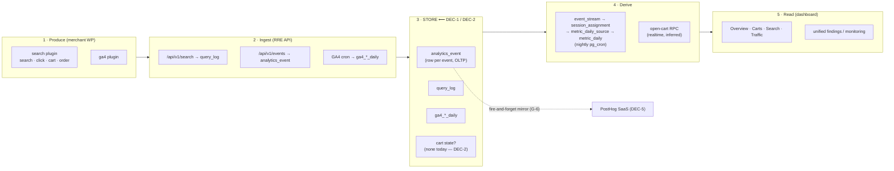
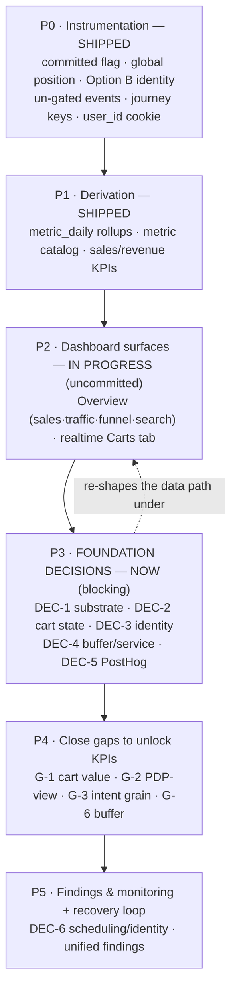

# Open architectural decisions & structural gaps

**Tracking → Measurement → Dashboard pipeline.** This is the planning guide
requested 2026-06-28: the list of things outstanding so a plan can be made
*before* we build further. Nothing here is solved — these are decisions to make
and gaps to close. The pipeline itself (what is already shipped) is documented in
[`event-tracking.md`](../design/event-tracking.md) and
[`conversion-measurement-foundations.md`](../design/conversion-measurement-foundations.md);
this doc is the **open set** only.

> **Headline (DEC-1):** we currently store *every* user event as one row in an
> OLTP Postgres (`analytics_event` in Supabase). That is a transactional
> database being used for an analytics workload. Before we build more dashboard
> and analysis on top of it, we need to decide whether the event store should be
> an analytics-optimised substrate instead. This blocks the efficient shape of
> the dashboard data path. **Owner of the detail: this doc + `event-tracking.md`.**

---

## A. Pipeline at a glance (where the decisions bite)

The **Store** box is the contested one: DEC-1 (what substrate) and DEC-2 (do we
also keep convergent cart *state*, not just events). Everything downstream — the
rollups, the realtime Carts read, cost and latency at scale — inherits whatever
we decide there.

---

## B. Decisions to be MADE

### DEC-1 — Event-store substrate: OLTP Postgres vs analytics-optimised  ⟵ raised 2026-06-28
**Status:** open · **Blocks:** efficient dashboard data path, ingest at scale, cost.
**Tied to:** the tracking module ([`event-tracking.md`](../design/event-tracking.md)).

We record **all** storefront events (clicks, typeahead probes, cart actions) as
one row each in `analytics_event` on a transactional Postgres (Supabase). The
read pattern is the opposite of transactional: group-by, time-bucketing, funnels,
per-`cart_id` folds. OLTP Postgres competes with transactional load, index/table
bloat grows with volume, and per-event analytical reads get expensive. The
[`search-proxy-event-pipeline.md`](../design/search-proxy-event-pipeline.md) already
flags Postgres (≈3–4 round-trips per keystroke) as the scaling ceiling.

Options:
- **A — Keep Postgres rows + nightly rollups (status quo).** One DB, RLS, easy
  joins, already built. Risk: scale, cost, read/write contention at volume.
- **B — Analytics-optimised raw store** (ClickHouse / Timescale columnar / BigQuery /
  DuckDB-over-object-store) for events; keep Postgres for *serving* (rollups +
  cart state). Best query cost/perf at volume; more infra/ops; cross-store joins
  and per-tenant isolation must be designed.
- **C — Managed event platform as the store** (Snowplow / self-host PostHog /
  warehouse). Off-the-shelf pipeline + UI; vendor coupling; the realtime +
  relational-join + tenant concerns from the PostHog discussion (DEC-5) apply.
- **D — Hybrid (recommended starting point):** durable buffer → OLAP store for
  analysis; a thin Postgres serving layer (rollups + current cart state) powers
  realtime/relational dashboard reads.

**Impact on dashboard & analysis:** decides whether dashboards read Postgres
rollups or query an OLAP store; the rollup mechanism (pg_cron batch vs streaming);
whether realtime surfaces (Carts) are feasible cheaply; and total cost at scale.
**Decide before further dashboard build-out.** Subsumes the "extract proxy/ingest
as a separate service" question in DEC-4.

### DEC-2 — Cart state: event-delta inference vs snapshot-on-mutation vs hybrid
**Status:** open · **Blocks:** an *exact* (vs estimated) Carts "Amount"; reliable open/closed status.
Today cart state is **inferred** by folding events (`open = add ∧ ¬order ∧ ¬removal`),
and cart value isn't tracked at all. Options: (A) pure delta (carries value on
every mutation — fragile, lossy, drifts permanently on a dropped event); (B) pure
snapshot (storefront sends full current cart each change — self-healing, exact);
(C) **hybrid (recommended): keep `analytics_event` for signal, add a convergent
cart-state table** (`status/value/quantity/updated_at`, upserted per mutation),
making Amount exact and "closed" an explicit transition. Open sub-questions:
snapshot granularity (total-only vs line items), the "closed" signal (WC order
hook vs inferred), and a stable `cart_id` across the session. Full trade-off in
chat 2026-06-28; ties to DEC-1's serving layer.

### DEC-3 — Identity / cross-device resolution
**Status:** open (Option B, device tier, shipped). `user_id` = anon browser id,
`account_id` = hashed (instance, WC user). Login = merge point; the full
identity-resolution graph (cross-device, anon→known stitching beyond device) is
**deferred**. Decide the target model before journey/LTV analysis is built.

### DEC-4 — Durable event buffer + proxy/ingest service extraction
**Status:** open. Event POSTs are fire-and-forget (see G-6). Design calls for a
durable buffer (pgmq-lean) so events are loss-free enough to feed revenue, and
raises extracting the proxy/ingest as a separate service. Largely **subsumed by
DEC-1** — decide together. Detail:
[`search-proxy-event-pipeline.md`](../design/search-proxy-event-pipeline.md).

### DEC-5 — PostHog: keep mirror / drop it / formalise as store + fix the naming
**Status:** open. `capturePostHog` is an **optional, lossy, partial** server-side
mirror to the PostHog SaaS (no `cart_id`/`value`/`quantity` forwarded; no-op
without `POSTHOG_API_KEY`). Nothing reads it back. Decide: keep as internal
exploration aid, drop the forwarder, or (only if DEC-1 lands on C) promote it.
**Also resolve the "PostHog (product) vs post-hoc store" naming** — the
ambiguity is the root of the 2026-06-28 confusion.

### DEC-6 — Unified findings: monitor scheduling + identity model
**Status:** open (taxonomy + storage decided). Merging prospect rubric + search/cart
events + GA4 into one findings store is decided (3-class taxonomy, `finding` +
`monitor_alert` + `findings_unified` view); **monitor scheduling**, the **identity
model**, and a required amendment to the locked `search-events.md` remain open.
Detail: [`unified-findings-and-monitoring.md`](../design/unified-findings-and-monitoring.md).

---

## C. Structural / instrumentation GAPS (block specific analysis)

| id | Gap | Blocks | Tied to |
|---|---|---|---|
| **G-1** | Cart adds/checkouts emit **no value/quantity** (only `Completed order` does) | exact Carts **Amount** (today AOV-estimated) | DEC-2; spawned plugin task |
| **G-2** | **No PDP-view event** emitted | `click_to_pdp`, `pdp_to_cart` KPIs; the PDP funnel stage | plugin instrumentation |
| **G-3** | No **intent/journey-grain rollups** | `reformulation_*`, `journey_conversion` KPIs | DEC-3; intent_group_id grain |
| **G-4** | Historical `position` is **page-relative** (fixed forward v0.9.0, old rows un-backfillable) | accuracy of Avg click position / MRR over old data | — |
| **G-5** | Sessions/daily-users are **folded from `analytics_event`**, no first-class sessions store | cheap realtime session/user reads at scale | DEC-1 |
| **G-6** | Event ingest is **fire-and-forget** (no durable buffer) | loss-free revenue data | DEC-4 / DEC-1 |

**Recently CLOSED (do not relist):** order revenue → `total_sales`/`orders`/`aov`
shipped (2026-06-27/28); `query_log.user_id` gap closed via `grolabs_bid` cookie
(v0.10.0); `metric_daily` rollups + catalog shipped.

---

## D. Implementation phases (guide)

P2 is built but **uncommitted and provisional**: it reads the P1 Postgres
rollups, so whatever P3/DEC-1 decides may re-shape its data path. That is the
argument for settling P3 before investing more in P2.

---

## E. Related modules & external dependencies

- **Tracking store** — [`event-tracking.md`](../design/event-tracking.md) (owns emission/storage/identity; DEC-1/2/3/5 live against it).
- **KPI grammar** — [`conversion-measurement-foundations.md`](../design/conversion-measurement-foundations.md) (reads the store; defines the KPIs the gaps block).
- **Scaling/fault-tolerance** — [`search-proxy-event-pipeline.md`](../design/search-proxy-event-pipeline.md) (DEC-4, subsumed by DEC-1).
- **Findings** — [`unified-findings-and-monitoring.md`](../design/unified-findings-and-monitoring.md) (DEC-6).
- **GA4 overlay** — [`ga4-integration.md`](../policy/ga4-integration.md) (aggregate sibling source).
- **Deferred-work registry** — [`backlog-registry.md`](../policy/backlog-registry.md) (Draft; when built, DEC-1 becomes its headline `arch` item).
- **External:** Supabase/Postgres (store today), Meilisearch Cloud (gated relevance subset), PostHog SaaS (optional mirror — DEC-5), GA4 Data API, WordPress/WooCommerce (producer).

---

**End — register of OPEN items only. Decisions are recorded here to plan from,
not resolved here. Update as each is decided (link the resolving doc + date).**
