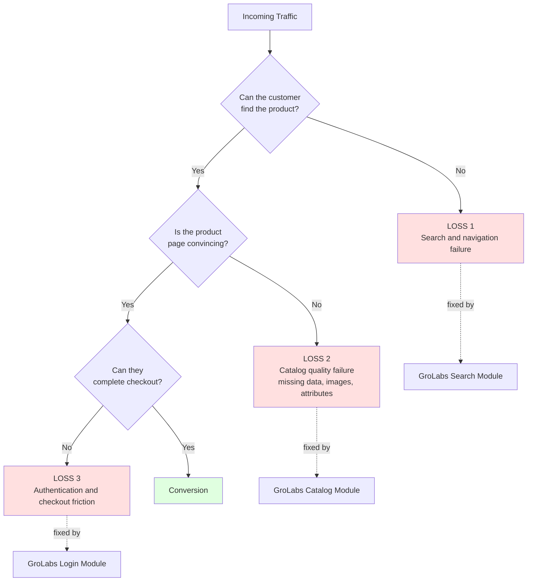
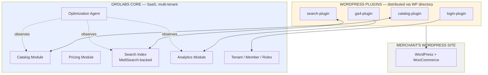
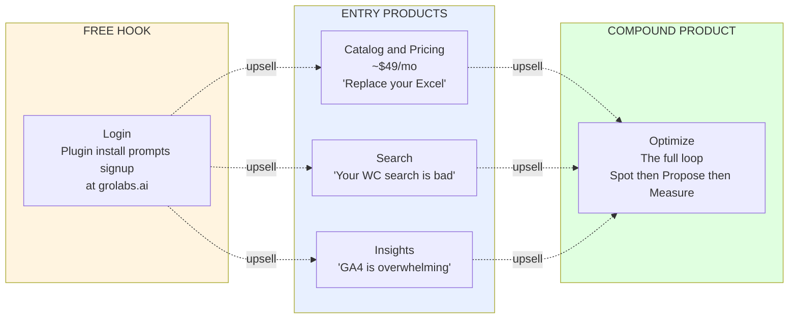

# GroLabs — Vision Document (Draft v0.4)

**Status:** Draft, pending review
**Date:** 2026-05-16
**Author of record:** Tuncho (with Claude as scribe)
**Changelog:**
- v0.4 — Removed "auto-registration on plugin install" language throughout. Aligned with Constitution Article 3: tenants register through explicit handshake at grolabs.ai. Affected: §4 diagram, §4 selling logic, §6 rule 3, §7 open questions Q4/Q6/Q7.
- v0.2 — renamed plugins to functional, source-based names (catalog-plugin, search-plugin, ga4-plugin, login-plugin). Marketing names deferred.

---

## 1. What GroLabs is

GroLabs is an AI-agent-driven optimization layer for small e-commerce businesses. It sits alongside the merchant's existing storefront and recovers revenue the merchant is already losing to three specific failure modes: customers who can't find the product, customers who find it but aren't convinced, and customers who are convinced but can't get through checkout.

The product is **platform-agnostic in design, WooCommerce-first in execution.** WordPress + WooCommerce is the initial connector because that's where the SMB beachhead is. The core (catalog, pricing, search index, analytics, optimization agent) is tech-agnostic and could connect to Shopify, Magento, or other platforms in the future without architectural change.

The brand verb is **recover**, not grow or improve. The product addresses loss-aversion: customers respond more strongly to "you're losing $X" than to "you could earn $X."

The acronym GRO encodes the causal chain:
- **G**rowth — the outcome
- **R**ecovery — the mechanism
- **O**ptimization — the method

---

## 2. The three revenue-loss categories

This is the product's spine. Every feature, every plugin, every alert maps back to one of these three.

Each loss category is independently addressable, independently sellable, and independently measurable. When a merchant addresses all three (plus the analytics overlay that measures the whole loop), the compound effect emerges — the Optimization product.

---

## 3. The product architecture: core + plugins

GroLabs is **two layers**:

**Core (one codebase, one schema, one deployable):** Multi-tenant SaaS hosted by us. Owns canonical product IDs, pricing rules, the search index, analytics aggregation, and the optimization agent. Internally organized into modules; externally exposed as four "selling shapes" via entitlements (feature flags).

**Plugins (separate codebases, each their own WordPress plugin):** Installed on the merchant's WordPress site. Each plugin is independently distributable, separately versioned, and connects back to GroLabs core via API. The merchant installs only the plugins matching the products they've purchased.

### Plugin naming convention

Plugin names are **functional and source-based**, not marketing-driven. Marketing names live on the product wrapper, not on the plugin. This decouples technical naming from market positioning — the plugin can keep its name forever while the product it's part of gets rebranded freely.

- `catalog-plugin` and `search-plugin` have implicit source (WooCommerce, the only catalog/search source we read from right now)
- `ga4-plugin` names its source explicitly because the analytics module could ingest from other sources later (Meta Pixel, Mixpanel, etc.), each requiring its own plugin
- `login-plugin` is the social SSO connector

### The four plugins

| # | Plugin | Purpose | Loss category addressed |
|---|---|---|---|
| 1 | **catalog-plugin** | Bidirectional catalog and pricing sync between WC and GroLabs | Loss 2 |
| 2 | **search-plugin** | Replaces WC default search with MeiliSearch-backed search | Loss 1 |
| 3 | **ga4-plugin** | Forwards GA4 events and basic metrics to GroLabs | Cross-cutting; powers detection |
| 4 | **login-plugin** | Social SSO to remove username/password friction | Loss 3 |

---

## 4. The four selling shapes

The customer perceives four distinct purchases. Internally, they share one codebase.

**The selling logic:**
- Each entry product is sellable standalone. A merchant can buy just Catalog and never adopt the others.
- **The login-plugin is the free hook.** Installing the plugin prompts the merchant to create a GroLabs account at grolabs.ai through an explicit handshake (Constitution Article 3). Once the merchant signs up and connects their site, GroLabs' agent probes the store and identifies leaks across all three loss categories — turning the assessment into evidence-based upsell.
- The agent uses those findings to drive personalized, evidence-based upsell: "We found 47 products with no photos and 12 search queries with zero results. Here's what that's costing you."
- Optimization is the compound product — only meaningful when at least 1+2+3 are active, because the loop requires all three data sources.

---

## 5. Who GroLabs is for

### Ideal customer profile

- **Platform:** WordPress + WooCommerce
- **Team size:** 1–5 people; solopreneurs explicitly included
- **Catalog management today:** Excel spreadsheets, WP Import, or direct typing into WC admin
- **Search today:** Default WooCommerce search (no external plugin). Market evidence: external search adoption is below 5% across ~4M WC stores.
- **Analytics today:** GA4 installed, rarely opened, not understood
- **Authentication today:** Default WC username/password checkout
- **The diagnostic question:** *"Is there a dedicated person with a related KPI or compensation tied to this area's performance?"* If no → that area is bleeding revenue → GroLabs target.

### Who is NOT a GroLabs customer

- Enterprise retailers with dedicated merchandising/UX teams
- Shopify, Magento, BigCommerce stores (until/unless we ship connectors)
- Pure-digital-product stores (no SKUs, no inventory, no variants)
- Stores already running mature search/analytics stacks with active owners

---

## 6. Constitutional rules emerging from this vision

The following are non-negotiable rules that flow from the vision. They will be lifted into the Constitution document as separate work.

1. **Industry-agnostic core.** No vertical-specific naming, schema, or assumptions in core code or docs. Verticals exist only as instance-provisioning templates (Wazú is the pet-shop test case).
2. **One core codebase, multiple plugin codebases.** Core uses feature-flag entitlements; plugins are physically separate distributable artifacts.
3. **Plugin-driven funnel with explicit signup.** Plugin install is the funnel entry point, but tenant registration happens through an explicit handshake at grolabs.ai — never silently on install. The funnel is plugin-initiated, signup-confirmed.
4. **Privacy-first defaults.** Any merchant-controlled data-sharing setting defaults to the most data-minimizing option, requires explicit consent to enable, and remains revocable.
5. **One switch in the search-plugin.** Search-only by default; full event + revenue tracking as a single opt-in upgrade.
6. **The clerk-delegation problem is solved inside GroLabs, not by plugin configuration.** The `financial_data_visible` role flag determines what each user sees in the dashboard.
7. **Phase 1 builds without enforcement.** Define every model now (entitlements, roles, multi-tenancy, sync identity). Enforce nothing until enforcement is the bottleneck.
8. **Sync identity through mapping tables.** GroLabs owns the canonical product ID. External system IDs are mapped, never inferred from names or SKUs.
9. **Pricing engine is GroLabs-native.** WooCommerce receives synced final prices; it is never the source of truth for pricing logic.
10. **Repo wins over memory on conflict.** Source of truth is the repository, always.
11. **Plugin names are functional, source-based, and decoupled from marketing.** Marketing names sit on the product wrapper; plugin technical names persist independently.

---

## 7. Open questions (must be resolved before Constitution is finalized)

| # | Question | Trigger to resolve |
|---|---|---|
| Q1 | Final product-name spelling locked as **GroLabs** ✓ | resolved |
| Q2 | Two SSO repo folders (`scout-wordpress-social-login`, `wp-multi-social-login`) — review and consolidate to one | cleanup task; before any plugin release |
| Q3 | Marketing names for the four selling shapes (e.g., Insights Suite, Fastlane Checkout) | before any marketing copy is written |
| Q4 | Exact data captured at signup handshake (email? domain? site name? WP owner identity?) | before login-plugin v1 ships |
| Q5 | Consent disclosure language at plugin install | before any plugin lands in WP directory |
| Q6 | Does the agent's store-probe behavior happen immediately after signup, or require separate consent? | before agent goes live |
| Q7 | Relationship between free-tier tenants (login-plugin only) and paid tenants — same ID? Upgrade flow? | before billing layer is built |
| Q8 | If the merchant later refuses to share revenue but had previously consented, what is the retention policy on already-collected data? | before privacy policy is published |

---

## 8. Market evidence (citations for the record)

- ~4.17M live WooCommerce stores worldwide (Colorlib, 2026); ~4.46M (StoreLeads, Jan 2026); ~6.3M active WC plugin installs (WordPress.org)
- Top WC plugins by adoption: Stripe Gateway 40%, Legacy REST API 30%, Facebook 29%, PDF Invoices 28%, Woo Subscriptions 27%, PayPal 25% — **search plugins are absent from the top 20** (Metorik, 2026)
- Average WC store runs 58 active plugins (Metorik, 2026) — merchants are not plugin-averse
- Algolia's total reach across the entire web is ~493K sites, with Fashion (13%) and Gaming (8%) as top verticals — confirming SMB WC penetration is minimal (SimilarWeb, Jan 2026)
- **Inference:** External search plugin adoption on WC is below 5%, likely 2–3%. ~4M WC stores running default search represents the addressable market for Loss 1.
- SMB willingness to share financial data with SaaS is well-established (QuickBooks, Webgility, Synder, A2X all operate on this premise). The concern is trust and transparency with new vendors, not data category.

---

## 9. Phase 1 scope (what we build to validate the vision)

In priority order (per Tuncho's stated urgency):

1. **Stabilize the Catalog module** — including the known image-display bug
2. **Complete GroLabs→WooCommerce sync cycle** with correct identity resolution (new product gets WC ID back; existing product syncs as update, not duplicate)
3. **MeiliSearch integration + search-plugin** working end-to-end as proof of concept
4. **GA4 ingestion + alert-based dashboard** (restarted from scratch with proper Discussion first)

Each of these will be its own Discussion event, producing its own structured spec.

---

## 10. What this vision rules out (the negative space)

- GroLabs will not become a full e-commerce platform. WooCommerce (and future connectors) own the storefront, cart, and checkout.
- GroLabs will not become a generic BI tool. The product is opinionated about which leaks matter and what to do about them.
- GroLabs will not become a CRM. We touch customer data through events, but managing customer relationships is not the job.
- GroLabs will not sell on dashboards. The product UI is alerts-first; dashboards exist to support investigation, not as the daily surface.
- GroLabs will not require code from the merchant. Plugin install + API key is the entire integration path.

---

**End of draft v0.2.**
